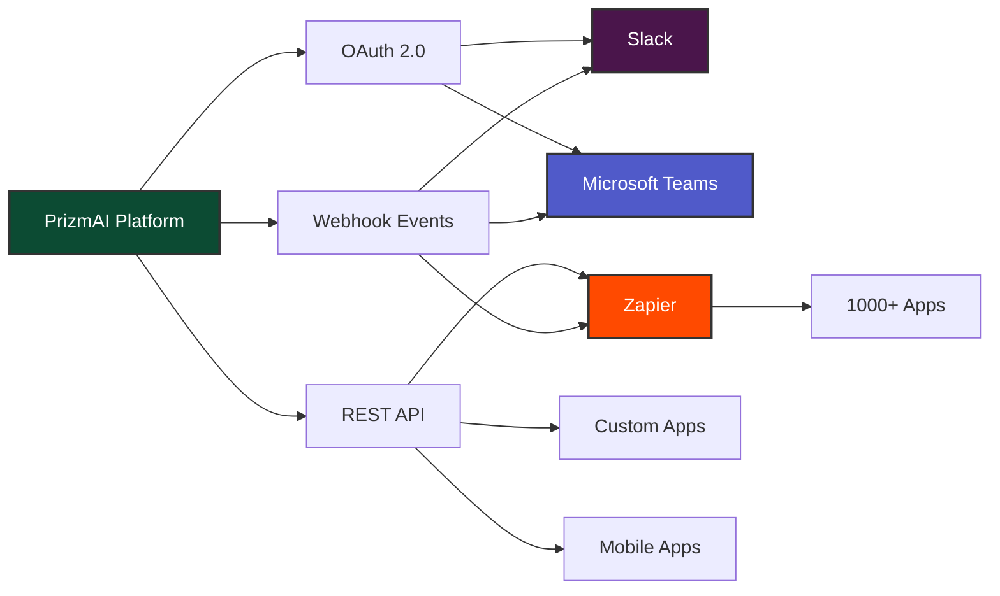
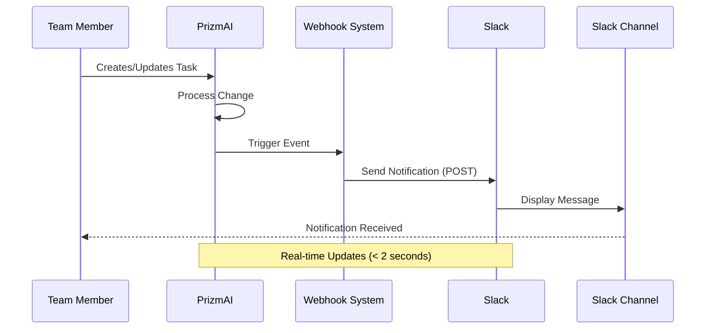
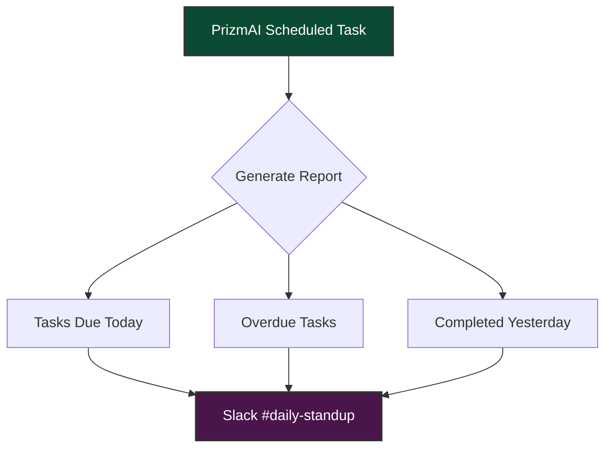
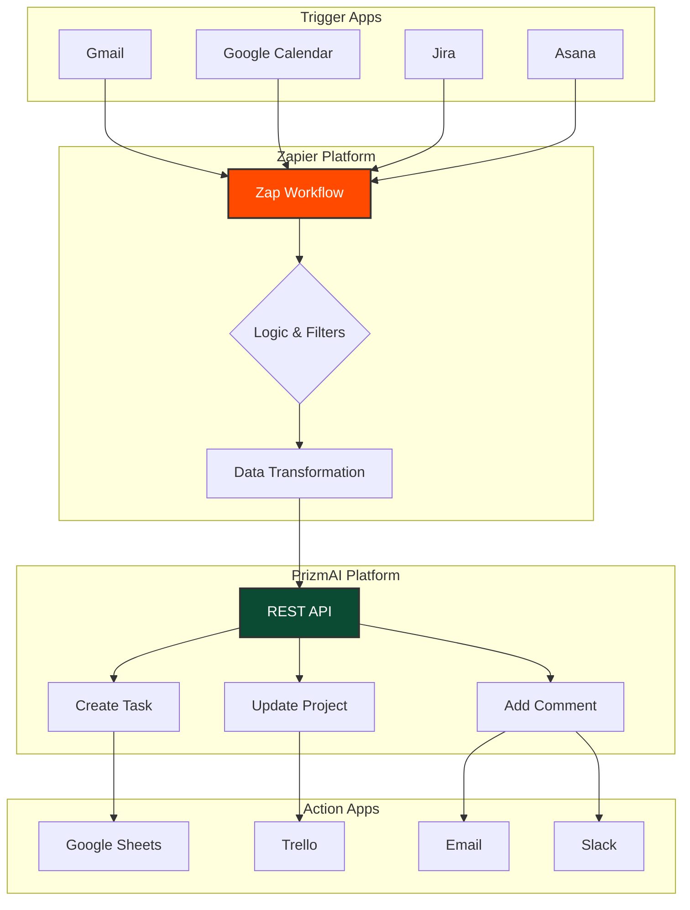
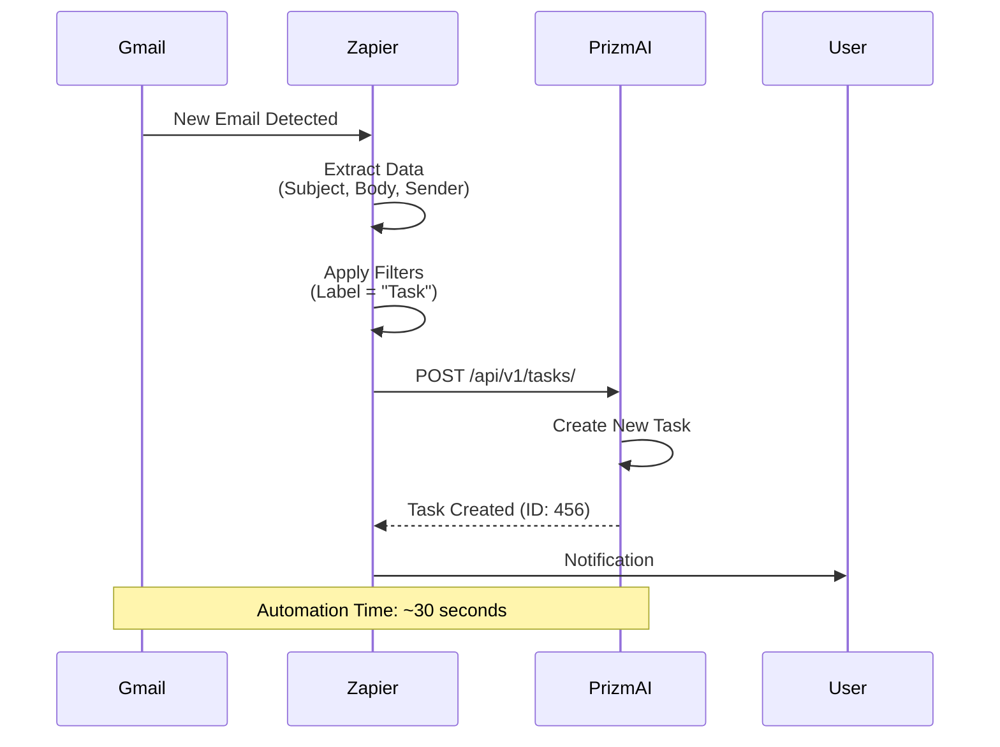
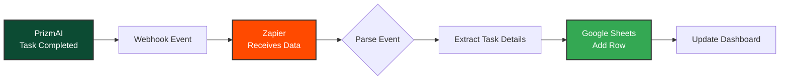
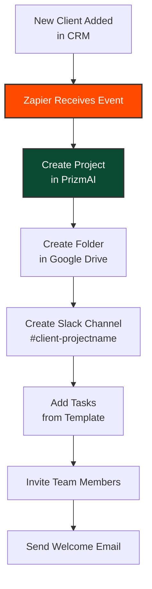
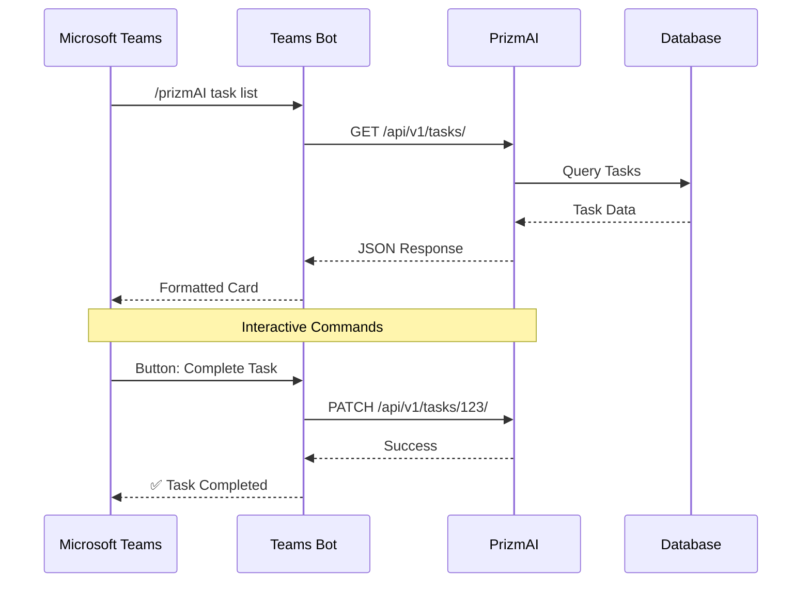

# 🔌 Integration Guide

> **Connect PrizmAI with Your Existing Tools**

This guide demonstrates how to integrate PrizmAI with popular third-party platforms like Slack, Zapier, and other tools to create a seamless project management ecosystem.

---

## 📋 Table of Contents

- [Overview](#overview)
- [Slack Integration](#slack-integration)
- [Zapier Integration](#zapier-integration)
- [Microsoft Teams Integration](#microsoft-teams-integration)
- [Custom Integrations](#custom-integrations)
- [Best Practices](#best-practices)
- [Troubleshooting](#troubleshooting)

---

## 🌐 Overview

PrizmAI supports integrations through multiple channels:

- **🪝 Webhooks** - Real-time event notifications to external systems
- **🔌 REST API** - 20+ endpoints for programmatic access
- **🔗 OAuth 2.0** - Secure authentication for third-party apps
- **📡 WebSockets** - Real-time bidirectional communication

### Integration Architecture



---

## 💬 Slack Integration

### Overview

Integrate PrizmAI with Slack to receive real-time notifications about project updates, task changes, and AI recommendations directly in your team's channels.

### Integration Flow



### Setup Steps

#### 1. Create Slack Incoming Webhook

1. Go to your Slack workspace settings
2. Navigate to **Apps** → **Custom Integrations** → **Incoming Webhooks**
3. Click **Add to Slack**
4. Select the channel where notifications should appear (e.g., `#project-updates`)
5. Copy the generated Webhook URL (e.g., `https://hooks.slack.com/services/YOUR/WEBHOOK/URL`)

#### 2. Configure PrizmAI Webhook

1. Log in to PrizmAI as an admin
2. Navigate to **Settings** → **Webhooks**
3. Click **Add New Webhook**
4. Fill in the details:

```
Name: Slack Project Updates
Webhook URL: https://hooks.slack.com/services/YOUR/WEBHOOK/URL
Events: task.created, task.updated, task.completed, 
        milestone.approaching, conflict.detected, 
        ai.recommendation.generated
Active: ✅ Enabled
```

5. Save and test the webhook

#### 3. Test Integration

Create or update a task in PrizmAI and verify the notification appears in Slack:

**Example Slack Notification:**

```
🔔 PrizmAI Notification

📋 Task Updated: "Implement user authentication"
Project: Q4 Product Launch
Status: In Progress → Review
Assigned to: @john.doe
Priority: High
Due: Dec 15, 2025

🔗 View Task: https://prizmAI.local/task/123
```

### Use Cases

#### 1. Daily Standup Updates

Configure webhook for morning digest:



**Sample Message:**
```
☀️ Good morning team! Here's your daily update:

✅ Completed Yesterday: 8 tasks
📋 Due Today: 5 tasks
⚠️ Overdue: 2 tasks

Top Priority Today:
1. Complete API documentation
2. Review security audit
3. Deploy staging environment

🔗 View Full Board: https://prizmAI.local/board/sprint-42
```

#### 2. Critical Alerts

Immediate notifications for urgent events:

- 🚨 Scope creep detected (>10% increase)
- ⚠️ Resource conflicts identified
- 🔴 Budget overrun warning
- 🤖 AI recommendation: high-impact action needed

#### 3. Team Celebrations

Celebrate milestone completions:

```
🎉 Milestone Completed!

🏆 "MVP Launch" completed ahead of schedule!
Team: Product Development
Completion: 100% (24/24 tasks)
Timeline: 2 days early

Great job team! 🎊

🔗 View Milestone: https://prizmAI.local/milestone/5
```

---

## ⚡ Zapier Integration

### Overview

Connect PrizmAI with 5,000+ apps through Zapier to automate workflows, sync data, and create custom integrations without coding.

### Integration Architecture



### Setup Steps

#### 1. Generate API Key

1. Log in to PrizmAI
2. Navigate to **Settings** → **API Keys**
3. Click **Generate New API Key**
4. Name it: `Zapier Integration`
5. Copy the API key (you won't see it again!)

#### 2. Connect to Zapier

**Option A: Use Webhooks (Recommended)**

1. In Zapier, create a new Zap
2. Select **Webhooks by Zapier** as trigger
3. Choose **Catch Hook** or **POST**
4. Copy the webhook URL
5. Add this URL in PrizmAI webhook settings

**Option B: Use API Requests**

1. In Zapier, use **Webhooks by Zapier** action
2. Select **Custom Request**
3. Configure:
   - **URL**: `https://your-prizmAI-domain.com/api/v1/tasks/`
   - **Method**: POST
   - **Headers**: 
     - `Authorization: Bearer YOUR_API_KEY`
     - `Content-Type: application/json`

#### 3. Example Zap Workflows

### Workflow 1: Email → PrizmAI Task

**Trigger**: New Email in Gmail (labeled "Task")  
**Action**: Create Task in PrizmAI



**Configuration:**
```json
{
  "title": "{{gmail_subject}}",
  "description": "{{gmail_body}}",
  "project": 5,
  "status": "todo",
  "priority": "medium",
  "assigned_to": "auto@prizmAI.com",
  "source": "email",
  "tags": ["email", "automated"]
}
```

### Workflow 2: PrizmAI Task Complete → Update Google Sheets

**Trigger**: Task Completed in PrizmAI (Webhook)  
**Action**: Add Row to Google Sheets



**Google Sheets Output:**

| Date | Task | Project | Assignee | Duration | Status |
|------|------|---------|----------|----------|--------|
| 2025-12-12 | Fix bug #234 | Web App | John Doe | 3 days | Completed |
| 2025-12-12 | Design mockup | Marketing | Jane Smith | 2 days | Completed |

### Workflow 3: Calendar Event → PrizmAI Milestone

**Trigger**: New Google Calendar Event (Category: Milestone)  
**Action**: Create Milestone in PrizmAI

```json
{
  "name": "{{calendar_event_title}}",
  "project": "{{calendar_location}}",
  "target_date": "{{calendar_start_date}}",
  "description": "{{calendar_description}}",
  "created_via": "zapier"
}
```

### Workflow 4: PrizmAI Budget Alert → Email Team

**Trigger**: Webhook from PrizmAI (budget.warning)  
**Action**: Send Email via Gmail

**Email Template:**
```
Subject: 🚨 Budget Alert: {{project_name}}

Team,

Budget alert for project: {{project_name}}

Current Spend: ${{current_spend}}
Budget Limit: ${{budget_limit}}
Remaining: ${{remaining_budget}}
Burn Rate: ${{daily_burn_rate}}/day

Estimated Depletion: {{days_remaining}} days

Action Required: Please review expenses and adjust resource allocation.

View Project: {{project_url}}

---
Automated by PrizmAI Budget Monitoring
```

### Advanced Multi-Step Zap

**Complex Workflow: New Client → Full Project Setup**



**Steps:**
1. **Trigger**: New row in Google Sheets (Client Database)
2. **Action 1**: Create Project in PrizmAI
3. **Action 2**: Create Google Drive folder
4. **Action 3**: Create Slack channel
5. **Action 4**: Bulk create tasks from template
6. **Action 5**: Invite team members
7. **Action 6**: Send welcome email with links

---

## 🏢 Microsoft Teams Integration

### Overview

Bring PrizmAI notifications and quick actions into Microsoft Teams for enterprise collaboration.

### Integration Flow



### Setup via Webhooks

Configure incoming webhook in Teams:

1. In Teams, go to your channel
2. Click **⋯** → **Connectors** → **Incoming Webhook**
3. Name it: `PrizmAI Updates`
4. Copy the webhook URL
5. Add to PrizmAI webhook settings

**Sample Adaptive Card (Teams):**

```json
{
  "@type": "MessageCard",
  "themeColor": "0c4b33",
  "summary": "New Task Assigned",
  "sections": [{
    "activityTitle": "📋 New Task Assigned to You",
    "activitySubtitle": "Project: Q4 Launch",
    "activityImage": "https://prizmAI.local/logo.png",
    "facts": [{
      "name": "Task:",
      "value": "Implement API authentication"
    }, {
      "name": "Priority:",
      "value": "High"
    }, {
      "name": "Due Date:",
      "value": "Dec 20, 2025"
    }],
    "markdown": true
  }],
  "potentialAction": [{
    "@type": "OpenUri",
    "name": "View Task",
    "targets": [{
      "os": "default",
      "uri": "https://prizmAI.local/task/789"
    }]
  }]
}
```

---

## 🛠 Custom Integrations

### Using the REST API

PrizmAI provides a comprehensive REST API for custom integrations.

#### Authentication

```bash
curl -X GET https://your-domain.com/api/v1/tasks/ \
  -H "Authorization: Bearer YOUR_API_KEY" \
  -H "Content-Type: application/json"
```

#### Common Endpoints

| Endpoint | Method | Description |
|----------|--------|-------------|
| `/api/v1/projects/` | GET, POST | List/Create projects |
| `/api/v1/tasks/` | GET, POST | List/Create tasks |
| `/api/v1/tasks/{id}/` | GET, PATCH, DELETE | Task details/update |
| `/api/v1/boards/{id}/` | GET | Board with columns and tasks |
| `/api/v1/ai/recommendations/` | POST | Get AI recommendations |
| `/api/v1/conflicts/` | GET | List detected conflicts |
| `/api/v1/budget/{id}/` | GET | Budget status |

**📖 Full API Reference:** See [API_DOCUMENTATION.md](API_DOCUMENTATION.md)

### Example: Python Script Integration

```python
import requests
import json

class PrizmAIClient:
    def __init__(self, base_url, api_key):
        self.base_url = base_url
        self.headers = {
            "Authorization": f"Bearer {api_key}",
            "Content-Type": "application/json"
        }
    
    def create_task(self, title, project_id, **kwargs):
        """Create a new task"""
        url = f"{self.base_url}/api/v1/tasks/"
        data = {
            "title": title,
            "project": project_id,
            **kwargs
        }
        response = requests.post(url, headers=self.headers, json=data)
        response.raise_for_status()
        return response.json()
    
    def get_tasks(self, filters=None):
        """Get list of tasks with optional filters"""
        url = f"{self.base_url}/api/v1/tasks/"
        response = requests.get(url, headers=self.headers, params=filters)
        response.raise_for_status()
        return response.json()
    
    def get_ai_recommendations(self, project_id):
        """Get AI recommendations for a project"""
        url = f"{self.base_url}/api/v1/ai/recommendations/"
        data = {"project": project_id}
        response = requests.post(url, headers=self.headers, json=data)
        response.raise_for_status()
        return response.json()

# Usage
client = PrizmAIClient(
    base_url="https://prizmAI.local",
    api_key="your-api-key-here"
)

# Create task
task = client.create_task(
    title="Implement feature X",
    project_id=5,
    status="todo",
    priority="high",
    assigned_to=3,
    due_date="2025-12-25"
)

# Get overdue tasks
overdue = client.get_tasks(filters={"overdue": True})

# Get AI recommendations
recommendations = client.get_ai_recommendations(project_id=5)
```

### Example: Node.js Integration

```javascript
const axios = require('axios');

class PrizmAIClient {
    constructor(baseURL, apiKey) {
        this.client = axios.create({
            baseURL: baseURL,
            headers: {
                'Authorization': `Bearer ${apiKey}`,
                'Content-Type': 'application/json'
            }
        });
    }

    async createTask(taskData) {
        const response = await this.client.post('/api/v1/tasks/', taskData);
        return response.data;
    }

    async getTasks(filters = {}) {
        const response = await this.client.get('/api/v1/tasks/', {
            params: filters
        });
        return response.data;
    }

    async updateTaskStatus(taskId, status) {
        const response = await this.client.patch(`/api/v1/tasks/${taskId}/`, {
            status: status
        });
        return response.data;
    }
}

// Usage
const prizmAI = new PrizmAIClient(
    'https://prizmAI.local',
    'your-api-key-here'
);

// Create task from webhook
app.post('/webhook/github-issue', async (req, res) => {
    const issue = req.body.issue;
    
    const task = await prizmAI.createTask({
        title: issue.title,
        description: issue.body,
        project: 5,
        status: 'todo',
        tags: ['github', 'automated']
    });
    
    res.json({ success: true, task_id: task.id });
});
```

---

## 🎯 Best Practices

### 1. Event Filtering

Only subscribe to events you need:
```
✅ DO: task.completed, milestone.approaching
❌ DON'T: *.* (all events)
```

### 2. Error Handling

Implement retry logic for webhook failures:

```python
import time
from requests.exceptions import RequestException

def send_webhook_with_retry(url, data, max_retries=3):
    for attempt in range(max_retries):
        try:
            response = requests.post(url, json=data, timeout=10)
            response.raise_for_status()
            return response
        except RequestException as e:
            if attempt == max_retries - 1:
                raise
            time.sleep(2 ** attempt)  # Exponential backoff
```

### 3. Rate Limiting

Respect API rate limits:
- **Default**: 100 requests/minute
- **Authenticated**: 1000 requests/minute
- **Enterprise**: Custom limits

Use batch endpoints when available:
```python
# ❌ DON'T: Multiple single requests
for task_id in task_ids:
    update_task(task_id)

# ✅ DO: Single batch request
bulk_update_tasks(task_ids, updates)
```

### 4. Security

- ✅ Use HTTPS for all webhook URLs
- ✅ Verify webhook signatures (HMAC)
- ✅ Store API keys in environment variables
- ✅ Rotate API keys regularly
- ❌ Never commit API keys to version control

### 5. Testing

Test integrations in staging environment:
```bash
# Test webhook endpoint
curl -X POST https://your-webhook-url.com \
  -H "Content-Type: application/json" \
  -d '{"event": "task.created", "data": {...}}'
```

### 6. Monitoring

Monitor integration health:
- Track webhook delivery success rate
- Set up alerts for failures
- Log all API requests/responses
- Monitor rate limit usage

---

## 🔧 Troubleshooting

### Webhook Not Receiving Events

**Check:**
1. ✅ Webhook URL is accessible from internet
2. ✅ Webhook is marked as "Active" in PrizmAI
3. ✅ Correct events are selected
4. ✅ Firewall allows incoming requests
5. ✅ SSL certificate is valid (for HTTPS)

**Debug:**
```bash
# Test webhook manually
curl -X POST YOUR_WEBHOOK_URL \
  -H "Content-Type: application/json" \
  -d '{"test": "data"}'
```

### API Authentication Errors

**401 Unauthorized:**
- Check API key is correct
- Verify `Authorization` header format: `Bearer YOUR_KEY`
- Ensure API key hasn't been revoked

**403 Forbidden:**
- Verify user has required permissions
- Check organization/team access

### Zapier Connection Issues

**Common Issues:**
1. **Invalid API Response**: Check API endpoint returns valid JSON
2. **Timeout**: Increase timeout settings in Zapier
3. **Data Mapping**: Verify field names match exactly

**Test Connection:**
```bash
# Verify API is accessible
curl -X GET https://your-domain.com/api/v1/health/ \
  -H "Authorization: Bearer YOUR_KEY"
```

### Rate Limit Exceeded

**Response:**
```json
{
  "error": "Rate limit exceeded",
  "retry_after": 60,
  "limit": 100,
  "remaining": 0
}
```

**Solution:**
- Implement exponential backoff
- Use batch endpoints
- Contact support for higher limits

---

## 📚 Additional Resources

- **[API Documentation](API_DOCUMENTATION.md)** - Complete API reference
- **[Webhook Guide](WEBHOOKS.md)** - Detailed webhook documentation
- **[Security Guide](SECURITY_OVERVIEW.md)** - Security best practices
- **[User Guide](USER_GUIDE.md)** - General usage documentation

---

## 💡 Integration Ideas

### Marketing Automation
- New campaign in Mailchimp → Create project in PrizmAI
- Blog post published → Update content calendar task

### Customer Support
- New Zendesk ticket → Create task
- High priority ticket → Send Slack alert + AI priority recommendation

### Development Workflow
- GitHub PR merged → Update task status
- Build failed → Create bug task with CI logs

### Sales & CRM
- Deal won in Salesforce → Trigger project template
- New lead → Create onboarding checklist

### Time Tracking
- Toggl time entry → Update task time spent
- Daily time report → Send to Google Sheets

---

**Need help with your integration?** [Open an issue on GitHub](https://github.com/paulavishek/PrizmAI/issues) or check our [community discussions](https://github.com/paulavishek/PrizmAI/discussions).

**Built with ❤️ by [Avishek Paul](https://github.com/paulavishek)**
