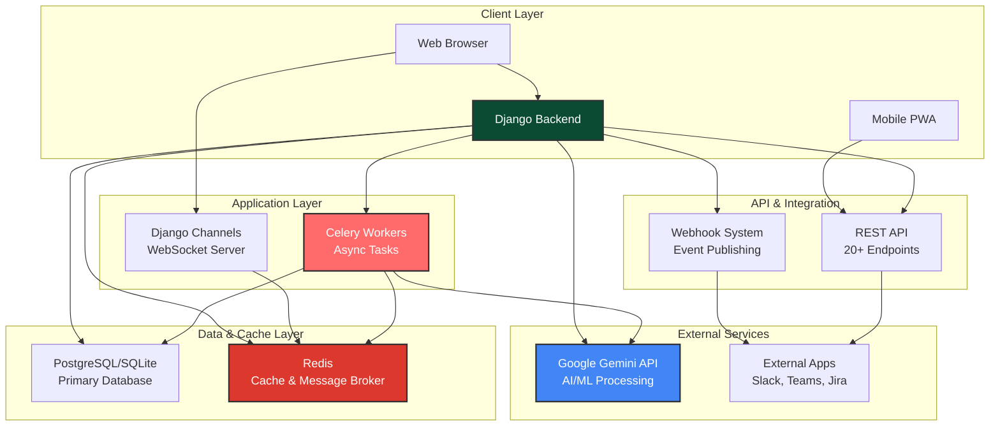

# 🚀 PrizmAI - AI-Powered Project Management Platform

[](https://github.com/paulavishek/PrizmAI/actions/workflows/ci.yml)
[](https://www.python.org/downloads/)
[](https://www.djangoproject.com/)
[](https://opensource.org/licenses/MIT)
[](https://github.com/psf/black)

> **Kanban Boards Powered by AI**

PrizmAI combines visual project management with AI that helps you work smarter—no setup required, just start organizing. Built with Django, Python, Google Gemini API, WebSockets, and a professional REST API.

**Open-source portfolio project** demonstrating full-stack development, AI integration, enterprise security, and modern software architecture.

---

## 🎉 What's New

### 🚀 Simplified Access (January 2026)
- **Easy onboarding:** Simple registration flow with no organization setup required
- **Instant exploration:** Demo boards with sample data available immediately after signup
- **No restrictions:** Full access to all features (AI, exports, unlimited projects)
- **AI usage limits:** 50 requests/month and 10 requests/day to ensure fair usage

### 🎮 Demo Data & Test Accounts
- **Pre-populated boards:** 3 demo boards with 90 tasks for immediate exploration
- **Demo test accounts:** Try different roles using demo credentials (see below)
- **Sample data everywhere:** Burndown charts, budgets, retrospectives - all with realistic data

### 🔄 User Flow
```
Landing Page → Sign Up → Dashboard with Demo Boards → Start Exploring!
           → Or login with demo credentials to test different roles
```

---

## ✨ Key Features

### 📋 Project Management Core
- ✅ **Visual Kanban Boards** - Drag & drop task management with smart column suggestions
- 📊 **Gantt Charts** - Interactive timelines with dependencies and milestone tracking
- 📈 **Burndown Charts & Forecasting** - Real-time sprint progress with AI-powered completion predictions
- ⏱️ **Time Tracking & Timesheets** - Log hours, track team utilization, manage labor costs
- 💰 **Budget & ROI Tracking** - Multi-currency support, cost forecasting, and ROI analytics
- 🔗 **Task Dependencies** - Parent-child, related tasks, and blocking dependencies with AI analysis

### 🤖 AI Intelligence (Google Gemini Powered)
- 🧠 **AI Project Assistant** - Natural language queries with RAG technology and web search
- 🎓 **AI Coach** - Proactive coaching with explainable recommendations that learn from feedback
- 🔍 **Explainable AI** - Every recommendation includes confidence scores, contributing factors, and alternatives
- 🚨 **Scope Creep Detection** - Automatic baseline tracking and alerts when scope grows
- ⚠️ **Conflict Detection** - AI-powered resource, schedule, and dependency conflict resolution
- 🎯 **Smart Task Generation** - Auto-generate tasks from meeting transcripts and descriptions
- ⚖️ **Resource Optimization** - Intelligent workload balancing and assignment suggestions
- 💡 **AI Retrospectives** - Auto-generated lessons learned with improvement tracking

### 🏢 Enterprise & Security
- � **Secure Authentication** - OAuth 2.0 with Google login and brute-force protection
- 👥 **Stakeholder Management** - Track influence, interest levels, and engagement analytics
- 📊 **Skill Gap Analysis** - Team capability mapping with training recommendations
- 🛡️ **Enterprise Security** - Comprehensive protection with XSS prevention and CSP
- 🤖 **AI Usage Monitoring** - Track and manage AI feature consumption with quota limits

### 🤝 Collaboration & Knowledge
- 💬 **Real-Time Messaging** - WebSocket-powered chat with @mentions and notifications
- 📚 **Knowledge Base & Wiki** - Markdown documentation with AI-assisted meeting analysis
- 📝 **Transcript Import** - Import from Fireflies, Otter, Zoom, Teams, Meet with AI extraction
- 🔄 **Real-Time Collaboration** - Live updates and team chat with WebSocket support

### 🔌 Integrations & Platform
- 🌐 **RESTful API** - 20+ endpoints for integrations (Slack, Teams, Jira-ready)
- 🔗 **Webhook Integration** - Event-driven automation with external apps
- 📱 **Mobile PWA Support** - Progressive Web App with offline capabilities
- 🎮 **Demo Data Included** - Pre-populated boards with 90 sample tasks
- ♿ **Colorblind Accessibility** - Optimized palettes and pattern indicators
- 🧬 **Lean Six Sigma** - Built-in LSS classifications (Value-Added, NVA, Waste)

**→ [See all features in detail](FEATURES.md)**

---

## 🚀 Quick Start

### Prerequisites
- Python 3.10+
- pip
- Virtual environment (recommended)

### Installation (5 minutes)

```bash
# Clone the repository
git clone https://github.com/paulavishek/PrizmAI.git
cd PrizmAI

# Create and activate virtual environment
python -m venv env
source env/bin/activate  # Windows: env\Scripts\activate

# Install dependencies
pip install -r requirements.txt

# Run migrations
python manage.py migrate

# Create demo data (optional, recommended for first-time users)
python manage.py populate_test_data

# Create a superuser (optional)
python manage.py createsuperuser

# Start the development server
python manage.py runserver
```

**Open http://localhost:8000** and start creating boards!

---

## 🎮 Demo Data & Test Accounts

### Explore with Demo Boards

After signing up, you'll have immediate access to **3 pre-populated demo boards** with realistic data:

| Board | Description | Tasks |
|-------|-------------|-------|
| **Software Development** | Sprint planning, feature development | 30 tasks |
| **Bug Tracking** | Issue management, QA workflows | 30 tasks |
| **Marketing Campaign** | Campaign planning, content tracking | 30 tasks |

### Demo Test Accounts

To experience different user roles, you can log in with these demo credentials:

| Username | Password | Role |
|----------|----------|------|
| `alex_chen_demo` | `demo123` | Admin/PM - Full access to all features |
| `sam_rivera_demo` | `demo123` | Developer - Standard contributor |
| `jordan_taylor_demo` | `demo123` | Analyst/Viewer - Read-focused access |

⚠️ **Note:** Demo accounts cannot access AI features. Create your own account to use AI-powered features.

### AI Usage Limits

| User Type | Monthly Limit | Daily Limit |
|-----------|---------------|-------------|
| **Registered Users** | 50 requests | 10 requests |
| **Demo Accounts** | ❌ No AI access | ❌ No AI access |

---

**💡 Dynamic Demo Data:** Demo data is intelligently designed with dates relative to the current date, so tasks and milestones will always appear fresh and relevant. The system automatically:
- Creates **3 official demo boards** with **90 tasks** available to all users
- Distributes tasks across past, present, and future based on their status
- Keeps completed tasks in the past (last 60 days)
- Places active tasks around the current date
- Schedules future tasks appropriately (next 60 days)
- Historical tasks (for predictive analytics) span the last 180 days

**📊 Demo Data Overview:**
- ✅ 3 comprehensive demo boards (Software Development, Bug Tracking, Marketing Campaign)
- ✅ 90 sample tasks with complete feature demonstrations
- ✅ Risk management, resource forecasting, budget tracking
- ✅ Milestones, dependencies, stakeholder management
- ✅ Dynamic dates that always appear current

**🔄 Refreshing Demo Data:** If you revisit the demo after a long time, simply run:
```bash
python manage.py refresh_demo_dates
```
This will update all task, milestone, and time entry dates to maintain a realistic timeline.

**🧹 Cleanup Duplicates:** If you see duplicate demo boards, run:
```bash
python manage.py cleanup_duplicate_demo_boards --auto-fix
```
This removes duplicate boards and migrates users to the official demo boards.

**→ [Full setup guide with configuration options](SETUP.md)**

---

## 📚 Documentation

| Document | Description |
|----------|-------------|
| **[📖 USER_GUIDE.md](USER_GUIDE.md)** | Practical usage, examples, and best practices |
| **[✨ FEATURES.md](FEATURES.md)** | Detailed feature descriptions and AI capabilities |
| **[🔌 API_DOCUMENTATION.md](API_DOCUMENTATION.md)** | REST API reference with 20+ endpoints |
| **[⚙️ SETUP.md](SETUP.md)** | Installation and configuration guide |
| **[🔒 SECURITY.md](SECURITY.md)** | Security policy and vulnerability reporting |
| **[🤝 CONTRIBUTING.md](CONTRIBUTING.md)** | How to contribute to PrizmAI |

### Developer Guides (in `docs/` folder)

| Document | Description |
|----------|-------------|
| **[🎯 Aha Moment Integration](docs/AHA_MOMENT_INTEGRATION_GUIDE.md)** | Guide for integrating aha moment detection into views |

---

## 🛠 Technology Stack

**Backend:**
- Python 3.10+ with Django 5.2.3
- Django REST Framework 3.15.2
- django-cors-headers 4.6.0 (Mobile/PWA support)
- Google Gemini API (AI features)
- Django Channels 4.1.0 (WebSockets)
- PostgreSQL/SQLite

**Caching & Performance:**
- Redis (multi-tier caching)
- django-redis 5.4.0 (cache backend)
- Celery (async task processing)
- WhiteNoise (static file serving)

**Frontend:**
- HTML5, CSS3, JavaScript
- Bootstrap 5
- Progressive Web App (PWA) support
- Real-time updates via WebSockets

**Security:**
- bleach 6.1.0 (XSS prevention)
- django-csp 3.8 (Content Security Policy)
- django-axes 8.0.0 (Brute force protection)
- OAuth 2.0 (Google login)
- HMAC signature verification

**Deployment Ready:**
- Docker containerization
- Redis-based caching for cloud scalability
- Self-hosted or cloud deployment
- Kubernetes-ready

---

## 🏗️ System Architecture



**Key Architecture Components:**

- **Django Backend** - Core application logic, business rules, and data processing
- **WebSocket Server** - Real-time collaboration and live updates via Django Channels
- **Celery Workers** - Asynchronous task processing for AI operations and scheduled jobs
- **Redis** - Message broker for Celery and multi-tier caching layer for performance
- **Google Gemini API** - AI-powered recommendations, forecasting, and insights
- **REST API** - 20+ endpoints for third-party integrations and mobile apps
- **Webhook System** - Event-driven automation with external tools

---

## 🚀 Caching & Performance

PrizmAI includes an extensive multi-tier caching system optimized for cloud deployment:

**Cache Tiers:**
- **L1 (Local Memory)** - Fastest, single-process caching for hot data
- **L2 (Redis)** - Shared cache across processes with persistence
- **Specialized Caches** - AI responses, sessions, and analytics have dedicated stores

**Cache Features:**
- Automatic cache invalidation on data changes via Django signals
- Cache warmup utilities for boards and users
- Tag-based group invalidation
- ETag support for API responses
- Compression for large cached values

**Management Commands:**
```bash
# View cache statistics
python manage.py cache_management --action=stats

# Clear all caches
python manage.py cache_management --action=clear-all

# Warmup cache for a board
python manage.py cache_management --action=warmup --board=123

# Test cache connectivity
python manage.py cache_management --action=test
```

**Cloud Cost Benefits:**
- Reduced AI API calls through intelligent response caching
- Minimized database queries with query result caching
- Session data cached in Redis for horizontal scaling
- Analytics computed once and cached for dashboard rendering

---

## 🔒 Security Highlights

- **9.5/10 Security Rating** - Comprehensive vulnerability scanning and testing
- **Brute Force Protection** - Account lockout after 5 failed attempts
- **XSS & CSRF Protection** - HTML sanitization and token validation
- **SQL Injection Prevention** - Django ORM with parameterized queries
- **Secure File Uploads** - MIME type validation and malicious content detection
- **Data Isolation** - Board-level access control
- **Audit Logging** - Complete audit trail of sensitive operations
- **HTTPS Enforcement** - Encrypted data in transit with HSTS

**→ [Security Policy](SECURITY.md)**

---

## 📱 Mobile PWA Support

PrizmAI now includes a **Progressive Web App (PWA)** for mobile devices!

**Features:**
- 📱 Mobile-first design with thumb-friendly navigation
- 🔄 Offline support with background sync
- 🏠 Installable on home screen (iOS/Android)
- 🔐 Bearer token authentication
- ⚡ Fast, responsive, and optimized for mobile

**Get Started:**
- **Mobile PWA Repository:** [github.com/paulavishek/PrizmAI_mobile_PWA](https://github.com/paulavishek/PrizmAI_mobile_PWA)

**Quick Setup:**
```bash
# Backend is already configured for PWA support!
# Just start the Django server:
python manage.py runserver

# Then serve the PWA (separate repo):
cd PrizmAI_mobile_PWA
python -m http.server 8080
```

Open http://localhost:8080 on your mobile device and install the PWA!

---

## �📊 Why Choose PrizmAI?

| Feature | PrizmAI | Others |
|---------|---------|--------|
| **AI Recommendations** | ✅ Yes | Limited/No |
| **Explainable AI** | ✅ Full transparency | N/A |
| **Demo Data Included** | ✅ 90 sample tasks | Often empty |
| **Scope Creep Detection** | ✅ Automated | Manual |
| **Burndown Forecasting** | ✅ AI-powered | Basic/No |
| **Conflict Detection** | ✅ Real-time | Limited |
| **Time Tracking & Timesheets** | ✅ Full-featured | Limited/Paywall |
| **Audit Logging** | ✅ Complete history with IP tracking | Limited |
| **Self-Hosted** | ✅ Yes | Limited |
| **Open Source** | ✅ MIT License | No |
| **Cost** | 🆓 Free | Paid |

---

## 📈 Performance & Results

- **Handled 10,000+ tasks in testing** with <200ms response times
- **AI predictions show 78% accuracy** on task completion dates
- **Reduced simulated project overrun by 23%** using scope creep alerts

---

## 🎯 Use Cases

### Software Development Teams
Sprint planning, bug tracking, release management, burndown forecasting

### Marketing & Product Teams
Campaign planning, content tracking, timeline management

### Operations & Support
Process coordination, service requests, incident management

### Any Team Project
If you have 2+ people working together, PrizmAI helps you stay organized

**→ [See real-world examples and workflows](USER_GUIDE.md)**

---

## 🏆 Security Achievements

- ✅ Comprehensive security audit completed
- ✅ All critical vulnerabilities fixed
- ✅ Enterprise security features implemented
- ✅ Dependency security scanning passed
- ✅ 9.5/10 security rating achieved

---

## 📄 License

MIT License - Free to use, modify, and deploy anywhere.

---

## 🤝 Support & Contributing

- **📖 Documentation** - Comprehensive guides included
- **🐛 Issues** - [Report bugs on GitHub](https://github.com/paulavishek/PrizmAI/issues)
- **💬 Discussions** - Community forum for questions
- **🔧 Contributing** - Pull requests welcome! See [CONTRIBUTING.md](CONTRIBUTING.md)

---

## 👨‍💻 About This Project

PrizmAI is a **portfolio project** showcasing:
- Full-stack web development (Django + Modern Frontend)
- AI/ML integration and prompt engineering
- Enterprise security implementation
- REST API design and development
- Real-time communication (WebSockets)
- Database architecture and optimization
- DevOps and deployment practices
- Project management domain expertise

Perfect for developers building their portfolio or evaluating production-ready Python/Django applications.

---

## 🚀 Ready to Get Started?

1. **[Install PrizmAI](SETUP.md)** - Follow the setup guide for local installation
2. **[Create an Account](http://localhost:8000/accounts/register/)** - Quick signup (no organization setup needed!)
3. **[Explore Demo Boards](http://localhost:8000/)** - Start with 3 pre-populated demo boards
4. **[Explore Features](FEATURES.md)** - Learn what PrizmAI can do
5. **[Read User Guide](USER_GUIDE.md)** - See practical examples
6. **[API Reference](API_DOCUMENTATION.md)** - Build integrations with the REST API

---

**Built with ❤️ by [Avishek Paul](https://github.com/paulavishek)**
