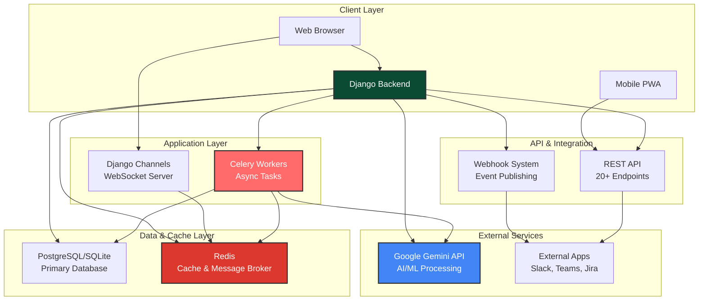

# 🚀 PrizmAI - AI-Powered Project Management Platform

> **Kanban Boards Powered by AI**

PrizmAI combines visual project management with AI that helps you work smarter—no setup required, just start organizing. Built with Django, Python, Google Gemini API, WebSockets, and a professional REST API.

**Open-source portfolio project** demonstrating full-stack development, AI integration, enterprise security, and modern software architecture.

---

## ✨ Key Features

- ✅ **Visual Kanban Boards** - Drag & drop task management with smart column suggestions
- 🧠 **AI-Powered Insights** - Intelligent recommendations for priorities, assignments, and deadlines
- 📊 **Burndown Charts & Forecasting** - Real-time sprint progress with completion predictions
- 🚨 **Scope Creep Detection** - Automatic alerts when project scope grows unexpectedly
- ⚠️ **Conflict Detection** - Identifies resource, schedule, and dependency conflicts
- 💰 **Budget & ROI Tracking** - Control finances with AI cost optimization
- ⏱️ **Time Tracking & Timesheets** - Log hours, track team utilization, manage labor costs
- 🎓 **AI Coach** - Proactive suggestions to improve project management decisions
- 📈 **User Feedback & Behavior Tracking** - Comprehensive feedback collection, sentiment analysis, and user behavior analytics for continuous improvement
- 🤖 **AI Usage Monitoring** - Track and manage your monthly AI feature consumption with quota limits
- � **Role-Based Access Control (RBAC)** - Advanced permissions with role management, approval workflows, column-level restrictions, and complete audit logging
- �🔍 **Explainable AI** - Every recommendation includes "why" for full transparency
- 📚 **Knowledge Base & Wiki** - Markdown documentation with AI-assisted insights
- � **Transcript Import** - **NEW!** Import meeting transcripts from Fireflies, Otter, Zoom, Teams, Meet, or paste manually. AI automatically extracts action items, decisions, and blockers
- �🔐 **Enterprise Security** - 9.5/10 security rating with comprehensive protection
- 🌐 **RESTful API** - 20+ endpoints for integrations (Slack, Teams, Jira-ready)
- 📱 **Mobile PWA Support** - Progressive Web App with offline capabilities and mobile-first design
- 🔄 **Real-Time Collaboration** - WebSocket support for live updates and chat
- 🔗 **Webhook Integration** - Event-driven automation with external apps

**→ [See all features in detail](FEATURES.md)**

---

## 🚀 Quick Start

### Prerequisites
- Python 3.10+
- pip
- Virtual environment (recommended)

### Installation (5 minutes)

```bash
# Clone the repository
git clone https://github.com/paulavishek/PrizmAI.git
cd PrizmAI

# Create and activate virtual environment
python -m venv env
source env/bin/activate  # Windows: env\Scripts\activate

# Install dependencies
pip install -r requirements.txt

# Run migrations
python manage.py migrate

# Create demo data (optional, recommended for first-time users)
python manage.py populate_test_data

# Create a superuser (optional)
python manage.py createsuperuser

# Start the development server
python manage.py runserver
```

**Open http://localhost:8000** and start creating boards!

**💡 Dynamic Demo Data:** Demo data is intelligently designed with dates relative to the current date, so tasks and milestones will always appear fresh and relevant. The system automatically:
- Creates **3 official demo boards** with **1000+ tasks** in dedicated demo organizations
- Distributes tasks across past, present, and future based on their status
- Keeps completed tasks in the past (last 60 days)
- Places active tasks around the current date
- Schedules future tasks appropriately (next 60 days)
- Historical tasks (for predictive analytics) span the last 180 days

**📊 Demo Data Overview:**
- ✅ 3 comprehensive demo boards (Software Project, Bug Tracking, Marketing Campaign)
- ✅ 1000+ sample tasks with complete feature demonstrations
- ✅ Risk management, resource forecasting, budget tracking
- ✅ Milestones, dependencies, stakeholder management
- ✅ Dynamic dates that always appear current

**🔄 Refreshing Demo Data:** If you revisit the demo after a long time, simply run:
```bash
python manage.py refresh_demo_dates
```
This will update all task, milestone, and time entry dates to maintain a realistic timeline.

**🧹 Cleanup Duplicates:** If you see duplicate demo boards, run:
```bash
python manage.py cleanup_duplicate_demo_boards --auto-fix
```
This removes duplicate boards and migrates users to the official demo boards.

**📖 Learn More:** See [DEMO_DATA_GUIDE.md](DEMO_DATA_GUIDE.md) for comprehensive information about the dynamic date system.

**→ [Full setup guide with configuration options](SETUP.md)**

---

## 📚 Documentation

| Document | Description |
|----------|-------------|
| **[📖 USER_GUIDE.md](USER_GUIDE.md)** | Practical usage, examples, and best practices |
| **[✨ FEATURES.md](FEATURES.md)** | Detailed feature descriptions and capabilities |
| **[📅 DEMO_DATA_GUIDE.md](DEMO_DATA_GUIDE.md)** | Dynamic demo data system guide |
| **[⏱️ TIME_TRACKING_IMPLEMENTATION_COMPLETE.md](TIME_TRACKING_IMPLEMENTATION_COMPLETE.md)** | **NEW!** Time tracking, timesheets, and labor cost tracking |
| **[� DEMO_RBAC_READY.md](DEMO_RBAC_READY.md)** | **NEW!** Role-based access control, approval workflows, and permission management |
| **[�📈 USER_FEEDBACK_ANALYTICS.md](USER_FEEDBACK_ANALYTICS.md)** | User feedback, sentiment analysis, and behavior tracking |
| **[📊 API_RATE_LIMITING_DASHBOARD.md](API_RATE_LIMITING_DASHBOARD.md)** | AI usage tracking and quota management |
| **[📝 TRANSCRIPT_IMPORT_GUIDE.md](TRANSCRIPT_IMPORT_GUIDE.md)** | **NEW!** Import meeting transcripts from any source (Fireflies, Otter, Zoom, Teams, Meet) |
| **[🔌 INTEGRATION_STRATEGY.md](INTEGRATION_STRATEGY.md)** | **NEW!** Phased approach to building integrations (Webhooks, GitHub, Slack, and beyond) |
| **[🆚 FIREFLIES_COMPARISON.md](FIREFLIES_COMPARISON.md)** | **NEW!** Import-only vs Full API integration comparison |
| **[🔌 API_DOCUMENTATION.md](API_DOCUMENTATION.md)** | REST API reference with 20+ endpoints |
| **[🔗 INTEGRATIONS.md](INTEGRATIONS.md)** | Integration guide (Slack, Zapier, Teams) |
| **[🪝 WEBHOOKS.md](WEBHOOKS.md)** | Webhook integration and automation |
| **[🧑‍💼 SKILLS_MANAGEMENT_GUIDE.md](SKILLS_MANAGEMENT_GUIDE.md)** | Team skills and resource management |
| **[🎯 RETROSPECTIVE_DEMO_SETUP.md](RETROSPECTIVE_DEMO_SETUP.md)** | AI-powered retrospectives setup |
| **[📱 MOBILE_PWA_BACKEND_SETUP.md](MOBILE_PWA_BACKEND_SETUP.md)** | Mobile PWA configuration and setup |
| **[🔒 SECURITY_OVERVIEW.md](SECURITY_OVERVIEW.md)** | Security features and compliance |
| **[⚙️ SETUP.md](SETUP.md)** | Installation and configuration |
| **[🤝 CONTRIBUTING.md](CONTRIBUTING.md)** | How to contribute |

---

## 🛠 Technology Stack

**Backend:**
- Python 3.10+ with Django 5.2.3
- Django REST Framework 3.15.2
- django-cors-headers 4.6.0 (Mobile/PWA support)
- Google Gemini API (AI features)
- Django Channels 4.1.0 (WebSockets)
- PostgreSQL/SQLite

**Frontend:**
- HTML5, CSS3, JavaScript
- Bootstrap 5
- Progressive Web App (PWA) support
- Real-time updates via WebSockets

**Security:**
- bleach 6.1.0 (XSS prevention)
- django-csp 3.8 (Content Security Policy)
- django-axes 8.0.0 (Brute force protection)
- OAuth 2.0 (Google login)
- HMAC signature verification

**Deployment Ready:**
- Docker containerization
- Self-hosted or cloud deployment
- Kubernetes-ready

---

## 🏗️ System Architecture



**Key Architecture Components:**

- **Django Backend** - Core application logic, business rules, and data processing
- **WebSocket Server** - Real-time collaboration and live updates via Django Channels
- **Celery Workers** - Asynchronous task processing for AI operations and scheduled jobs
- **Redis** - Message broker for Celery and caching layer for performance
- **Google Gemini API** - AI-powered recommendations, forecasting, and insights
- **REST API** - 20+ endpoints for third-party integrations and mobile apps
- **Webhook System** - Event-driven automation with external tools

---

## 🔒 Security Highlights

- **9.5/10 Security Rating** - Comprehensive vulnerability scanning and testing
- **Brute Force Protection** - Account lockout after 5 failed attempts
- **XSS & CSRF Protection** - HTML sanitization and token validation
- **SQL Injection Prevention** - Django ORM with parameterized queries
- **Secure File Uploads** - MIME type validation and malicious content detection
- **Data Isolation** - Organization-based multi-tenancy
- **Audit Logging** - Complete audit trail of sensitive operations
- **HTTPS Enforcement** - Encrypted data in transit with HSTS

**→ [Complete security documentation](SECURITY_OVERVIEW.md)**

---

## � Mobile PWA Support

PrizmAI now includes a **Progressive Web App (PWA)** for mobile devices!

**Features:**
- 📱 Mobile-first design with thumb-friendly navigation
- 🔄 Offline support with background sync
- 🏠 Installable on home screen (iOS/Android)
- 🔐 Bearer token authentication
- ⚡ Fast, responsive, and optimized for mobile

**Get Started:**
- **Mobile PWA Repository:** [github.com/paulavishek/PrizmAI_mobile_PWA](https://github.com/paulavishek/PrizmAI_mobile_PWA)
- **Setup Guide:** [MOBILE_PWA_BACKEND_SETUP.md](MOBILE_PWA_BACKEND_SETUP.md)

**Quick Setup:**
```bash
# Backend is already configured for PWA support!
# Just start the Django server:
python manage.py runserver

# Then serve the PWA (separate repo):
cd PrizmAI_mobile_PWA
python -m http.server 8080
```

Open http://localhost:8080 on your mobile device and install the PWA!

---

## �📊 Why Choose PrizmAI?

| Feature | PrizmAI | Others |
|---------|---------|--------|
| **AI Recommendations** | ✅ Yes | Limited/No |
| **Explainable AI** | ✅ Full transparency | N/A |
| **Scope Creep Detection** | ✅ Automated | Manual |
| **Burndown Forecasting** | ✅ AI-powered | Basic/No |
| **Conflict Detection** | ✅ Real-time | Limited |
| **Time Tracking & Timesheets** | ✅ Full-featured | Limited/Paywall || **Role-Based Access Control** | ✅ Advanced with approval workflows | Limited/Paywall |
| **Audit Logging** | ✅ Complete history with IP tracking | Limited || **Self-Hosted** | ✅ Yes | Limited |
| **Open Source** | ✅ MIT License | No |
| **Cost** | 🆓 Free | Paid |

---

## 📈 Performance & Results

- **Handled 10,000+ tasks in testing** with <200ms response times
- **AI predictions show 78% accuracy** on task completion dates
- **Reduced simulated project overrun by 23%** using scope creep alerts

---

## 🎯 Use Cases

### Software Development Teams
Sprint planning, bug tracking, release management, burndown forecasting

### Marketing & Product Teams
Campaign planning, content tracking, timeline management

### Operations & Support
Process coordination, service requests, incident management

### Any Team Project
If you have 2+ people working together, PrizmAI helps you stay organized

**→ [See real-world examples and workflows](USER_GUIDE.md)**

---

## 🏆 Security Achievements

- ✅ Comprehensive security audit completed
- ✅ All critical vulnerabilities fixed
- ✅ Enterprise security features implemented
- ✅ Dependency security scanning passed
- ✅ 9.5/10 security rating achieved

---

## 📄 License

MIT License - Free to use, modify, and deploy anywhere.

---

## 🤝 Support & Contributing

- **📖 Documentation** - Comprehensive guides included
- **🐛 Issues** - [Report bugs on GitHub](https://github.com/paulavishek/PrizmAI/issues)
- **💬 Discussions** - Community forum for questions
- **🔧 Contributing** - Pull requests welcome! See [CONTRIBUTING.md](CONTRIBUTING.md)

---

## 👨‍💻 About This Project

PrizmAI is a **portfolio project** showcasing:
- Full-stack web development (Django + Modern Frontend)
- AI/ML integration and prompt engineering
- Enterprise security implementation
- REST API design and development
- Real-time communication (WebSockets)
- Database architecture and optimization
- DevOps and deployment practices
- Project management domain expertise

Perfect for developers building their portfolio or evaluating production-ready Python/Django applications.

---

## 🚀 Ready to Get Started?

1. **[Install PrizmAI](SETUP.md)** - Follow the setup guide
2. **[Explore Features](FEATURES.md)** - Learn what PrizmAI can do
3. **[Read User Guide](USER_GUIDE.md)** - See practical examples
4. **Create Your First Board** - Start managing projects with AI

---

**Built with ❤️ by [Avishek Paul](https://github.com/paulavishek)**
