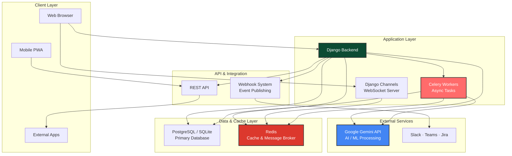

# PrizmAI — AI-Powered Project Management Platform

[](https://github.com/paulavishek/PrizmAI/actions/workflows/ci.yml)
[](https://www.python.org/downloads/)
[](https://www.djangoproject.com/)
[](https://opensource.org/licenses/MIT)

> Visual project management, rooted in strategy, accelerated by AI.

PrizmAI is a full-stack project management platform built with Django, Google Gemini, WebSockets, and a REST API. It goes beyond task tracking — connecting individual work items to an organization's strategic goals through a structured hierarchy, while AI surfaces risks, explains its reasoning, and helps teams stay ahead of problems before they escalate.

**Open-source portfolio project** demonstrating full-stack development, AI integration, enterprise security, and modern software architecture.

---

## Features

### Project Management Core

- **Visual Kanban Boards** — Drag-and-drop task management with AI-suggested column structures
- **Gantt Charts** — Interactive timelines with milestone tracking and task dependency visualization *(Professional mode and above)*
- **Burndown Charts & Sprint Forecasting** — Real-time sprint progress with AI-powered completion predictions and confidence intervals *(Professional mode and above)*
- **Goal-Aware Analytics & Dynamic Charts** — The column-distribution chart is always available. In Professional mode and above, Spectra classifies each board's project type (Product / Tech, Marketing / Campaign, Operations) and promotes the metrics and charts most relevant to that type — cycle time, deployment rate, campaign ROI, SLA adherence, and more. Boards without a classification fall back to the standard four charts (column distribution, priority, user workload, Lean Six Sigma); Lean users see the priority, user workload, and Lean Six Sigma cards as blurred preview tiles with an upgrade prompt, ensuring the analytics page always feels informative rather than empty. A subtle sparkle hint on the Analytics tile signals when a board has not yet been classified.
- **Time Tracking & Timesheets** — Log hours, track team utilization, and manage labor costs
- **Budget & ROI Tracking** — Multi-currency support, cost forecasting, and ROI analytics
- **Task Dependencies** — Parent-child, related, and blocking dependency types with AI analysis
- **Board Automations** — Trigger-based rules for repetitive workflows *(Professional mode and above)*; scheduled recurring automations *(Enterprise mode)*
- **Unified Cross-Board Calendar** — Consolidated view of tasks, milestones, and events across all boards
- **Requirements Analysis** — AI-powered requirement lifecycle management with full traceability. Define, categorize, and track requirements from draft through verified status with auto-generated identifiers (REQ-001). Link requirements to project objectives and board tasks for complete traceability. Features include a traceability matrix (objectives × requirements × tasks), CSV export, hierarchical parent-child requirements, coverage statistics, and comment threads with status change history. AI capabilities include: **Quality Scoring** (per-requirement analysis across clarity, completeness, testability, unambiguity, and feasibility dimensions), **Gap Detection** (identify uncovered objectives, orphaned tasks, and missing requirement areas), **Acceptance Criteria Generation** (auto-generate Given/When/Then criteria from requirement descriptions), and **Impact Analysis** (downstream impact assessment for linked tasks, child requirements, and objectives). Spectra AI can answer questions about requirement status, coverage gaps, quality scores, and traceability. Accessible from the AI Tools panel → Manage section on the board page. *(Professional mode and above)*

### Strategic Alignment

- **Organizational Goal Hierarchy** — Connect work to strategy through a Goal → Mission → Strategy → Board → Task hierarchy *(Professional mode and above; navigation links hidden in Lean mode)*
- **Triple Constraint Dashboard** — Visualize and analyze the Scope, Cost, and Time interplay for a project with AI-powered recommendations
- **Mission & Strategy Management** — Define organizational missions and link strategies to projects and boards

### AI Intelligence (Google Gemini)

- **Spectra — AI Project Assistant** — Natural language queries with RAG technology and web search, scoped to your project data. Spectra operates in **read-only Q&A mode (v1.0)** — ask questions about tasks, deadlines, risks, team workload, strategic goals, wiki content, and more. Spectra enforces full RBAC, meaning it only surfaces data from boards you have explicit access to, and respects sandbox isolation in the Demo Workspace.
  - **Board Analysis** — "What tasks are overdue?" · "Summarize this board" · "Who's overloaded?"
  - **Strategic Hierarchy** — "How are our goals tracking?" · "Show the mission hierarchy" · "What's our OKR progress?"
  - **Risk & Dependency Insight** — "What are the current blockers?" · "Which dependencies are at risk?"
  - **Cross-Board Reporting** — "Compare workload across all my boards" · "What needs attention?"
  - **Document Analysis** — Attach PDF, DOCX, or TXT files and ask questions about their content
  - **Web Search** — Supplemental web context for research and strategic queries (when enabled)
  
  Spectra uses a **Tiered AI Architecture**: a lightweight Flash-Lite model handles most queries cheaply, upgrading to Flash for complex analysis — keeping AI costs low while delivering rich project insights. Action capabilities (creating tasks, sending messages, logging time, scheduling events, and more) are code-complete and will ship in **Spectra v2.0**.
- **AI Coach** — Proactive, personalized coaching with recommendations that learn from your feedback
- **Explainable AI** — Every recommendation includes a transparent breakdown: confidence level, contributing factors, assumptions, limitations, and alternative perspectives
- **Scope Creep Detection** — Automatic baseline tracking with alerts when scope expands beyond the original plan
- **Conflict Detection** — Automated detection and resolution suggestions for resource, schedule, and dependency conflicts
- **AI Onboarding** — Enter your organization's goal and let AI generate a complete workspace — missions, strategies, boards, and starter tasks — tailored to your objectives
- **PrizmBrief** — Generate structured, audience-aware presentation content directly from live board data, for clients, executives, or internal teams
- **AI Retrospectives** — Auto-generated lessons learned with improvement tracking
- **Skill Gap Analysis** — Team capability mapping against task requirements, with individual development plans
- **Resource Leveling & Workload Optimization** — Intelligent workload balancing and assignment suggestions
- **Requirements AI Analysis** — Gemini-powered requirement quality scoring (clarity, completeness, testability, unambiguity, feasibility), gap detection across objectives and tasks, automatic acceptance criteria generation in Given/When/Then format, and downstream impact analysis. Results are surfaced both in the Requirements UI and through Spectra chat queries.
- **AI Bubble-up Summaries** — On-demand AI summaries generated and propagated at every level of the hierarchy (task, board, strategy, mission)
- **Deadline Prediction & Risk Assessment** — AI-powered deadline estimates and risk scoring with mitigation suggestions
- **Semantic Task Search** — Find tasks by meaning and intent, not just keywords
- **Knowledge Graph Project Memory** — Automatically captures decisions, risk events, lessons learned, conflicts, scope changes, and milestones as an interconnected knowledge graph. AI discovers causal links between events and surfaces relevant past patterns when similar situations arise, preserving organizational memory across projects.
- **Cognitive Load Guardian** — Monitors per-member task complexity, assignment density, and context-switching frequency. Alerts managers when team members are at cognitive overload risk and recommends re-sequencing or redistribution to protect focus and prevent burnout.
- **Pre-Mortem AI** — Before scope locks in, AI simulates five distinct ways a project could fail. Each scenario includes a risk level, root-cause analysis, and mitigation strategy, with team acknowledgment tracking so no critical risk goes unaddressed.
- **Project Stress Test** — A "Red Team" AI that tries to break your project plan before real life does. It simulates five targeted attacks (e.g., a key person leaving, a critical dependency breaking, a sudden budget spike) and scores your plan's resilience from 0 to 100 across five dimensions: Schedule, Budget, Team, Dependencies, and Scope Stability. For each attack, it prescribes a structural "Vaccine" fix — a concrete change you can apply to strengthen your plan. Run multiple sessions to track your immunity score over time and watch it improve as you apply vaccines. Linked to Pre-Mortem so risk scenarios flow naturally into stress testing.
- **Scope Creep Autopsy** — Forensic post-mortem analysis that traces every scope expansion to its exact cause, contributor, date, and cost or delay impact. Generates exportable PDF reports that turn scope history into actionable lessons for future projects.
- **What-If Scenario Analyzer** — A decision-support engine that lets PMs simulate the cascading impact of three key variables before committing: scope changes (±20 tasks), team size adjustments (±5 members, modeled with Brooks's Law), and deadline shifts (±8 weeks). Each simulation computes a live baseline from velocity history, budget, and burndown data, then produces a projected state with a feasibility score (0–100), detected conflicts (resource overload, deadline infeasibility, budget overrun), a before/after comparison table, and a Gemini-powered strategic recommendation. Scenarios can be saved, starred, and reloaded for ongoing comparison.
- **Shadow Board — Parallel Universe Simulator** — Takes What-If further: instead of running one scenario and discarding it, Shadow Board lets you promote saved scenarios into living, parallel *branches* of your project. Each branch keeps updating automatically as real work progresses, so you can compare "hire 3 contractors" vs "cut 5 tasks" side-by-side with live feasibility scores, AI recommendations, and projected completion dates — all powered by Gemini. When you're ready to decide, commit one branch to reality and archive the rest with a full audit trail. See the [Shadow Board guide](#shadow-board--parallel-universe-simulator-1) below.
- **Living Commitment Protocols (Anti-Roadmap)** — Replace rigid, pretend-certain project plans with living commitments that honestly track how confident your team actually is. Each protocol has a real-time confidence score that decays automatically over time, a prediction market where team members bet tokens on outcomes, an AI coach that triggers renegotiation when confidence drops too low, and a full signal log showing every event that moved the needle. See the [Living Commitment Protocols guide](#living-commitment-protocols--anti-roadmap) below.
- **Exit Protocol — Project Wind-Down System** — A structured, compassionate system for ending projects deliberately instead of letting them die quietly. When a project is struggling, PrizmAI watches for warning signs and guides the team through a dignified wind-down: extracting all reusable knowledge, generating transition memos for every team member, archiving the project with a full AI-written autopsy report, and preserving the lessons in a searchable Project Cemetery. Reusable components (templates, workflows, automation rules) can be transplanted into future projects. Buried projects can even be "resurrected" as a fresh board pre-loaded with all the lessons from the original. See the [Exit Protocol guide](#exit-protocol--project-wind-down-system-1) below.

### Enterprise & Collaboration

- **Role-Based Access Control (RBAC)** — Four roles — Org Admin, Owner, Member, and Viewer — control exactly what each person can see and do. Access flows downward automatically through the Goal → Mission → Strategy → Board hierarchy. Board members can view parent Strategy, Mission, and Goal names in read-only mode (upward visibility), but cannot edit parent levels without a separate explicit invitation. Budget data and strategic goals are restricted to Owners and Org Admins. A user becomes an Org Admin by creating an organisation during onboarding or by being promoted via the Member management page. Django superusers bypass board-level access checks but do not automatically hold the Org Admin role.
- **Workspace Preset System** — Three progressive complexity tiers — **Lean**, **Professional**, and **Enterprise** — let Org Admins tune the interface to match their team's size and needs. Lean surfaces a clean Kanban board, calendar, Spectra chat, and one analytics chart. Professional unlocks Gantt Charts, Burndown, Goals & Missions navigation, AI Retrospectives, Skill Gap Analysis, full Analytics, and trigger-based Automations. Enterprise adds Shadow Board, What-If Simulator, Pre-Mortem, Stress Test, Commitment Protocols, Scope Autopsy, Resource Optimization, Scheduled Automations, Exit Protocol, and Budget / ROI tools. Board Owners can further restrict individual boards to a lower tier, but can never exceed the org-wide ceiling. The global preset is configured in **Workspace Settings** (sidebar → profile menu → Workspace Settings, Org Admins only). New organisations default to Lean; existing organisations migrated to Enterprise.
- **Decision Center** — A unified morning review dashboard that batches conflicts, risks, overdue tasks, over-allocations, scope alerts, budget warnings, and AI recommendations into a prioritized daily queue with AI-generated briefings
- **Favorites Sidebar** — Star and reorder boards, goals, tasks, wiki pages, and other items for quick access from the sidebar
- **Stakeholder Management** — Track influence, interest levels, and engagement across projects
- **Real-Time Messaging** — WebSocket-powered team chat with @mentions, notifications, and **AI Message Composer** — type a rough draft and let AI rewrite it as a polished, professional team update in one click
- **Board Member Invitations** — Invite collaborators via email with tokenized invitation links
- **Task Search** — Press `/` to instantly search tasks by keyword across all boards, or switch to AI semantic search for meaning-based results with relevance scoring
- **Knowledge Base & Wiki** — Markdown documentation with AI-assisted meeting analysis
- **Meeting Transcript Import** — Import from Fireflies, Otter, Zoom, Teams, and Meet with AI extraction
- **File Attachments with AI Analysis** — Attach files to tasks and let AI extract structured tasks from documents
- **Per-User Timezone Support** — Users worldwide can set their preferred timezone from the topbar; all dates, times, calendars, and AI responses automatically display in the selected timezone
- **Unified Display Mode** — A single Display Mode selector in the topbar (and in Profile Settings) gives every user four choices: **Light** (default), **Dark** (Bootstrap 5 native dark theme with full component coverage), **Browser** (follows the OS `prefers-color-scheme` setting and responds to live OS changes), and **Accessibility** (color-blind friendly palette using the Okabe-Ito blue/orange scheme with pattern indicators on priority badges and charts). The preference is persisted to the database and applied before the first CSS paint on every page load, preventing any flash of the wrong theme.

### Security & Compliance

- **OAuth 2.0** — Google login via django-allauth
- **Brute-Force Protection** — Account lockout on repeated failed authentication attempts (django-axes)
- **XSS & CSRF Protection** — HTML sanitization (bleach) and token validation
- **SQL Injection Prevention** — Django ORM with parameterized queries throughout
- **Content Security Policy** — CSP headers enforced via django-csp
- **Audit Logging** — Complete audit trail of sensitive operations with IP tracking
- **Secure File Uploads** — MIME type validation and malicious content detection
- **AI Usage Monitoring** — Track and manage AI feature consumption with configurable quota limits

### Integrations & Platform

- **RESTful API** — Token-authenticated REST API for third-party integrations and mobile clients
- **Webhook Integration** — Event-driven automation with external applications
- **Mobile PWA** — Progressive Web App with offline support and home-screen installation
- **Board Import / Export** — Import boards from Jira (CSV/JSON export) and Monday.com (Excel export), or use PrizmAI's own JSON format for full round-trip import/export. Imported boards are automatically assigned to the importer's workspace; an organisation and Org Admin role are created automatically if the user does not yet have one.
- **Lean Six Sigma Classifications** — Built-in LSS task labels (Value-Added, NVA, Waste)

**→ [Detailed feature documentation](FEATURES.md)**

---

## Project Stress Test — Red Team AI

> **In plain English:** Most project planning is optimistic. The Stress Test is the opposite — an AI that deliberately tries to *break* your project plan before real life does. It invents the five most damaging things that could go wrong, scores how resilient your plan is, and then tells you exactly how to fix the weak spots. Think of it as a fire drill for your project.

### Why it exists

Plans feel solid until the moment they aren't. A key team member leaves. A vendor doubles their price. A stakeholder demands a complete redesign at 70% completion. These things happen — and most project plans have no structural answer for them.

The Stress Test forces you to confront those failures *before* they happen, when you still have time to build in safeguards.

### How it works

Navigate to any board and click **Stress Test** → **Run Stress Test**. The Red Team AI reads your live project data — every task, assignee, dependency, budget figure, deadline, and conflict — and then does three things:

1. **Simulates five targeted attacks** — It picks the five attack types most likely to damage *your specific plan* (not generic risks, but ones that exploit your actual data). Examples: removing the team member with the most tasks, discovering a critical skill gap mid-project, or a sudden 40% price increase from a key vendor.

2. **Scores your resilience (Immunity Score)** — A score from 0–100 across five dimensions: Schedule, Budget, Team, Dependencies, and Scope Stability. Think of it like a credit score for your project's robustness.

3. **Prescribes structural vaccines** — For each attack, the AI recommends one concrete structural fix — not "communicate better" but real changes like cross-training a backup for your critical task owner, adding a budget contingency line, or decoupling a high-risk dependency.

### The two actions — and why they're different

This is the most important thing to understand. The Stress Test page shows two columns: **Attack Scenarios** on the left and **Vaccines** on the right. They look similar but mean very different things.

#### 🎯 Attack Scenarios — "Mark Addressed"

An attack scenario is something the AI *invented* as a hypothetical future threat. "Sam Rivera Vanishes" didn't happen — the AI simulated it because Sam has 11 tasks and no backup.

**"Mark Addressed"** means: *"I, the project manager, have read this scenario, I understand the risk it describes, and I am actively watching for the early warning signs."*

This is a **managerial acknowledgment**. You're not saying you've fixed anything — you're saying it's on your radar. Think of it like circling a risk in red on a whiteboard and writing your initials next to it.

The AI gives credit (3–8 points) for addressed scenarios because a team that's aware of a risk is less likely to be blindsided by it.

#### 💉 Vaccines — "Mark as Applied"

A vaccine is a **structural change** the AI prescribes to close the specific gap that made the attack possible. "Implement Critical Role Redundancy" means: actually cross-train a second person on Sam's top tasks, document that knowledge, and schedule regular knowledge-transfer sessions.

**"Mark as Applied"** means: *"We have actually made this structural change."* The budget contingency exists. The cross-training happened. The dependency was decoupled.

The AI gives substantial credit (8–20 points each) for applied vaccines — and importantly, it **stops attacking that same weakness** in the next run and finds new vulnerabilities instead.

#### The key difference at a glance

| | Mark Addressed | Apply Vaccine |
|---|---|---|
| **What it means** | "I'm aware of this risk" | "I've structurally fixed this weakness" |
| **Score impact** | +3–8 pts | +8–20 pts each |
| **Effort required** | None — just a click | Real project work |
| **Effect on next run** | AI still probes same area | AI finds NEW weaknesses instead |
| **Analogy** | Knowing a road is icy | Gritting the road |

#### What happens if you only apply vaccines (without marking scenarios addressed)?

You get the full vaccine score credit and the AI will stop attacking those weaknesses. You miss the small awareness credit (3–8 pts per scenario). **This is still the more impactful action** — vaccines are what actually move the needle.

#### What happens if you only mark scenarios addressed (without applying vaccines)?

You get a small awareness credit (3–8 pts per scenario). But the underlying structural weaknesses remain. The AI will keep finding new angles to exploit them in future runs. Score improves only slightly. **Awareness without structural change doesn't build real resilience.**

#### Should you do both?

Yes — but start with vaccines. The recommended workflow is:

1. **Run the Stress Test** — read all five attacks and their cascade effects carefully
2. **Apply vaccines** where it's feasible to make the structural change
3. **Mark scenarios addressed** for every risk you understand and are monitoring, even if you can't fully fix it yet
4. **Re-run the test** — the AI will see both your vaccines and acknowledged risks, score you accordingly, and attack new weak spots
5. **Repeat** until you hit your target resilience band

**Best practice:** When you apply a vaccine, also mark its corresponding scenario as addressed — it signals that both the structural fix is in place *and* the team is monitoring for that specific risk pattern.

### The Immunity Score bands

| Score | Band | What it means |
|---|---|---|
| 90–100 | **ANTIFRAGILE** | Built-in redundancy; the plan gets stronger under pressure |
| 70–89 | **RESILIENT** | Survives most real-world disruptions |
| 40–69 | **MODERATE** | Handles minor shocks; fails major ones |
| 0–39 | **FRAGILE** | Collapses under first real disruption |

### Progressive scoring across runs

The Immunity Score is **cumulative** — it builds across sessions. Each time you re-run the test:
- All previously applied vaccines are remembered and credited
- All addressed scenarios are remembered
- The AI is explicitly told not to repeat attack types already covered by vaccines
- The minimum score the AI can return is anchored to your last session score, preventing the score from dropping just because the AI got creative with new scenarios

This means every vaccine you apply and every scenario you address is permanently banked — your score can only trend upward as you strengthen the plan.

### Session History and Reset

The **Session History** table at the bottom of the Stress Test page shows every run — date, who ran it, score, band, and vaccines applied. This history feeds into progressive scoring.

If you want to start fresh (e.g., after a major project restructure, or during testing), the board creator can use the **Reset History** button to clear all sessions and start with a clean slate.

### Getting to the Stress Test

- From any board, click **Stress Test** in the board navigation *(Enterprise mode only)*
- Or navigate directly to `/board/<board-id>/stress-test/`
- The page links back to the **Pre-Mortem** feature — run Pre-Mortem first to identify failure scenarios before stress-testing your defences against them

---

## Exit Protocol — Project Wind-Down System

> **In plain English:** Every project eventually ends — but most just *fade out*. Work stops, the team scatters, and nobody writes down what went wrong or what was worth keeping. Exit Protocol is PrizmAI's answer to that: a guided process that helps you close a project properly, preserve everything valuable, and carry the lessons forward.

### Why it exists

Most project management tools are built for starting and running projects. Almost none handle *ending* them well. When a project fails or gets cancelled, teams usually just stop showing up. Critical decisions, hard-won lessons, reusable templates, and important contacts all disappear into the void.

Exit Protocol treats project endings as something worth doing right.

### The three parts of Exit Protocol

#### 🏥 Project Hospice — The Wind-Down Process

PrizmAI quietly monitors every project's health every night, looking at four things: how fast the team is getting work done, whether the budget is being spent responsibly, how many deadlines have been missed recently, and whether the team is still actively working at all.

When the health score crosses **75%** on the risk scale, PrizmAI shows a gentle warning on the project page: *"This project may be struggling — consider a structured review."*

A manager can then click **Initiate Wind-Down Review**, and PrizmAI takes it from there:
- **AI Assessment** — Gemini reads the entire project history and writes a plain-English summary of what's been happening and why the project is in trouble
- **Knowledge Extraction Checklist** — PrizmAI pulls every important decision, lesson, risk event, and milestone from the project's memory and presents them as a checklist to review and sign off
- **Transition Memos** — One personalised AI-written memo per team member, summarising their contributions, open tasks, and what they need to hand over
- **Organ Scanning** — PrizmAI automatically identifies which parts of this project could be useful in a future one — automation rules, task templates, workflow structures, goal frameworks — and packages them up for reuse

When the team is ready, a manager types a confirmation phrase and clicks **Archive This Project**. PrizmAI then writes the full autopsy report and closes the project permanently.

#### 🫀 Organ Transplant — Keeping What's Valuable

Not everything about a struggling project is bad. Maybe the team built a brilliant automation rule, or designed a task breakdown structure that could save weeks on the next project.

The **Organ Bank** lets you see everything reusable that was extracted from a project — templates, workflows, automation rules, role definitions, knowledge entries.

The **Organ Library** is a searchable catalogue of reusable components from *all* past projects across your organisation. When you're setting up a new project, you can browse it, see how compatible each component is with your new board (scored by AI), and transplant it in with one click.

Think of it like a parts library — built automatically every time a project closes.

#### ⚰️ Project Cemetery — The Permanent Archive

Every project that goes through Exit Protocol gets a permanent entry in the **Project Cemetery** — a searchable archive accessible from the sidebar.

Each entry is a full autopsy report:
- **Vital Statistics** — Team size, tasks completed vs planned, budget used
- **Cause of Death** — AI classifies the project's closure into one of eight named categories: *Scope Cancer, Velocity Collapse, Budget Bleed, Zombie Death, Resource Exodus, Market Shift, Strategic Pivot*, or *Natural Completion* — and explains its reasoning
- **Timeline of Decline** — A chart showing how the health score declined over the project's lifetime
- **Lessons Learned** — Organised into three buckets: things to repeat on future projects, things to avoid, and open questions that were never resolved
- **Organ Transplant Record** — Which reusable components were extracted from this project and where they went

You can search the Cemetery by project name, filter by cause of death or date range, and export any autopsy as a **PDF report**.

#### 🌱 Resurrection — Starting Again Smarter

Sometimes a project dies before its time — the timing was wrong, the team changed, or the budget ran out — but the underlying idea was still good.

The Cemetery's **Resurrect as New Board** button creates a brand-new project pre-loaded with:
- All the decisions and lessons from the original, already in the Knowledge Graph
- A Pre-Mortem analysis with every risk that contributed to the original project's failure, tagged with a warning: *"⚠️ This risk destroyed the original project this board was resurrected from."*

The Cemetery entry remains permanently — resurrection is a new start, not an undo.

### The health score explained

PrizmAI calculates a **Hospice Risk Score** from 0–100% every night for every project. Higher means more at risk. The dashboard shows a live breakdown so managers know exactly which dimension is driving the number:

| Dimension | What it measures | Weight |
|---|---|---|
| **Velocity** | Has the team's work rate been falling? | 30% |
| **Budget** | Is money being spent faster than work is being completed? | 25% |
| **Deadlines** | How many tasks were due in the last 30 days and missed? | 25% |
| **Activity** | How long since anyone last touched this project? | 20% |

Scores below 40% are green (healthy). 40–74% are amber (worth watching). 75%+ are red (concern detected). A **Recalculate Now** button lets managers refresh the score on demand — useful when something significant just happened mid-day.

### Getting to Exit Protocol

- From any board, open the **AI Tools** panel and click **Exit Protocol**
- Or navigate directly to `/boards/<board-id>/exit-protocol/`
- The **Project Cemetery** is accessible from the sidebar under **More → Project Cemetery**
- The **Organ Library** is at `/exit-protocol/organ-library/`

---

## Shadow Board — Parallel Universe Simulator

> **In plain English:** Imagine you're managing a project and you're stuck between two options — "hire 3 contractors to speed things up" or "cut 5 tasks to hit the deadline." Instead of guessing, Shadow Board lets you run both options *at the same time*, watch how each one plays out as your real project moves forward, and only commit to a decision when the numbers make it obvious.

### How it works

Shadow Board builds directly on the **What-If Scenario Analyzer**. The journey from idea to decision looks like this:

```
Real Board  →  What-If Scenario  →  Shadow Branch  →  Commit to Reality
  (live)        ("what if I…?")     (living sim)       (decision made)
```

1. **Run a What-If scenario** — Use the three sliders (tasks, team size, deadline) and click *Analyze Impact*. PrizmAI shows you a feasibility score and Gemini's recommendation.
2. **Save & promote to a branch** — If the scenario looks interesting, save it and click *Promote to Shadow Branch*. This creates a live clone of your project under that scenario.
3. **Run multiple branches in parallel** — Repeat for each option. You might have *Branch A: Hire 3 contractors* and *Branch B: Cut 5 tasks* running side by side.
4. **Watch them update automatically** — Every time something changes on your real board — a task is completed, someone joins the team, the deadline shifts — all active branches recalculate instantly. You always see current scores, not stale what-ifs.
5. **Commit when ready** — When one branch clearly wins, click *Commit This Branch*. It's merged into reality, the others are archived with a full history, and the audit log records your decision.

### A concrete example

You're running a product launch with 30 tasks remaining and 6 weeks until the deadline. Your team is behind schedule and you have two options:

| Option | What you set | What PrizmAI shows |
|---|---|---|
| Branch A: Hire 3 contractors | Team size +3 | Feasibility 90% · Projected completion: May 12 |
| Branch B: Cut 5 tasks | Tasks −5 | Feasibility 60% · Projected completion: May 28 |

Two weeks later, your team completes 8 tasks ahead of schedule. Both branches recalculate automatically:

| Option | Updated score | AI Recommendation snippet |
|---|---|---|
| Branch A | 94% | *"Strong trajectory. Contractor ramp-up risk has resolved — recommend committing."* |
| Branch B | 72% | *"Feasibility improved but deadline is still tight. Consider restoring 2 of the cut tasks."* |

You commit Branch A. The other branch is archived. Done.

### Getting to Shadow Board

- From any board, open the **AI Tools** panel on the right side and click **Shadow Board** *(Enterprise mode only)*
- Or navigate directly to `/boards/<board-id>/shadow/` — you will be redirected to the Kanban view if your workspace is not on Enterprise mode
- To promote a saved scenario, open the **What-If Analyzer** → click **Saved Scenarios** → click **Promote to Shadow Branch** next to any scenario.

### The Quantum Standup

At the top of the Shadow Board page is a collapsible **Quantum Standup** panel. It shows:
- Tasks your real team completed today
- How today's progress changed each branch's feasibility score (with ▲/▼ delta indicators)

It's a one-glance answer to: *"Did today's work make our decision easier or harder?"*

---

## Living Commitment Protocols — Anti-Roadmap

> **In plain English:** A traditional project plan says "we will ship by June 15th" and never updates that statement even when reality changes. Living Commitment Protocols replace that false certainty with an honest answer: *"Right now, we're 72% confident we'll hit this target — and here's exactly why that number moved since last week."*

### Why it exists

Roadmaps lie — not because teams are dishonest, but because plans made months in advance can't account for blockers, team changes, shifting requirements, and the dozen small surprises that hit every project. The result: PMs report green status until the very last week, then the deadline slips.

Living Commitment Protocols treat **confidence as a first-class measurement**. Instead of pretending certainty, your team publicly tracks how likely each commitment actually is — and the system automatically warns you when confidence is eroding before it's too late to act.

### The four parts of a Commitment Protocol

#### 📉 Confidence Decay

Every commitment starts with an initial confidence score (e.g., 80%). That score **automatically decreases over time** based on a decay model you choose when creating the protocol:

- **Exponential** — Confidence drops quickly at first, then levels off. Good for near-term commitments where uncertainty is front-loaded.
- **Linear** — Confidence drops at a steady, predictable rate. Good for long, stable projects.
- **Stepped** — Confidence holds steady, then drops sharply when milestones are missed. Good for phase-gated projects.

You set a **half-life** (e.g., 14 days) which controls how fast the decay happens. After 14 days with no positive news, the confidence score halves. The **Confidence Curve** chart shows both what actually happened historically and where the score is heading if nothing changes.

#### 🎯 Prediction Market

Team members can each place a **bet** on what they think the final outcome will be. They wager **tokens** (100 per person, reset weekly) on their prediction.

Why bets? When people put even a small stake behind their opinion, they share honest assessments instead of socially safe ones. The **Market Consensus** — a weighted average of all bets — is often more accurate than the official score because it surfaces what the team *actually* believes privately.

When at least 3 bets are placed, the market opens and shows:
- **Weighted consensus** — Each person's bet is weighted by their past accuracy (credibility score)
- **Divergence** — How far the team's honest view is from the official confidence score. A big divergence is an early warning sign.
- **Total tokens wagered** — How much conviction is behind the market

After the deadline, bets are resolved and accurate predictors earn better credibility scores, making their future bets count more.

#### 📡 Signal Log

Anything that happens on the project can **push the confidence score up or down** in real time. Signals come from two sources:

- **Automatic** — When tasks linked to a protocol are completed, added, or deleted, PrizmAI automatically logs a signal and adjusts the score
- **Manual** — Team members can log their own signals from the detail page: milestone hit, blocker emerged, stakeholder approval, team change, etc. Each signal requires a short description of what happened

The Signal Log tab shows every event in order — what type it was, how much it moved the score, and who recorded it.

#### 🤝 AI Renegotiation Bot

When confidence drops below a **negotiation threshold** you set (e.g., 30%), PrizmAI's AI coach automatically steps in and opens a **Negotiation Session**. The bot:
1. Reads the full history of the commitment — all signals, bets, and the original plan
2. Drafts a plain-English message explaining what's going wrong and why
3. Proposes **three concrete options** to restore confidence, each with an impact assessment

The team reviews the options and picks one (or writes a custom resolution). The protocol then moves to *Renegotiated* status and the new terms are recorded permanently.

### Creating a Commitment Protocol

From any board, open the **AI Tools** panel and expand the **Manage** section, then click **Commitments**. On the Commitments dashboard, click **New Protocol**. Fill in:

| Field | What to enter |
|---|---|
| **Title** | A short, clear name — e.g., "Ship Mobile App v2" |
| **Description** | What exactly you're committing to |
| **Target date** | The deadline |
| **Initial confidence** | Your honest starting confidence (0–100%) |
| **Decay model** | Exponential, linear, or stepped |
| **Half-life (days)** | How many days before confidence halves without new signals |
| **Negotiation threshold** | The confidence % that triggers the AI renegotiation bot |
| **Linked tasks** | Optional — tasks from this board that affect this commitment |

### The portfolio view

The **Commitments dashboard** shows all protocols for a board at a glance — portfolio-level confidence, individual protocol cards with live confidence bars, and counts of at-risk and critical protocols at the top.

### Status meanings

| Status | What it means |
|---|---|
| **Active** | On track, confidence above the warning threshold |
| **At Risk** | Confidence is declining — worth watching |
| **Critical** | Confidence has fallen to a dangerous level |
| **Renegotiated** | The team has agreed new terms after a negotiation session |
| **Met** | Deadline passed and the commitment was fulfilled |
| **Missed** | Deadline passed and the commitment was not fulfilled |

### Getting to Commitment Protocols

- From any board, open the **AI Tools** panel → **Manage** section and click **Commitments** *(visible in Enterprise mode only — ask your Org Admin to upgrade the workspace preset if the tile is not shown)*
- Or navigate directly to `/boards/<board-id>/commitments/` — if your workspace is not on Enterprise mode, you will be redirected to the Kanban view
- A summary widget also appears on the **Triple Constraint Dashboard**
- You can ask **Spectra** directly: *"What is the status of commitment #1?"*, *"Show me all at-risk commitments"*, or *"Place a bet of 5 tokens at 65% confidence on commitment #1"*

---

## Role-Based Access Control (RBAC)

> **In plain English:** Not everyone on a project should be able to do everything. A new contractor shouldn't be able to delete the entire board, and a client observer shouldn't be able to edit the budget. RBAC gives each person exactly the level of access they need — no more, no less.

### The four roles

Every board in PrizmAI has four possible roles. Think of it like a set of keys to a building:

| Role | What they can do | The analogy |
|---|---|---|
| **Org Admin** | Everything system-wide — create Goals, manage all users, override any permission. Multiple users in an organisation can hold this role | Building owner with every key |
| **Owner** | Full control of records they own — edit, delete, invite others. Access flows down automatically to all children in the hierarchy | Landlord with a master key |
| **Member** | Day-to-day work — create and edit tasks, post updates, log time, comment, and upload files. Cannot delete boards or touch parent levels unless separately invited | Tenant with a room key |
| **Viewer** | Read-only — see everything they are invited to but cannot create, edit, or delete anything | Guest with a visitor pass |

### How access works

- **Board access is invitation-based.** You only see boards you have been explicitly added to by an Owner or Org Admin. There is no "everyone can see everything" mode.
- **Roles apply per board.** You might be an Owner on one board and a Member on another, even within the same organisation. The only system-wide elevated role is Org Admin.
- **Access flows down automatically.** Owning a Strategy gives automatic Owner access to all Boards beneath it. Owning a Mission gives access to all Strategies and Boards below.
- **Upward visibility is read-only.** Board members can view the names and summary details of the parent Strategy, Mission, and Goal above their board. They cannot edit, delete, or create records at those levels without a separate invitation.
- **Strategic goals have their own protection.** Only Org Admins can create new Goals. Missions can be created by Org Admins or by the owner/creator of the parent Goal. Strategies can be created by Org Admins or by owners at the Mission level or above.
- **Org Admin is assigned automatically on org creation.** When a user completes onboarding (AI-assisted or manual) or imports a board without an existing organisation, PrizmAI creates an organisation for them and grants Org Admin access. Workspace creators can also promote existing Members to Org Admin via the Member management page.
- **Board settings and webhooks are restricted.** The board settings menu (Edit Board, Manage Members, Add Column, Manage Labels, Stakeholders, Webhooks) and all webhook management endpoints are only accessible to users with Owner or Org Admin access to that board. Members and Viewers cannot access these controls.
- **Workspace Settings are restricted to Org Admins.** The Workspace Settings page (sidebar → profile menu → Workspace Settings) — where the global feature-tier preset is configured — is only accessible to users with the Org Admin role.
- **Budget and AI analysis are restricted.** The Budget Dashboard, ROI tracking, and AI budget recommendations are visible only to Owners and Org Admins, keeping financial data private from the wider team.
- **Workspace data isolation is enforced.** Board dropdowns and linking actions (such as linking a board to a Strategy) are always scoped to boards the user can access — cross-workspace or cross-organisation board access is blocked at the server level.

### Inviting people to a board

From any board, click **Members** in the board navigation → **Invite Member**, choose a role, and send the invitation. The invited person receives a link to join. Owners and Org Admins can also remove members or change their role at any time. The Member management page is itself permission-protected — only users who have access to the board can reach it.

---

## Demo Experience — Personal Sandbox

PrizmAI's demo gives every visitor a private, fully editable sandbox the moment they enter demo mode. There is no read-only phase — you have full write access from the start.

### How it works

1. **Enter demo mode** — Click **Try Demo** (or the workspace switcher in the sidebar). PrizmAI deep-copies all demo template boards into a private set of boards owned by you alone. The copy includes columns, tasks, labels, comments, dependencies, budget data, analytics snapshots, and more. Provisioning runs asynchronously via Celery (with a synchronous fallback when Redis is unavailable).
2. **Experiment freely** — Your sandbox has full write access. Create tasks, delete columns, drag and drop, trigger automations — anything you like. Changes here have no effect on the shared demo templates or any other user's sandbox.
3. **Switch workspaces freely** — Use the workspace switcher in the sidebar to toggle between your **Demo Workspace** and **My Workspace** at any time. Your sandbox is preserved between switches — nothing is deleted when you leave demo mode.
4. **Sandbox persists** — Your sandbox has no expiry. It stays around as long as your account exists, so you can return to your demo data whenever you like.
5. **Reset** — Click **Reset my demo** to wipe your sandbox and re-provision a fresh copy from the templates at any time.

### Data isolation guarantees

Every user's sandbox is completely walled off:

- **No cross-user leakage** — User A cannot see User B's sandbox boards, tasks, or data. Board memberships from the template are never carried over to sandboxes; only three synthetic demo personas (team members with `@demo.prizmai.local` emails) are added so that assigned-to fields, chat rooms, and team analytics work realistically.
- **No demo-to-real leakage** — When you leave demo mode and return to your real workspace, no sandbox or template data appears in your dashboard, board list, API, messaging, analytics, AI assistant, wiki, or any other view.
- **No real-to-demo leakage** — When you are in demo mode, your real workspace boards, missions, goals, and messages are invisible.
- **Template immutability** — The master demo template boards are never modified by user actions. Each sandbox is an independent deep copy.

All data-fetching views use centralized query helpers (`get_user_boards()`, `get_user_missions()`, `get_user_goals()`) as a single source of truth for demo-vs-real separation, and a self-healing middleware automatically repairs any state inconsistencies.

### The sandbox banner

While you are in the demo workspace, a dismissible banner appears at the top of every page confirming that you have full edit access and that your changes are private to your sandbox.

### What is copied into the sandbox

| Data | Copied? |
|---|---|
| Boards, columns, labels | Yes — full deep copy |
| Tasks (titles, descriptions, priorities, dates, risk levels) | Yes |
| Task comments | Yes (attributed to you) |
| Checklist items | Yes |
| Task dependencies, related-task links, parent-child relationships | Yes |
| Demo team members (3 synthetic personas) | Yes — added as Members for realistic team data |
| Budget, task costs, time entries, ROI snapshots | Yes |
| Burndown predictions, velocity snapshots, sprint milestones | Yes |
| Scope tracking snapshots and scope creep alerts | Yes |
| Skill profiles, skill gaps, and development plans | Yes |
| Retrospectives, lessons learned, and action items | Yes |
| Conflict detections and resolution patterns | Yes |
| Stakeholders and engagement metrics | Yes |
| Chat rooms and messages | Yes |
| Commitment protocols (signals, bets, credibility scores) | Yes |
| Decision Center items | Yes |
| Wiki links and knowledge base entries | Yes |
| AI coaching suggestions and PM metrics | Yes |
| Real user memberships from the template | No — you are the sole real Owner |
| Strategic context (Mission / Strategy links) | No — sandbox boards are standalone |
| File attachments | No |

> **→ [Full architecture reference](docs/DEMO_SANDBOX_ARCHITECTURE.md)** — detailed data model, lifecycle diagrams, issue history, and enterprise scalability analysis.

---

## Workspace Preset System

> **In plain English:** PrizmAI can handle everything from a solo freelancer's task list to a multinational programme office — but showing every enterprise feature to a five-person startup is overwhelming. The Workspace Preset System solves this by letting an Org Admin choose a complexity tier, so new team members see exactly what they need and nothing they don't.

### The three tiers

| | Lean | Professional | Enterprise |
|---|---|---|---|
| **Best for** | Under 10 people | 10–50 people | 50+ people |
| **Kanban Board** | ✅ | ✅ | ✅ |
| **Calendar View** | ✅ | ✅ | ✅ |
| **Spectra Chat (basic)** | ✅ | ✅ | ✅ |
| **Column Distribution Chart** | ✅ | ✅ | ✅ |
| **Gantt Chart** | — | ✅ | ✅ |
| **Burndown & Sprint Forecasting** | — | ✅ | ✅ |
| **Goals / Missions / Strategies** | — | ✅ | ✅ |
| **AI Coach & Retrospectives** | — | ✅ | ✅ |
| **Full Analytics (all 4 charts)** | — | ✅ | ✅ |
| **Skill Gap Analysis** | — | ✅ | ✅ |
| **Trigger-Based Automations** | — | ✅ | ✅ |
| **Spectra Agentic Mode** | — | _v2.0_ | _v2.0_ |
| **Shadow Board & What-If** | — | — | ✅ |
| **Pre-Mortem & Stress Test** | — | — | ✅ |
| **Commitment Protocols** | — | — | ✅ |
| **Scope Autopsy & Exit Protocol** | — | — | ✅ |
| **Budget & ROI Dashboard** | — | — | ✅ |
| **Resource Optimization** | — | — | ✅ |
| **Scheduled Automations** | — | — | ✅ |

### How locked features look

Locked features are never silently removed — they act as *passive upgrade advertisements* (the same pattern used by Linear, Notion, and Figma):

- **Sidebar links** (Goals, Missions) — hidden entirely in Lean mode to keep navigation uncluttered
- **Board view tabs** (Gantt) — hidden in the tab bar; a direct URL redirect returns the user to the Kanban view with an info message
- **AI Tools panel tiles** (Commitments, Requirements) — shown as locked tiles in the Manage section with a tooltip explaining which tier unlocks them
- **Board panel tiles** (Shadow Board, Pre-Mortem, etc.) — visible as greyed-out locked tiles with a tooltip explaining which tier unlocks them
- **Analytics charts** — the three advanced charts (Priority, User Workload, Lean Six Sigma) appear as blurred/greyed preview cards with a lock badge; the column-distribution chart always renders in full

### Changing the workspace preset

**Org Admins** can change the global preset from the sidebar → profile menu → **Workspace Settings**. The page shows the three tiers as selectable cards with a feature list for each.

**Board Owners** can further restrict an individual board to a *lower* tier from the **Board Settings** section of the AI Tools panel on any board (the dropdown is only visible to board owners and Org Admins). The local override cannot exceed the global ceiling.

### Spectra onboarding

When an Org Admin creates their first board, Spectra automatically asks:

> *"One more thing — how large is your team? I can set up the right feature level so your workspace feels just right from the start."*

Three quick-reply options map the answer to a preset and save it immediately, with a plain-English confirmation of exactly which features were unlocked.

### Defaults for existing vs new accounts

- **New organisations** — default to **Lean** (promotes discovery; Spectra prompts on first board creation)
- **Existing organisations** (created before this feature) — auto-migrated to **Enterprise** (no disruption to current users)

---

## Quick Start

### Prerequisites

- Python 3.10+
- pip
- Virtual environment (recommended)

### Installation

```bash
# Clone the repository
git clone https://github.com/paulavishek/PrizmAI.git
cd PrizmAI

# Create and activate a virtual environment
python -m venv venv
source venv/bin/activate       # Windows (Command Prompt): venv\Scripts\activate.bat
                               # Windows (PowerShell):     venv\Scripts\Activate.ps1

# Install dependencies
pip install -r requirements.txt

# Configure environment variables
cp .env.example .env
# Edit .env — add your SECRET_KEY and GEMINI_API_KEY at minimum

# Apply migrations
python manage.py migrate

# (Optional) Populate demo boards with sample data
python manage.py populate_test_data

# Start the development server
python manage.py runserver
```

Open [http://localhost:8000](http://localhost:8000) and sign up to get started.

---

## Demo Data & Test Accounts

PrizmAI ships with a demo-mode toggle that gives you access to pre-populated demo boards — a software development sprint, a bug-tracking workflow, and a marketing campaign — each populated with realistic tasks, milestones, budgets, and dependencies. All demo dates are calculated relative to today so the boards always appear current.

To populate the demo data, run the setup command first:

```bash
python manage.py populate_test_data
```

After signing up, activate **demo mode** from the UI to explore the sample boards.

### Demo Test Accounts

To explore without creating an account:

| Username | Password |
|---|---|
| `alex_chen_demo` | `demo123` |
| `sam_rivera_demo` | `demo123` |
| `jordan_taylor_demo` | `demo123` |

Demo accounts can explore all demo boards and use every read feature freely, but cannot make permanent changes — create, edit, and delete actions are blocked to keep the shared demo environment clean for everyone.

> Demo accounts have rate-limited AI features (5 calls per 10 minutes). Create your own account for unrestricted AI access.

> **Want to experiment freely?** Enter demo mode and PrizmAI creates a private, persistent copy of all demo boards with full write access — just for you. See the [Demo Experience — Personal Sandbox](#demo-experience--personal-sandbox) section for details.

### Keeping Demo Data Fresh

```bash
# Refresh all demo dates to stay relative to today
python manage.py refresh_demo_dates

# Remove duplicate demo boards if they appear
python manage.py cleanup_duplicate_demo_boards --auto-fix
```

**→ [Full setup and configuration guide](SETUP.md)**

---

## Documentation

| Document | Description |
|---|---|
| **[USER_GUIDE.md](USER_GUIDE.md)** | Practical usage, workflows, and best practices |
| **[FEATURES.md](FEATURES.md)** | Detailed feature descriptions and AI capabilities |
| **[API_DOCUMENTATION.md](API_DOCUMENTATION.md)** | REST API reference |
| **[SETUP.md](SETUP.md)** | Installation and configuration guide |
| **[SECURITY.md](SECURITY.md)** | Security policy and vulnerability reporting |
| **[CONTRIBUTING.md](CONTRIBUTING.md)** | How to contribute |

### Developer Guides (`docs/`)

| Document | Description |
|---|---|
| **[Aha Moment Integration](docs/AHA_MOMENT_INTEGRATION_GUIDE.md)** | Integrating aha moment detection into views |

---

## Technology Stack

**Backend**
- Python 3.10+ with Django 5.2
- Django REST Framework
- Django Channels 4 (WebSockets)
- Celery + django-celery-beat (async and scheduled tasks)
- Google Gemini API — `gemini-2.5-flash` (complex reasoning & analysis) and `gemini-2.5-flash-lite` (standard tasks, default)
- scikit-learn, numpy, scipy (ML pipeline for priority and deadline models)

**Frontend**
- HTML5, CSS3, JavaScript
- Bootstrap 5
- Progressive Web App (PWA) support

**Data & Caching**
- PostgreSQL or SQLite
- Redis — cache backend and Celery message broker
- django-redis, WhiteNoise

**Security**
- bleach (XSS prevention)
- django-csp (Content Security Policy)
- django-axes (brute-force protection)
- django-allauth with OAuth 2.0 (Google login)
- django-rules (predicate-based RBAC permissions)
- PyJWT, cryptography

---

## System Architecture


```mermaid
graph TB
    subgraph "Client Layer"
        A[Web Browser]
        B[Mobile PWA]
        ExtApp[External Apps]
    end

    subgraph "Application Layer"
        App[Django Backend]
        WS[Django Channels\nWebSocket Server]
        Worker[Celery Workers\nAsync Tasks]
    end

    subgraph "API & Integration"
        API[REST API]
        Hooks[Webhook System\nEvent Publishing]
    end

    subgraph "External Services"
        Gemini[Google Gemini API\nAI / ML Processing]
        ThirdParty[Slack · Teams · Jira]
    end

    subgraph "Data & Cache Layer"
        DB[PostgreSQL / SQLite\nPrimary Database]
        Cache[Redis\nCache & Message Broker]
    end

    A --> App
    A --> WS
    B --> API
    App --> API
    App --> Gemini
    App --> DB
    App --> Cache
    WS --> Cache
    Worker --> Gemini
    Worker --> DB
    Worker --> Cache
    App --> Worker
    Hooks --> ThirdParty
    App --> Hooks
    API --> ExtApp

    style Gemini fill:#4285f4,stroke:#333,stroke-width:2px,color:#fff
    style App fill:#0c4b33,stroke:#333,stroke-width:2px,color:#fff
    style Worker fill:#ff6b6b,stroke:#333,stroke-width:2px,color:#fff
    style Cache fill:#dc382d,stroke:#333,stroke-width:2px,color:#fff
```

**Key Components**

- **Django Backend** — Core application logic, business rules, and data processing
- **WebSocket Server** — Real-time collaboration and live updates via Django Channels
- **Celery Workers** — Asynchronous task processing for AI operations and scheduled automations
- **Redis** — Message broker for Celery and a shared caching layer
- **Google Gemini API** — AI recommendations, forecasting, summaries, and coaching
- **REST API** — Token-authenticated endpoints for third-party integrations and mobile clients
- **Webhook System** — Event-driven automation with external tools

---

## Caching

PrizmAI includes a multi-tier caching system built for cloud deployment:

| Tier | Backend | Purpose |
|---|---|---|
| L1 | Local memory | Hot data, single-process |
| L2 | Redis | Shared across processes, persistent |
| Specialized | Redis (separate stores) | AI responses, sessions, analytics |

Features include automatic cache invalidation via Django signals, tag-based group invalidation, ETag support for API responses, and cache warmup utilities.

```bash
# Cache management commands
python manage.py cache_management --action=stats
python manage.py cache_management --action=clear-all
python manage.py cache_management --action=warmup --board=<id>
python manage.py cache_management --action=test
```

---

## Security

- **Brute-Force Protection** — Account lockout on repeated failed login attempts (django-axes)
- **XSS & CSRF Protection** — HTML sanitization (bleach) and token validation on all forms
- **SQL Injection Prevention** — Django ORM with parameterized queries
- **Content Security Policy** — Enforced via django-csp headers
- **Secure File Uploads** — MIME type validation and malicious content detection
- **Authentication Enforcement** — All routes require login via `@login_required`
- **Audit Logging** — Complete audit trail of sensitive operations with IP tracking
- **HTTPS Enforcement** — HSTS support for encrypted data in transit

**→ [Security Policy](SECURITY.md)**

---

## Mobile PWA

A companion Progressive Web App is available in a separate repository, consuming the Django REST API.

- Mobile-first, thumb-friendly navigation
- Offline support with background sync
- Installable to home screen (iOS and Android)
- Bearer token authentication

**Mobile PWA repository:** [github.com/paulavishek/PrizmAI_mobile_PWA](https://github.com/paulavishek/PrizmAI_mobile_PWA)

```bash
# Start the Django backend (provides the REST API for the PWA):
python manage.py runserver

# Serve the PWA (from the separate PWA repo):
cd PrizmAI_mobile_PWA
python -m http.server 8080
```

---

## Use Cases

**Software Development Teams** — Sprint planning, bug tracking, release management, burndown forecasting

**Marketing & Product Teams** — Campaign planning, content tracking, timeline management

**Operations & Support** — Process coordination, incident management, service requests

**Strategic Planning** — Connect organizational goals to operational projects through the full Goal → Mission → Strategy → Board hierarchy

**→ [Real-world examples and workflows](USER_GUIDE.md)**

---

## License

MIT License — free to use, modify, and deploy anywhere.

---

## Contributing & Support

- **Documentation** — Comprehensive guides included in this repository
- **Bug Reports** — [Open an issue on GitHub](https://github.com/paulavishek/PrizmAI/issues)
- **Discussions** — Community forum for questions and ideas
- **Pull Requests** — Contributions welcome. See [CONTRIBUTING.md](CONTRIBUTING.md)

---

## About This Project

PrizmAI is a **portfolio project** demonstrating:

- Full-stack web development (Django + modern frontend)
- AI/ML integration and prompt engineering (Google Gemini, scikit-learn)
- Enterprise security implementation
- REST API design and development
- Real-time communication via WebSockets
- Database architecture and query optimization
- Asynchronous task processing with Celery
- Project management domain expertise

---

**Built by [Avishek Paul](https://github.com/paulavishek)**
