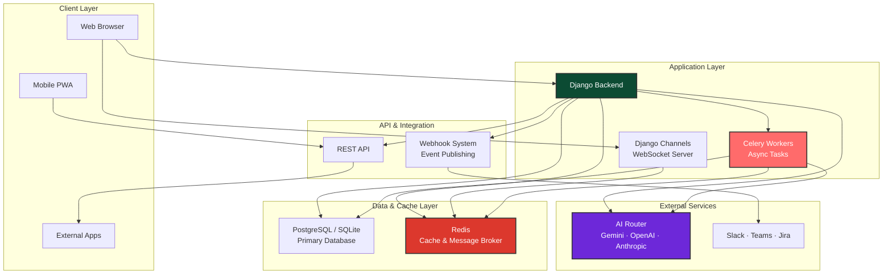

# PrizmAI — AI-Powered Project Management Platform

[](https://github.com/paulavishek/PrizmAI/actions/workflows/ci.yml)
[](https://www.python.org/downloads/)
[](https://www.djangoproject.com/)
[](https://opensource.org/licenses/MIT)

> Visual project management, rooted in strategy, accelerated by AI.

PrizmAI is a full-stack project management platform built with Django, Google Gemini, WebSockets, and a REST API. It goes beyond task tracking — connecting individual work items to an organization's strategic goals through a structured hierarchy, while AI surfaces risks, explains its reasoning, and helps teams stay ahead of problems before they escalate.

**Open-source portfolio project** demonstrating full-stack development, AI integration, enterprise security, and modern software architecture.

---

## Features

### Project Management Core

- **Visual Kanban Boards** — Drag-and-drop task management with AI-suggested column structures
- **Task Aging Alerts** — Cards show an adaptive badge counting how many days a task has sat in its **current column** (the count resets every time the task moves). The badge is hidden while a task is fresh, then escalates through three states — a neutral grey pill, an amber **warning**, and a red **critical** — as it stalls. Thresholds are configurable on two layers: **board-level defaults** in Board Settings (a Warning and a Critical day count), and **per-column overrides** from each column's ⋮ menu → *Aging Alerts* (use board defaults, set custom thresholds, or disable the badge for that column). The grey "show" threshold is derived automatically from the warning value, so only two numbers ever need tuning. Done- and Backlog-style columns have aging disabled by default. The first time a task ages into the warning state on a never-configured board, a one-time tooltip points users to the column menu (dismissal is remembered per user, per board). The underlying *days-in-column* signal is exposed on each task as a **single source of truth** (`Task.aging_state()`), so the exact day counts and tiers shown on the badges also power three other surfaces: **Focus Today** raises stalled tasks as a daily action when nothing is overdue or high-risk; **Spectra** answers *"which tasks are stalling?"* with column-dwell counts that match the badges; and the **Focus Today decision queue** flags tasks stuck in a column (measured by column dwell, not last-edited time, so a stray comment can't mask genuinely stuck work).
- **Gantt Charts** — Interactive timelines with milestone tracking and task dependency visualization *(Professional mode and above)*
- **Burndown Charts & Sprint Forecasting** — Real-time sprint progress with AI-powered completion predictions and confidence intervals *(Professional mode and above)*
- **Story Points & Capacity Planning** — Tasks carry a native Fibonacci effort estimate (1, 2, 3, 5, 8, 13, 21 — separate from the 1–10 risk/complexity score), set from a dropdown on task create/edit and shown as a badge on task cards and detail pages. Story points are the single source of truth for velocity: the Burndown Dashboard sums completed points into weekly velocity snapshots and surfaces a **Committed vs. Capacity** metric comparing a board's open story points against its recent average velocity, raising an over-commitment warning when the team has taken on more than a typical iteration's worth of work *(capacity metric: Professional mode and above, alongside Burndown)*. Estimates round-trip through board import/export and CSV/Jira/Asana/Monday.com imports, which map each provider's native point or effort field onto the same Fibonacci scale.
- **Goal-Aware Analytics & Genuinely Distinct Charts** — The column-distribution chart is always available. In Professional mode and above, Spectra classifies each board's project type and shows a completely different set of 4 charts tailored to how that type of work is actually measured: **Product / Tech** boards show (1) Cycle Time Distribution (bucket histogram of how long tasks took to complete), (2) Deployment / Completion Frequency by week, (3) Bug vs Feature vs Chore Breakdown — classified from task labels with an automatic title-inference fallback so the chart is never empty, falling back to priority mix only when no meaningful categories can be inferred, and (4) Task Age in Backlog (amber gradient — older buckets display in deeper amber); **Marketing / Campaign** boards show (1) Tasks by Phase (horizontal bar), (2) Content Priority Mix, (3) Content Delivered per Week, and (4) Stage Transition Funnel revealing pipeline pile-ups; **Operations** boards show (1) Process Stage Distribution, (2) On-Time vs Late Completion — stacked weekly bar for the last 8 weeks (falls back to completion trend when fewer than 3 tasks have due dates), (3) SLA / Cycle Time by Stage — weighted estimate distributing avg cycle time across columns by role (To-Do heavier, Done lighter), with a placeholder shown instead of misleading identical bars when the board lacks stage history, and (4) Workload Distribution by team member. Boards without a confirmed classification fall back to the standard four charts (column distribution, priority, user workload, Lean Six Sigma); Lean users see the priority, user workload, and Lean Six Sigma cards as blurred preview tiles with an upgrade prompt, ensuring the analytics page always feels informative rather than empty. The "Generate AI Summary" button produces type-specific written analysis — flagging cycle-time health and backlog aging for Product/Tech boards, deadline adherence and pipeline bottlenecks for Marketing boards, and on-time rates and stage bottlenecks for Operations boards — and always ends with 2–3 concrete, actionable recommendations. A subtle sparkle hint on the Analytics tile signals when a board has not yet been classified.
- **Time Tracking & Timesheets** — Log hours, track team utilization, and manage labor costs. Each time entry carries a **billable/non-billable flag** (billable by default) so teams can separate client-chargeable hours from internal overhead at a glance. The weekly timesheet shows a billable vs. non-billable split below the daily totals row.
- **Budget & ROI Tracking** — Multi-currency support, cost forecasting, and ROI analytics
- **Task Dependencies** — Parent-child, related, and blocking dependency types with AI analysis
- **Custom Fields** — The workspace owner can define typed metadata fields on tasks — **Text**, **Long Text**, **Number**, **Date**, **Boolean**, and **List** (single or multi-select, with preset option values). Fields are workspace-scoped (defined once, apply across all boards), auto-filterable in the board filter bar, and automatically injected into every AI feature: Spectra surfaces them in answers, AI Coach references them in enhancement prompts, Scope Autopsy records field-value changes as timeline events, and Retrospectives break down completion rates by field value (e.g., "Externally Blocked tasks took 1.8× longer"). A per-field **Exclude from AI** checkbox keeps sensitive data such as contract values or PII out of every prompt. The workspace owner manages fields at `/workspace/<id>/custom-fields/`; members set values in the normal task detail and create flows. *(Professional mode and above)*
- **Board Automations** — A full WHEN / IF / THEN / OTHERWISE rule engine spanning **a growing library of triggers, conditions, and actions** across seven categories: **Task State**, **Time & Activity**, **AI & Risk**, **Hierarchy & Dependencies**, **AI Tools & Platform**, **Communications**, and **Scheduled**. Rules can fire on task events (created, completed, assigned, status change, progress change, description update, due-date change), time-based scans (overdue, idle, start-date reached, due-date approaching), AI-derived state (risk-level changed, complexity increased, predicted to miss due date, schedule-status change), hierarchy events (subtask completed, all subtasks done, blocking dependency completed/overdue, checklist completed, milestone reached, parent-status change), AI-tool outputs (AI Coach suggestion created, conflict detected, Discovery idea AI-scored, immunity-score drop, scope-creep detection), comments and attachments, or daily/weekly/monthly schedules. Actions go well beyond labels and notifications — set priority/progress/description, cascade due-dates and priority to subtasks, request AI analysis, flag for review, capture decisions and lessons to the project memory graph, acknowledge AI Coach suggestions, resolve conflicts, promote Discovery ideas, generate PrizmBrief status reports, notify all stakeholders, link or create wiki pages, log time, assign to the best skill match or lightest workload, and more. Conditions can be **task-scoped** (priority, risk level, predicted-completion vs due-date, checklist progress, idle days, skill-match score, hours logged, etc.) or **board-scoped** (board has active conflicts, board immunity score, board scope-creep %, board velocity trend, board predicted overrun days) — board conditions work freely alongside task triggers so a task rule can be gated by board-level health. Rules support AND/OR logic, an OTHERWISE fallback branch, and run with per-day deduplication and auto-disable after three consecutive failures. *(Trigger-based rules: Professional mode and above. Scheduled recurring rules: Enterprise mode.)*
- **Unified Cross-Board Calendar** — Consolidated view of tasks, milestones, and events across all boards
- **Requirements Analysis** — AI-powered requirement lifecycle management with full traceability. Define, categorize, and track requirements from draft through verified status with auto-generated identifiers (REQ-001). Link requirements to project objectives and board tasks for complete traceability. Features include a traceability matrix (objectives × requirements × tasks), CSV export, hierarchical parent-child requirements, coverage statistics, and comment threads with status change history. AI capabilities include: **Quality Scoring** (per-requirement analysis across clarity, completeness, testability, unambiguity, and feasibility dimensions), **Gap Detection** (identify uncovered objectives, orphaned tasks, and missing requirement areas), **Acceptance Criteria Generation** (auto-generate Given/When/Then criteria from requirement descriptions), and **Impact Analysis** (downstream impact assessment for linked tasks, child requirements, and objectives). Spectra AI can answer questions about requirement status, coverage gaps, quality scores, and traceability. Accessible from the AI Tools panel → Manage section on the board page. *(Professional mode and above)*
- **PrizmDiscovery — Idea Inbox** — A structured idea pipeline for capturing, discussing, and prioritising product ideas before they enter the delivery pipeline. Submit ideas with a title, description, and source label; move them through four stages (New → Under Review → Approved → Rejected); and promote approved ideas directly to a Kanban board as tasks. Spectra AI scores each idea on **Impact** (0–100), **Effort** (0–100), and **Confidence** (0–100), assigns a quadrant (Quick Win / Strategic Bet / Fill-in / Deprioritize), and generates a reasoning paragraph. Scored ideas are visualised on an interactive **Discovery Matrix** scatter chart. Rejected ideas remain on the matrix with a muted, strikethrough style so prioritisation decisions are always explainable. *(Professional mode and above)*
- **Forms — AI Intake Engine** — A structured alternative to free-typing into Discovery: build a reusable form with typed fields (Short Text, Long Text, Single/Multi Select, or static instructional blocks), each mapped to a target property (Title, Description, Source, or context-only). Point a form at **PrizmDiscovery** — submissions are automatically scored by Spectra in the background the moment they arrive, so the Idea Inbox and Discovery Matrix fill in without anyone clicking "Score" — or at a **Kanban Task**, where submissions land straight into the target board's intake column. The responses dashboard shows every submission alongside its resulting idea or task, live-updating from "Scoring…" to the real Impact/Effort/quadrant as Spectra finishes. v1 is workspace-members-only (no public/anonymous links yet). See [Forms — AI Intake Engine](#forms--ai-intake-engine) below. *(Professional mode and above)*

### Strategic Alignment

- **Organizational Goal Hierarchy** — Connect work to strategy through a Goal → Mission → Strategy → Board → Task hierarchy *(Professional mode and above; navigation links hidden in Lean mode)*
- **Triple Constraint Dashboard** — Visualize and analyze the Scope, Cost, and Time interplay for a project with AI-powered recommendations
- **Mission & Strategy Management** — Define organizational missions and link strategies to projects and boards

### AI Intelligence (Gemini · OpenAI · Anthropic)

- **Spectra — AI Project Assistant** — Natural language queries with RAG technology and web search, scoped to your project data. Spectra operates in **read-only Q&A mode (v1.0)** — ask questions about tasks, deadlines, risks, team workload, task aging (*"which tasks are stalling?"*), strategic goals, wiki content, and more. Spectra enforces full RBAC, meaning it only surfaces data from boards you have explicit access to, and respects sandbox isolation in the Demo Workspace.
  - **Board Analysis** — "What tasks are overdue?" · "Summarize this board" · "Who's overloaded?"
  - **Strategic Hierarchy** — "How are our goals tracking?" · "Show the mission hierarchy" · "What's our OKR progress?"
  - **Risk & Dependency Insight** — "What are the current blockers?" · "Which dependencies are at risk?"
  - **Cross-Board Reporting** — "Compare workload across all my boards" · "What needs attention?"
  - **Document Analysis** — Attach PDF, DOCX, or TXT files and ask questions about their content
  - **Web Search** — Supplemental web context for research and strategic queries (when enabled)
  - **Feature Help & Onboarding Advisor** — Beyond your project data, Spectra knows PrizmAI itself. Ask *"What does the Pre-Mortem feature do?"* for a factual explanation and where to find it, or describe a problem (*"I'm stuck planning a risky launch — which feature should I use?"*) and Spectra recommends the right tool, why it fits, and how to reach it. Answers come from a maintained feature reference, so Spectra never invents features or menu paths.
  
  Spectra uses a **Tiered AI Architecture**: `gemini-3.1-flash-lite` handles most queries cheaply (no extended thinking, ~2–3 s), upgrading to `gemini-2.5-flash` for complex analysis — keeping AI costs low while delivering rich project insights. Action capabilities (creating tasks, sending messages, logging time, scheduling events, and more) are code-complete and will ship in **Spectra v2.0**.
- **Multi-Provider AI** — PrizmAI supports **Google Gemini**, **OpenAI (GPT-4o)**, and **Anthropic Claude** as interchangeable AI providers. Org Admins choose the platform-wide default; individual users can optionally override it. **BYOK (Bring Your Own Key)** lets users and organisations supply their own API keys, stored encrypted (AES-256 Fernet) and never logged in plain text.
- **AI Coach** — Proactive, personalized coaching with recommendations that learn from your feedback
- **Explainable AI** — Every recommendation includes a transparent breakdown: confidence level, contributing factors, assumptions, limitations, and alternative perspectives
- **Scope Creep Detection** — Automatic baseline tracking with alerts when scope expands beyond the original plan
- **Conflict Detection** — Automated detection and resolution suggestions for resource, schedule, and dependency conflicts
- **AI Onboarding** — Enter your organization's goal and let AI generate a complete workspace — missions, strategies, boards, and starter tasks — tailored to your objectives
- **PrizmBrief** — Generate structured, audience-aware presentation content directly from live board data, for clients, executives, or internal teams
- **AI Retrospectives** — Auto-generated lessons learned with improvement tracking
- **Skill Gap Analysis** — Team capability mapping against task requirements, with individual development plans
- **Resource Leveling & Workload Optimization** — Intelligent workload balancing and assignment suggestions
- **Requirements AI Analysis** — Gemini-powered requirement quality scoring (clarity, completeness, testability, unambiguity, feasibility), gap detection across objectives and tasks, automatic acceptance criteria generation in Given/When/Then format, and downstream impact analysis. Results are surfaced both in the Requirements UI and through Spectra chat queries.
- **AI Bubble-up Summaries** — On-demand AI summaries generated and propagated at every level of the hierarchy (task, board, strategy, mission)
- **Deadline Prediction & Risk Assessment** — AI-powered deadline estimates and risk scoring with mitigation suggestions
- **Semantic Task Search** — Find tasks by meaning and intent, not just keywords
- **Knowledge Graph Project Memory** — Automatically captures decisions, risk events, lessons learned, conflicts, scope changes, and milestones as an interconnected knowledge graph. AI discovers causal links between events and surfaces relevant past patterns when similar situations arise, preserving organizational memory across projects. Teams can also **log memories manually** (optionally workspace-wide), search them in natural language on the Organizational Memory page, and rely on **Spectra Gap Analysis** to flag thin or unreviewed memories that are missing critical context. See the [Organizational Memory & Spectra Gap Analysis guide](#organizational-memory--spectra-gap-analysis) below.
- **Cognitive Load Guardian** — Monitors per-member task complexity, assignment density, and context-switching frequency. Alerts managers when team members are at cognitive overload risk and recommends re-sequencing or redistribution to protect focus and prevent burnout.
- **Pre-Mortem AI** — Before scope locks in, AI simulates five distinct ways a project could fail. Each scenario includes a risk level, root-cause analysis, and mitigation strategy, with team acknowledgment tracking so no critical risk goes unaddressed.
- **Project Stress Test** — A "Red Team" AI that tries to break your project plan before real life does. It simulates five targeted attacks (e.g., a key person leaving, a critical dependency breaking, a sudden budget spike) and scores your plan's resilience from 0 to 100 across five dimensions: Schedule, Budget, Team, Dependencies, and Scope Stability. For each attack, it prescribes a structural "Vaccine" fix — a concrete change you can apply to strengthen your plan. Run multiple sessions to track your immunity score over time and watch it improve as you apply vaccines. Linked to Pre-Mortem so risk scenarios flow naturally into stress testing.
- **Scope Creep Autopsy** — Forensic post-mortem analysis that traces every scope expansion to its exact cause, contributor, date, and cost or delay impact. Generates exportable PDF reports that turn scope history into actionable lessons for future projects.
- **What-If Scenario Analyzer** — A decision-support engine that lets PMs simulate the cascading impact of three key variables before committing: scope changes (±20 tasks), team size adjustments (±5 members, modeled with Brooks's Law), and deadline shifts (±8 weeks). Each simulation computes a live baseline from velocity history, budget, and burndown data, then produces a projected state with a feasibility score (0–100), detected conflicts (resource overload, deadline infeasibility, budget overrun), a before/after comparison table, and a Gemini-powered strategic recommendation. Scenarios can be saved, starred, and reloaded for ongoing comparison.
- **Shadow Board — Parallel Universe Simulator** — Takes What-If further: instead of running one scenario and discarding it, Shadow Board lets you promote saved scenarios into living, parallel *branches* of your project. Each branch keeps updating automatically as real work progresses, so you can compare "hire 3 contractors" vs "cut 5 tasks" side-by-side with live feasibility scores, AI recommendations, and projected completion dates — all powered by Gemini. When you're ready to decide, commit one branch to reality and archive the rest with a full audit trail. See the [Shadow Board guide](#shadow-board--parallel-universe-simulator-1) below.
- **Project Confidence & Signals (integrated into Triple Constraint Dashboard)** — Instead of a standalone commitment tracker, PrizmAI auto-computes a composite confidence score (0–100) for every board by analysing three dimensions in real time: **Scope** (how much scope has changed), **Budget** (spend vs. allocation), and **Schedule** (delay probability from burndown data). A unified Signal Log records every event that moves the needle — task completions, budget changes, scope shifts — and team members can log manual signals too. When confidence drops below 40%, the AI Coach automatically proposes three concrete recovery options (reduce scope, extend timeline, add resources). The full confidence history, trend chart, and signal log live on the [Triple Constraint Dashboard](#project-confidence--signals).
- **Exit Protocol — Project Wind-Down System** — A structured, compassionate system for ending projects deliberately instead of letting them die quietly. When a project is struggling, PrizmAI watches for warning signs and guides the team through a dignified wind-down: extracting all reusable knowledge, generating transition memos for every team member, archiving the project with a full AI-written autopsy report, and preserving the lessons in a searchable Project Cemetery. Reusable components (templates, workflows, automation rules) can be transplanted into future projects. Buried projects can even be "resurrected" as a fresh board pre-loaded with all the lessons from the original. See the [Exit Protocol guide](#exit-protocol--project-wind-down-system-1) below.

### Enterprise & Collaboration

- **Role-Based Access Control (RBAC)** — **Workspace is the top-level tenant boundary**: every workspace is private to its owner, and collaboration happens through explicit board invitations. Three per-board roles — Owner, Member, and Viewer — control exactly what each person can see and do, and access flows downward automatically through the Goal → Mission → Strategy → Board hierarchy. Board members can view parent Strategy, Mission, and Goal names in read-only mode (upward visibility), but cannot edit parent levels without a separate explicit invitation. Budget data and strategic goals are restricted to board Owners. A separate **Org Admin** role governs only organisation-level settings (the Workspace Preset tier and AI-provider/BYOK configuration) — it no longer grants access to other users' boards or data. Django superusers bypass board-level access checks.
- **Workspace Preset System** — Three progressive complexity tiers — **Lean**, **Professional**, and **Enterprise** — let Org Admins tune the interface to match their team's size and needs. Lean surfaces a clean Kanban board, calendar, Spectra chat, and one analytics chart. Professional unlocks Gantt Charts, Burndown, Goals & Missions navigation, AI Retrospectives, Skill Gap Analysis, full Analytics, and trigger-based Automations. Enterprise adds Shadow Board, What-If Simulator, Pre-Mortem, Stress Test, Project Confidence & Signals, Scope Autopsy, Resource Optimization, Scheduled Automations, Exit Protocol, and Budget / ROI tools. Board Owners can further restrict individual boards to a lower tier, but can never exceed the org-wide ceiling. The global preset is configured in **Workspace Settings** (sidebar → profile menu → Workspace Settings, Org Admins only). New organisations default to Lean; existing organisations migrated to Enterprise.
- **Focus Today** — A unified daily review dashboard that batches conflicts, risks, overdue tasks, **stalled tasks** (stuck in a column past the aging threshold), over-allocations, scope alerts, budget warnings, and AI recommendations into a prioritized daily queue with AI-generated briefings
- **Favorites Sidebar** — Star and reorder boards, goals, tasks, wiki pages, and other items for quick access from the sidebar
- **Stakeholder Management** — Track influence, interest levels, and engagement across projects
- **Real-Time Messaging** — WebSocket-powered team chat with @mentions, notifications, and **AI Message Composer** — type a rough draft and let AI rewrite it as a polished, professional team update in one click
- **Board Member Invitations** — Invite collaborators via email with tokenized invitation links
- **Task Search** — Press `/` to instantly search tasks by keyword across the current board, or switch to AI semantic search for meaning-based results with relevance scoring. Toggle to **All Boards** scope to run a cross-workspace search that returns matching tasks and boards from every board you have access to, displayed in a grouped results panel without disrupting the current board view.
- **Rich Text Task Descriptions** — Task descriptions use a full **Tiptap** rich-text editor (loaded via CDN, no build step required) supporting bold, italic, underline, strikethrough, headings (H2/H3), bullet and ordered lists, inline code, code blocks, blockquotes, and highlights. All HTML is sanitized server-side via bleach before storage, preventing XSS. The "Generate with AI" button populates the rich-text editor directly. Falls back to a plain textarea if JavaScript is unavailable.
- **Knowledge Base & Wiki** — Markdown documentation with AI-assisted meeting analysis
- **Meeting Transcript Import** — Import from Fireflies, Otter, Zoom, Teams, and Meet with AI extraction
- **File Attachments with AI Analysis** — Attach files to tasks and let AI extract structured tasks from documents
- **Per-User Timezone Support** — Users worldwide can set their preferred timezone from the topbar; all dates, times, calendars, and AI responses automatically display in the selected timezone
- **Unified Display Mode** — A single Display Mode selector in the topbar (and in Profile Settings) gives every user four choices: **Light** (default), **Dark** (Bootstrap 5 native dark theme with full component coverage), **Browser** (follows the OS `prefers-color-scheme` setting and responds to live OS changes), and **Accessibility** (color-blind friendly palette using the Okabe-Ito blue/orange scheme with pattern indicators on priority badges and charts). The preference is persisted to the database and applied before the first CSS paint on every page load, preventing any flash of the wrong theme.

### Security & Compliance

- **Role-Based Access Control** — Per-board roles (Owner / Member / Viewer) enforced through a single canonical permission rule, a board-access enforcement middleware backstop, and object-level checks on the REST API. Board access is by creator or explicit membership only — Organization is not a basis for access. See [Role-Based Access Control](#role-based-access-control-rbac)
- **Multi-Tenant Isolation** — Workspace is the tenant boundary: every data query is scoped to the user's workspace, workspaces are private to their owner, and cross-workspace access is blocked at the server level (not just hidden in the UI). See [Workspace data isolation](#how-access-works)
- **OAuth 2.0** — Google login via django-allauth
- **Brute-Force Protection** — Account lockout on repeated failed authentication attempts (django-axes)
- **XSS & CSRF Protection** — HTML sanitization (bleach) and token validation
- **SQL Injection Prevention** — Django ORM with parameterized queries throughout
- **Content Security Policy** — CSP headers enforced via django-csp
- **Audit Logging** — Complete audit trail of sensitive operations with IP tracking
- **Secure File Uploads** — MIME type validation and malicious content detection
- **AI Usage Monitoring** — Track and manage AI feature consumption with configurable quota limits
- **Production-Hardened Settings** — HSTS, secure cookies, SSL redirect, and clickjacking/MIME-sniffing protections auto-enabled outside `DEBUG`. See [Deployment & Production Security](#deployment--production-security)

### Integrations & Platform

- **RESTful API** — Token-authenticated REST API for third-party integrations and mobile clients
- **Webhook Integration** — Event-driven outbound webhooks with one-click quick-setup presets grouped by category: **Chat** (Slack, MS Teams, Google Chat, Discord), **Automation** (Zapier, Make, n8n, Power Automate), and **DevOps** (GitHub, GitLab, PagerDuty), plus Custom. Payloads are auto-formatted per platform, with HMAC-SHA256 signing, custom headers, retries, live delivery logs, and an SSRF guard. See [External Integrations](#external-integrations)
- **GitHub Webhook Receiver** — Automatically moves tasks to "In Review" when a GitHub pull request mentions a task ID (e.g., `SD-101`) in its title or description. Per-board configuration with HMAC-SHA256 secret verification. See [External Integrations](#external-integrations)
- **Zapier Integration** — Native Zapier REST polling endpoints (New Task, Task Completed, Task Assigned triggers; Create Task and Update Status actions); ships with a ready-to-publish Zapier CLI app in `zapier-app/`. See [External Integrations](#external-integrations)
- **Google Calendar Sync** — OAuth 2.0-based two-way sync; tasks assigned to you with a due date automatically appear in Google Calendar and update whenever the due date changes. Master toggle in Profile Settings. See [External Integrations](#external-integrations)
- **Mobile PWA** — Progressive Web App with offline support and home-screen installation
- **Board Import / Export** — Import boards from Jira (CSV/JSON export) and Monday.com (Excel export), or use PrizmAI's own JSON format for full round-trip import/export. Imported boards are automatically assigned to the importer's workspace; an organisation and Org Admin role are created automatically if the user does not yet have one.
- **Lean Six Sigma Classifications** — Built-in LSS task labels (Value-Added, NVA, Waste)

**→ [Detailed feature documentation](FEATURES.md)**

---

## Project Stress Test — Red Team AI

> **In plain English:** Most project planning is optimistic. The Stress Test is the opposite — an AI that deliberately tries to *break* your project plan before real life does. It invents the five most damaging things that could go wrong, scores how resilient your plan is, and then tells you exactly how to fix the weak spots. Think of it as a fire drill for your project.

### Why it exists

Plans feel solid until the moment they aren't. A key team member leaves. A vendor doubles their price. A stakeholder demands a complete redesign at 70% completion. These things happen — and most project plans have no structural answer for them.

The Stress Test forces you to confront those failures *before* they happen, when you still have time to build in safeguards.

### How it works

Navigate to any board and click **Stress Test** → **Run Stress Test**. The Red Team AI reads your live project data — every task, assignee, dependency, budget figure, deadline, and conflict — and then does three things:

1. **Simulates five targeted attacks** — It picks the five attack types most likely to damage *your specific plan* (not generic risks, but ones that exploit your actual data). Examples: removing the team member with the most tasks, discovering a critical skill gap mid-project, or a sudden 40% price increase from a key vendor.

2. **Scores your resilience (Immunity Score)** — A score from 0–100 across five dimensions: Schedule, Budget, Team, Dependencies, and Scope Stability. Think of it like a credit score for your project's robustness.

3. **Prescribes structural vaccines** — For each attack, the AI recommends one concrete structural fix — not "communicate better" but real changes like cross-training a backup for your critical task owner, adding a budget contingency line, or decoupling a high-risk dependency.

### The two actions — and why they're different

This is the most important thing to understand. The Stress Test page shows two columns: **Attack Scenarios** on the left and **Vaccines** on the right. They look similar but mean very different things.

#### 🎯 Attack Scenarios — "Mark Addressed"

An attack scenario is something the AI *invented* as a hypothetical future threat. "Marcus Chen Vanishes" didn't happen — the AI simulated it because Marcus has 11 tasks and no backup.

**"Mark Addressed"** means: *"I, the project manager, have read this scenario, I understand the risk it describes, and I am actively watching for the early warning signs."*

This is a **managerial acknowledgment**. You're not saying you've fixed anything — you're saying it's on your radar. Think of it like circling a risk in red on a whiteboard and writing your initials next to it.

The AI gives credit (3–8 points) for addressed scenarios because a team that's aware of a risk is less likely to be blindsided by it.

#### 💉 Vaccines — "Mark as Applied"

A vaccine is a **structural change** the AI prescribes to close the specific gap that made the attack possible. "Implement Critical Role Redundancy" means: actually cross-train a second person on Marcus's top tasks, document that knowledge, and schedule regular knowledge-transfer sessions.

**"Mark as Applied"** means: *"We have actually made this structural change."* The budget contingency exists. The cross-training happened. The dependency was decoupled.

The AI gives substantial credit (8–20 points each) for applied vaccines — and importantly, it **stops attacking that same weakness** in the next run and finds new vulnerabilities instead.

#### The key difference at a glance

| | Mark Addressed | Apply Vaccine |
|---|---|---|
| **What it means** | "I'm aware of this risk" | "I've structurally fixed this weakness" |
| **Score impact** | +3–8 pts | +8–20 pts each |
| **Effort required** | None — just a click | Real project work |
| **Effect on next run** | AI still probes same area | AI finds NEW weaknesses instead |
| **Analogy** | Knowing a road is icy | Gritting the road |

#### What happens if you only apply vaccines (without marking scenarios addressed)?

You get the full vaccine score credit and the AI will stop attacking those weaknesses. You miss the small awareness credit (3–8 pts per scenario). **This is still the more impactful action** — vaccines are what actually move the needle.

#### What happens if you only mark scenarios addressed (without applying vaccines)?

You get a small awareness credit (3–8 pts per scenario). But the underlying structural weaknesses remain. The AI will keep finding new angles to exploit them in future runs. Score improves only slightly. **Awareness without structural change doesn't build real resilience.**

#### Should you do both?

Yes — but start with vaccines. The recommended workflow is:

1. **Run the Stress Test** — read all five attacks and their cascade effects carefully
2. **Apply vaccines** where it's feasible to make the structural change
3. **Mark scenarios addressed** for every risk you understand and are monitoring, even if you can't fully fix it yet
4. **Re-run the test** — the AI will see both your vaccines and acknowledged risks, score you accordingly, and attack new weak spots
5. **Repeat** until you hit your target resilience band

**Best practice:** When you apply a vaccine, also mark its corresponding scenario as addressed — it signals that both the structural fix is in place *and* the team is monitoring for that specific risk pattern.

### The Immunity Score bands

| Score | Band | What it means |
|---|---|---|
| 90–100 | **ANTIFRAGILE** | Built-in redundancy; the plan gets stronger under pressure |
| 70–89 | **RESILIENT** | Survives most real-world disruptions |
| 40–69 | **MODERATE** | Handles minor shocks; fails major ones |
| 0–39 | **FRAGILE** | Collapses under first real disruption |

### Progressive scoring across runs

The Immunity Score is **cumulative** — it builds across sessions. Each time you re-run the test:
- All previously applied vaccines are remembered and credited
- All addressed scenarios are remembered
- The AI is explicitly told not to repeat attack types already covered by vaccines
- The minimum score the AI can return is anchored to your last session score, preventing the score from dropping just because the AI got creative with new scenarios

This means every vaccine you apply and every scenario you address is permanently banked — your score can only trend upward as you strengthen the plan.

### Session History and Reset

The **Session History** table at the bottom of the Stress Test page shows every run — date, who ran it, score, band, and vaccines applied. This history feeds into progressive scoring.

If you want to start fresh (e.g., after a major project restructure, or during testing), the board creator can use the **Reset History** button to clear all sessions and start with a clean slate.

### Getting to the Stress Test

- From any board, click **Stress Test** in the board navigation *(Enterprise mode only)*
- Or navigate directly to `/board/<board-id>/stress-test/`
- The page links back to the **Pre-Mortem** feature — run Pre-Mortem first to identify failure scenarios before stress-testing your defences against them

---

## Exit Protocol — Project Wind-Down System

> **In plain English:** Every project eventually ends — but most just *fade out*. Work stops, the team scatters, and nobody writes down what went wrong or what was worth keeping. Exit Protocol is PrizmAI's answer to that: a guided process that helps you close a project properly, preserve everything valuable, and carry the lessons forward.

### Why it exists

Most project management tools are built for starting and running projects. Almost none handle *ending* them well. When a project fails or gets cancelled, teams usually just stop showing up. Critical decisions, hard-won lessons, reusable templates, and important contacts all disappear into the void.

Exit Protocol treats project endings as something worth doing right.

### The three parts of Exit Protocol

#### 🏥 Project Hospice — The Wind-Down Process

PrizmAI quietly monitors every project's health every night, looking at four things: how fast the team is getting work done, whether the budget is being spent responsibly, how many deadlines have been missed recently, and whether the team is still actively working at all.

When the health score crosses **75%** on the risk scale, PrizmAI shows a gentle warning on the project page: *"This project may be struggling — consider a structured review."*

A manager can then click **Initiate Wind-Down Review**, and PrizmAI takes it from there:
- **AI Assessment** — Gemini reads the entire project history and writes a plain-English summary of what's been happening and why the project is in trouble
- **Knowledge Extraction Checklist** — PrizmAI pulls every important decision, lesson, risk event, and milestone from the project's memory and presents them as a checklist to review and sign off
- **Transition Memos** — One personalised AI-written memo per team member, summarising their contributions, open tasks, and what they need to hand over
- **Organ Scanning** — PrizmAI automatically identifies which parts of this project could be useful in a future one — automation rules, task templates, workflow structures, goal frameworks — and packages them up for reuse

When the team is ready, a manager types a confirmation phrase and clicks **Archive This Project**. PrizmAI then writes the full autopsy report and closes the project permanently.

#### 🫀 Organ Transplant — Keeping What's Valuable

Not everything about a struggling project is bad. Maybe the team built a brilliant automation rule, or designed a task breakdown structure that could save weeks on the next project.

The **Organ Bank** lets you see everything reusable that was extracted from a project — templates, workflows, automation rules, role definitions, knowledge entries.

The **Organ Library** is a searchable catalogue of reusable components from *all* past projects across your organisation. When you're setting up a new project, you can browse it, see how compatible each component is with your new board (scored by AI), and transplant it in with one click.

Think of it like a parts library — built automatically every time a project closes.

#### ⚰️ Project Cemetery — The Permanent Archive

Every project that goes through Exit Protocol gets a permanent entry in the **Project Cemetery** — a searchable archive accessible from the sidebar.

Each entry is a full autopsy report:
- **Vital Statistics** — Team size, tasks completed vs planned, budget used
- **Cause of Death** — AI classifies the project's closure into one of eight named categories: *Scope Cancer, Velocity Collapse, Budget Bleed, Zombie Death, Resource Exodus, Market Shift, Strategic Pivot*, or *Natural Completion* — and explains its reasoning
- **Timeline of Decline** — A chart showing how the health score declined over the project's lifetime
- **Lessons Learned** — Organised into three buckets: things to repeat on future projects, things to avoid, and open questions that were never resolved
- **Organ Transplant Record** — Which reusable components were extracted from this project and where they went

You can search the Cemetery by project name, filter by cause of death or date range, and export any autopsy as a **PDF report**.

#### 🌱 Resurrection — Starting Again Smarter

Sometimes a project dies before its time — the timing was wrong, the team changed, or the budget ran out — but the underlying idea was still good.

The Cemetery's **Resurrect as New Board** button creates a brand-new project pre-loaded with:
- All the decisions and lessons from the original, already in the Knowledge Graph
- A Pre-Mortem analysis with every risk that contributed to the original project's failure, tagged with a warning: *"⚠️ This risk destroyed the original project this board was resurrected from."*

The Cemetery entry remains permanently — resurrection is a new start, not an undo.

### The health score explained

PrizmAI calculates a **Hospice Risk Score** from 0–100% every night for every project. Higher means more at risk. The dashboard shows a live breakdown so managers know exactly which dimension is driving the number:

| Dimension | What it measures | Weight |
|---|---|---|
| **Velocity** | Has the team's work rate been falling? | 30% |
| **Budget** | Is money being spent faster than work is being completed? | 25% |
| **Deadlines** | How many tasks were due in the last 30 days and missed? | 25% |
| **Activity** | How long since anyone last touched this project? | 20% |

Scores below 40% are green (healthy). 40–74% are amber (worth watching). 75%+ are red (concern detected). A **Recalculate Now** button lets managers refresh the score on demand — useful when something significant just happened mid-day.

### Getting to Exit Protocol

- From any board, open the **AI Tools** panel and click **Exit Protocol**
- Or navigate directly to `/boards/<board-id>/exit-protocol/`
- The **Project Cemetery** is accessible from the sidebar under **More → Project Cemetery**
- The **Organ Library** is at `/exit-protocol/organ-library/`

---

## Shadow Board — Parallel Universe Simulator

> **In plain English:** Imagine you're managing a project and you're stuck between two options — "hire 3 contractors to speed things up" or "cut 5 tasks to hit the deadline." Instead of guessing, Shadow Board lets you run both options *at the same time*, watch how each one plays out as your real project moves forward, and only commit to a decision when the numbers make it obvious.

### How it works

Shadow Board builds directly on the **What-If Scenario Analyzer**. The journey from idea to decision looks like this:

```
Real Board  →  What-If Scenario  →  Shadow Branch  →  Commit to Reality
  (live)        ("what if I…?")     (living sim)       (decision made)
```

1. **Run a What-If scenario** — Use the three sliders (tasks, team size, deadline) and click *Analyze Impact*. PrizmAI shows you a feasibility score and Gemini's recommendation.
2. **Save & promote to a branch** — If the scenario looks interesting, save it and click *Promote to Shadow Branch*. This creates a live clone of your project under that scenario.
3. **Run multiple branches in parallel** — Repeat for each option. You might have *Branch A: Hire 3 contractors* and *Branch B: Cut 5 tasks* running side by side.
4. **Watch them update automatically** — Every time something changes on your real board — a task is completed, someone joins the team, the deadline shifts — all active branches recalculate instantly. You always see current scores, not stale what-ifs.
5. **Commit when ready** — When one branch clearly wins, click *Commit This Branch*. It's merged into reality, the others are archived with a full history, and the audit log records your decision.

### A concrete example

You're running a product launch with 30 tasks remaining and 6 weeks until the deadline. Your team is behind schedule and you have two options:

| Option | What you set | What PrizmAI shows |
|---|---|---|
| Branch A: Hire 3 contractors | Team size +3 | Feasibility 90% · Projected completion: May 12 |
| Branch B: Cut 5 tasks | Tasks −5 | Feasibility 60% · Projected completion: May 28 |

Two weeks later, your team completes 8 tasks ahead of schedule. Both branches recalculate automatically:

| Option | Updated score | AI Recommendation snippet |
|---|---|---|
| Branch A | 94% | *"Strong trajectory. Contractor ramp-up risk has resolved — recommend committing."* |
| Branch B | 72% | *"Feasibility improved but deadline is still tight. Consider restoring 2 of the cut tasks."* |

You commit Branch A. The other branch is archived. Done.

### Getting to Shadow Board

- From any board, open the **AI Tools** panel on the right side and click **Shadow Board** *(Enterprise mode only)*
- Or navigate directly to `/boards/<board-id>/shadow/` — you will be redirected to the Kanban view if your workspace is not on Enterprise mode
- To promote a saved scenario, open the **What-If Analyzer** → click **Saved Scenarios** → click **Promote to Shadow Branch** next to any scenario.

### The Quantum Standup

At the top of the Shadow Board page is a collapsible **Quantum Standup** panel. It shows:
- Tasks your real team completed today
- How today's progress changed each branch's feasibility score (with ▲/▼ delta indicators)

It's a one-glance answer to: *"Did today's work make our decision easier or harder?"*

---

## Project Confidence & Signals

> **In plain English:** Instead of a standalone commitment tracker with manual setup, PrizmAI now auto-computes a Project Confidence score for every board — no configuration required. It analyses your scope changes, budget usage, and schedule health in real time, then shows you a single number (0–100) that honestly answers: *"How likely is this project to land on time and on budget?"*

### Why it exists

Roadmaps lie — not because teams are dishonest, but because plans made months in advance can't account for blockers, team changes, shifting requirements, and the dozen small surprises that hit every project. The old Commitment Protocols required manual setup per commitment; the new system is **zero-configuration** — it reads data that already exists on your board.

### How the confidence score works

The composite score (0–100) is a weighted blend of three dimensions, each scored independently:

| Dimension | Weight | What it measures |
|---|---|---|
| **Scope** | 30% | How much scope has changed vs. original task count — 0% change = 100, >40% = 0 |
| **Budget** | 30% | Spend ratio — ≤70% used = 100, 100% = 30, >120% = 0 |
| **Schedule** | 40% | Delay probability from burndown forecasting, adjusted by risk level |

A **signal adjustment** (±10 max) nudges the composite score based on recent positive or negative events. Scores recalculate automatically every 6 hours via a background Celery task, and you can trigger a manual recalculation from the dashboard.

### The Signal Log

Anything that happens on the project is recorded as a **Project Signal** with a strength value (-1.0 to +1.0). Signals come from two sources:

- **Automatic** — Task completions (+0.15), new tasks added (-0.05), task deletions (neutral), budget changes, and schedule shifts are logged automatically by PrizmAI
- **Manual** — Team members can record signals from the Triple Constraint Dashboard: milestone hit, blocker emerged, stakeholder approval, requirement change, team change, or a custom event. Each signal requires a short description

The Signal Log table on the dashboard shows the 20 most recent signals — type, impact direction, description, timestamp, and whether it was AI-generated or manual.

### AI Coach recovery (auto-renegotiation)

When the composite confidence score drops below **40%**, the AI Coach automatically creates a **confidence_drop** coaching suggestion with three structured recovery options:

1. **Reduce Scope** — Cut low-priority items to restore feasibility
2. **Extend Timeline** — Negotiate a realistic new deadline
3. **Add Resources** — Bring in additional team members or budget

These appear as recovery cards in the coaching panel, each with a clear description of the trade-offs involved.

### Where to find it

- Open the **Triple Constraint Dashboard** from any board (AI Tools → Analyse → Triple Constraint). The **Project Confidence** section sits between the What-If Simulator and the AI Analysis
- The section shows: the composite score circle (colour-coded green/yellow/orange/red), three dimension bars, the 30-day trend chart, and the signal log
- You can record a manual signal or trigger a recalculation directly from the dashboard
- Old `/boards/<board-id>/commitments/` URLs automatically redirect to the Triple Constraint Dashboard

---

## Automation Engine — WHEN / IF / THEN / OTHERWISE

> **In plain English:** Almost every recurring chore on a project — chasing overdue tasks, escalating high-risk work, cascading due-dates to subtasks, capturing lessons when a milestone slips — can be expressed as "WHEN *X* happens, IF *Y* is true, THEN do *Z* (OTHERWISE do something else)." PrizmAI's Automation Engine lets you write those rules in a form, no code, and have them run safely against task events, AI-tool outputs, board health, and a daily/weekly/monthly schedule.

### What's new in this release

The Automation Engine has been substantially expanded. The numbers tell the story:

| Surface | Count | Highlights |
|---|---|---|
| **Triggers** | **45** | Task events, time scans, AI risk transitions, hierarchy/dependency events, AI-tool outputs, comments & attachments, scheduled daily/weekly/monthly |
| **Conditions** | **49** | Task-scoped (priority, risk level, predicted-completion, checklist progress, idle days, skill match, hours logged, cost variance…) **and** board-scoped (active conflicts, immunity score, scope-creep %, velocity trend, predicted overrun days) |
| **Actions** | **50** | Beyond labels and notifications — set priority/progress/description, cascade due-date and priority to subtasks, request AI analysis, acknowledge AI Coach suggestions, resolve conflicts, promote Discovery ideas, generate PrizmBriefs, capture decisions/lessons to the knowledge graph, link or create wiki pages, notify all stakeholders |
| **UI groups** | **7** | Triggers and conditions are organised into Task State, Time & Activity, AI & Risk, Hierarchy & Dependencies, AI Tools & Platform, Communications, and Scheduled — the dropdowns stay scannable even with hundreds of options |

### The four blocks of a rule

```text
WHEN  ← one trigger (e.g. "Risk level becomes critical")
IF    ← zero or more conditions joined by AND / OR
        (e.g. "Priority is High" AND "Board has active conflicts")
THEN  ← one or more actions
        (e.g. "Flag for review" → "Notify rule creator" → "Capture decision")
OTHERWISE ← optional fallback actions when IF is false
```

Conditions are evaluated together with AND/OR logic; if they pass, the THEN branch runs; otherwise the OTHERWISE branch (if defined) runs. Every action is logged to the audit trail with a structured outcome — `success`, `skipped` (with reason), or `failed` (with error detail).

### Trigger categories at a glance

- **Task State** — created, completed, assigned, unassigned, status (column) changed, priority changed, progress changed, description updated, due-date changed, label added
- **Time & Activity** — overdue, idle for N days, start-date reached, completion threshold reached, due-date approaching
- **AI & Risk** — risk level changed (or specifically became critical), predicted to miss due date, schedule-status changed (late / at-risk / on-track), complexity increased
- **Hierarchy & Dependencies** — subtask completed, all subtasks completed, blocking dependency completed or overdue, checklist fully completed, checklist item added, milestone reached, parent-status changed
- **AI Tools & Platform** — AI Coach suggestion created, Conflict detected, Discovery idea submitted or AI-scored, Stress Test immunity score dropped, Hospice (Exit Protocol) risk threshold reached, scope-creep detected, prediction-confidence dropped, retrospective finalised
- **Communications** — comment added, assignee @-mentioned, attachment added, task thread message posted
- **Scheduled** — every day, every week on a chosen day, every month on a chosen date

### Action categories at a glance

- **Task State** — set priority, progress, description (or append to it), labels, assignee, column, due/start date, close task
- **AI & Risk** — set risk level, request AI analysis, flag for review (auto-adds a "Needs Review" label + a reason comment), add risk indicator, add mitigation strategy
- **Hierarchy & Dependencies** — cascade due-date or priority to subtasks, bulk-assign subtasks, complete parent when all subtasks done, notify tasks blocked by this one, auto-check a checklist item, add a checklist item or subtask
- **Resources & Workload** — set workload impact, estimated hours, estimated cost; assign to best skill match or lightest workload; add a required skill; escalate to board owner
- **AI Tools & Platform** — acknowledge an AI Coach suggestion, mark a conflict resolved, promote a Discovery idea, apply a Stress Test vaccine, capture a memory-graph node, generate a PrizmBrief status report, log stakeholder engagement
- **Communications & Memory** — send a notification (assignee / rule creator / all board members / specific user), notify all stakeholders, mention users in a comment, start a task thread, link or create a wiki page, capture a decision or lesson to the project memory graph, post a comment, log a time entry

### Examples of rules you can write

- **Overdue urgent task** — *WHEN task becomes overdue, IF priority is Urgent AND assignee is not empty, THEN notify the assignee + add the "Hot" label + post a comment "{task_title} is overdue, please update progress."*
- **Risk auto-escalation** — *WHEN risk level becomes critical, IF board has active conflicts, THEN flag for review + escalate to board owner + capture a decision node.*
- **Subtask cascade** — *WHEN parent status changes to "In Progress", THEN cascade priority to subtasks + assign subtasks to the parent's assignee.*
- **Quick wins from Discovery** — *WHEN a Discovery idea is AI-scored, IF impact ≥ 70 AND effort ≤ 30, THEN promote the idea + post a comment in the wiki page "Quick Wins Log".*
- **Idle-task sweep (scheduled)** — *Every day at 09:00, IF idle days ≥ 7 AND status is not "Done", THEN post a comment requesting a status update + send a notification to the rule creator.*
- **Stakeholder broadcast on milestone** — *WHEN milestone reached, THEN generate a PrizmBrief status report + notify all stakeholders + log stakeholder engagement.*

### How it stays safe

- **Defensive evaluation** — every condition and action handler is wrapped to never break a task save. A misconfigured rule can be skipped or failed, but it cannot crash the app.
- **Per-day deduplication** — overdue / idle / predicted-late rules write at most one log row per task per rule per calendar day, so an active task isn't spammed with notifications when it's edited repeatedly.
- **Auto-disable on repeated failure** — a rule that fails three times in a row is disabled and the board owner is notified with the reason.
- **Demo workspaces are protected** — notifications and external actions are suppressed on official demo boards so real users browsing the demo never receive automated messages.
- **Target contract for non-task triggers** — triggers like *coach_suggestion_created* or *conflict_detected* aren't bound to a single task. Every action declares whether it needs a task, a board, or "either" — and the engine refuses to run a task-only action on a board-only trigger, recording a clean `skipped` outcome with a structured reason rather than failing silently.

### Where to find Automations

- **Per-board** — open any board → **Automations** tab. Create rules with the Unified Rule Builder (one modal, four blocks). Rules apply only to the board they were created on.
- **Workspace overview** — sidebar → **Automations** for a cross-board summary of active/inactive/scheduled rule counts per board.
- **Audit log** — the Automations page's Audit Log tab shows every rule firing with trigger, actions taken, outcome, and any skip reason or error.
- **Templates** — the Templates tab ships pre-built rules for common scenarios (overdue chasing, completion celebration, sprint kick-off, etc.) which can be copied and adapted.

> Trigger-based and event rules are available in Professional mode and above. Scheduled daily / weekly / monthly rules are Enterprise mode.

---

## PrizmDiscovery — Idea Inbox

> **In plain English:** Product ideas come from everywhere — customer calls, internal brainstorms, competitor analysis, sales feedback. PrizmDiscovery gives your team a single structured inbox to capture all of them, score them with AI, and decide what to build — before anything touches a Kanban board.

### Why it exists

Most product backlogs are either a graveyard of unreviewed ideas or a running argument about what to prioritise. PrizmDiscovery solves both: every idea gets an AI-scored assessment on Impact and Effort so the conversation is grounded in objective reasoning, and the best ideas move directly into the delivery pipeline with a single click.

### The idea lifecycle

Ideas move through four stages:

| Stage | What it means |
|---|---|
| **New** | Just submitted — awaiting review |
| **Under Review** | Actively being evaluated; team is discussing and gathering context |
| **Approved** | Prioritised for delivery; can be promoted to a Kanban board |
| **Rejected** | Consciously deprioritised; still visible on the Discovery Matrix for reference |

Stage changes require a confirmation step, ensuring no idea is accidentally moved without intent.

### Scoring with Spectra

Any team member can trigger an AI scoring session on any unscored idea. Spectra analyses the idea across three dimensions:

| Dimension | What it measures | Scale |
|---|---|---|
| **Impact** | Expected value delivered — user benefit, revenue potential, strategic alignment | 0–100 |
| **Effort** | Engineering and operational complexity to ship | 0–100 |
| **Confidence** | How certain Spectra is about its scores, based on available context | 0–100 |

Spectra also produces a one-line **recommendation** (e.g. *"Quick Win — high impact with relatively low implementation effort"*) and a detailed **reasoning** paragraph explaining the score. Both are shown on the idea's detail page and as a preview card in the inbox list.

### The Discovery Matrix

Scored ideas are plotted on an interactive 2D scatter chart — **Impact on the Y-axis, Effort on the X-axis** — divided into four quadrants:

| Quadrant | Impact | Effort | Meaning |
|---|---|---|---|
| **Quick Win** | High (≥50) | Low (<50) | Deliver first — strong return for low cost |
| **Strategic Bet** | High (≥50) | High (≥50) | Worth the investment; plan and resource carefully |
| **Fill-in** | Low (<50) | Low (<50) | Nice-to-haves; good candidates for quiet sprints |
| **Deprioritize** | Low (<50) | High (≥50) | Poor ROI — deprioritise unless strategic context changes |

Hovering over any dot on the matrix shows a tooltip with the idea's title, Impact score, Effort score, and Spectra's confidence. **Rejected ideas remain visible on the matrix** with a muted, strikethrough appearance — so the full prioritisation picture is preserved and every rejection is explainable.

### Promoting ideas to boards

When an idea is approved, an Owner or Org Admin can promote it to any Kanban board. Promotion creates a task on the target board with the idea's title and description pre-filled. A chip badge on the idea's detail page links back to the created task, providing a clear audit trail from initial idea to delivered work.

### Source tracking

Every idea carries a source label:

- **Customer Feedback** · **Internal Brainstorm** · **Market Research** · **User Feedback** · **Sales Team** · **Finance Team** · **Other**

Source labels help teams understand where high-value ideas originate and which input channels to invest in.

### Discussion & comments

Each idea has a threaded comment section. Team members can debate, add context, and record the reasoning behind stage changes before committing to a decision. For unscored ideas with no comments yet, PrizmDiscovery prompts the team to score the idea with Spectra to kick off the conversation.

### Getting to PrizmDiscovery

- Click **Discovery** in the sidebar (or navigate to `/discovery/`)
- The **Idea Inbox** is the default view — a filterable list of all ideas, grouped by stage tab
- Switch to the **Discovery Matrix** tab to see the full Impact vs Effort scatter plot
- Individual idea detail pages are at `/discovery/<idea-id>/`

### Demo data

The demo workspace ships with 8 pre-populated ideas spanning all four quadrants and all stages, including realistic comment threads and promotion records. To seed them:

```bash
python manage.py populate_discovery_demo_data
```

---

## Forms — AI Intake Engine

> **In plain English:** In most tools, a form is a dead end — it drops a row into a spreadsheet and waits for a human to notice. In PrizmAI, a form is the front door to an AI pipeline: submit a feature request or bug report through a structured form, and it's automatically scored by Spectra and placed on the Discovery Matrix before anyone even opens the inbox.

### Why it exists

PrizmDiscovery's own "Submit Idea" button is great for a single title-and-description entry, but it doesn't guide the submitter toward the structured detail that makes AI scoring accurate — and it can't route straight onto a Kanban board when that's the more appropriate destination. Forms solves both: a form builder defines exactly what questions to ask, and every submission is automatically converted into a real, AI-processed record — not a static row waiting to be triaged.

### Building a form

From the sidebar, click **Forms** → **New Form**. Give it a title, description, and choose a **Destination**:

- **PrizmDiscovery Idea** — submissions become `DiscoveryIdea` records and are auto-scored by Spectra in the background the moment they're submitted (Impact, Effort, Confidence, quadrant, and reasoning — the exact same scoring engine used by Discovery's own "Score" button, just triggered automatically instead of on demand)
- **Kanban Task** — submissions become tasks on a board you choose, dropped into an auto-detected intake-style column (To Do / Backlog / Inbox / Ideas — whichever exists on the target board)

Then add fields. Each field has a **type** (Short Text, Long Text, Single Select, Multi Select, or a Static Content block for instructional text between questions) and a **mapped property** — which part of the created idea/task this field's answer fills in:

| Mapped property | What happens to the answer |
|---|---|
| **Title** | Becomes the idea/task title |
| **Description** | Appended into the idea/task description |
| **Source** *(Discovery only)* | Sets the idea's source label (Customer Feedback, Sales Team, etc.) |
| **Context only** | Not mapped to any single property — folded into the description as `"Label: answer"`, so Spectra still sees it when scoring, even though it isn't the main description field |

This is what makes Forms more than a plain Notion-style form: structured fields like "Target User & Expected Value" or "Problem & Proposed Solution" feed directly into the same prompt Spectra uses to score the idea, producing more grounded Impact/Effort/Confidence numbers than a single free-text box would.

### Filling out and reviewing submissions

Any non-viewer workspace member can fill out an active form from its detail page (**Fill Out** button). Required fields are enforced before the submission is accepted. Once submitted, the form's detail page becomes a responses dashboard showing:

- **Fields** — a read-only summary of the form's configured questions, so landing here after building a form immediately confirms what was set up
- **Responses** — every submission, linking to the idea or task it created. Discovery-destination submissions show a live **"Scoring…"** badge that automatically flips to the quadrant label and Impact/Effort numbers the moment Spectra finishes — the page polls in the background, so no manual reload is needed

Form owners can **Edit**, **Deactivate** (stop accepting new submissions without deleting history), or **Delete** a form from the same page.

### v1 scope

Forms is intentionally scoped for its first release:

- **Workspace members only** — there is no public or anonymous submission link yet. Every submission requires being logged in and a non-viewer member of the workspace.
- **Two destinations** — PrizmDiscovery Idea and Kanban Task. Requirement-destination forms, conditional field logic, file uploads, and a submissions analytics dashboard are deferred to a later phase.

### Getting to Forms

- Click **Forms** in the sidebar (or navigate to `/forms/`)
- Build a new form at `/forms/create/`
- Each form's responses dashboard is at `/forms/<form-id>/`

> Forms is available in Professional mode and above.

---

## Organizational Memory — Spectra Gap Analysis

> **In plain English:** A memory is only useful months later if it actually captured *why* something happened — the root cause, who decided it, the impact, and what came next. People rarely write all that down; they jot one line and move on. Spectra Gap Analysis catches that the moment a memory is created — and flags older, thin, or auto-captured memories so the missing context can be filled in before anyone needs it.

### Why it exists

Organizational Memory is only as valuable as the detail inside each entry. Auto-captured memories (a missed deadline, a budget breach) are always terse because no human reviewed them, and manually logged ones are usually a sentence or two written in a hurry. Three months later a teammate searches, gets the gist, but the critical context — root cause, owner, impact, timeline, follow-up — is gone. Gap Analysis closes that window while the person who knows the story is still at the form.

### Logging a memory

The **Organizational Memory** page (`/memory/`, left-nav **Memory**) is the single home for project memory. It replaces the former per-board "Knowledge Base" tab, which was a redundant second view over the same data; the old route `/boards/<id>/knowledge/` now redirects here, pre-filtered to that board.

On the Memory page, click **Log a Memory**. Pick the board, describe what happened in plain English, choose a type (Decision, Lesson Learned, Risk Event, Milestone, Note), and — as the board owner — optionally mark it **workspace-wide** so it's visible to everyone who collaborates in that board's workspace (anyone who owns the workspace or is a member of any board in it), not just members of this board. A clean title is derived automatically from the text. Manually logged memories can be edited or deleted by their creator, board overseers, or anyone in the demo sandbox.

### Pre-save review — "Ask Spectra what's missing"

Once you've typed at least ~20 characters, a **✨ Ask Spectra what's missing** button appears under the description. Click it and Spectra returns 3–5 specific questions about the context this entry is missing — tailored to what you actually wrote, not generic advice. It's optional: you can still save directly. If you save *without* expanding the entry, it's flagged as having gaps; if you substantially address the questions first, it saves clean.

### "Gaps Noted" badges

Memories that still need context show an amber **⚠ Gaps Noted** badge — on the recent-memory grid, in the Browse panel, and on auto-captured system memories (which are analysed lazily in the background, a few per page load). Clicking the badge opens a popover listing the missing-context questions, with an **Expand this memory** button that opens the edit form pre-filled and shows exactly which gaps to address. Memories saved without a review are flagged too, with a prompt to open them and ask Spectra.

### Smart flag clearing

Editing a flagged memory re-runs Spectra against the new content: the badge clears once few critical gaps remain (a threshold, not all-or-nothing), and otherwise stays with a refreshed question list. A typo-fix won't clear a genuinely thin memory; meaningfully enriching it will.

### Searching & continuing in Spectra

Ask questions in natural language ("Have we migrated databases before? What went wrong?") and Spectra synthesises an answer from the memories you can access, citing its sources, with thumbs-up/down feedback that nudges memory rankings and seeds future answers. Results are cached per user for an hour, so reopening the same memory is instant and consistent. **Continue in Ask Spectra** hands the answer off to the full assistant as a structured "knowledge gaps" prompt for a deeper dive.

### AI-Discovered Connections

Memories don't stand alone — a decision *leads to* a lesson, a lesson *prevents* a future risk. Memories with such links show a **🔗 connections** badge on the recent-memory grid and in the Browse panel; clicking it opens a detail view with the full entry, its tags, and each AI-discovered connection (`led to` / `caused` / `similar to` / `prevented` / `repeated from`) with the reasoning behind it. This causal graph was previously only visible on the retired per-board Knowledge Base page and now lives on the Memory page for every memory you can access.

### Demo data

The demo workspace pre-seeds a handful of prominent memories with realistic gap flags and AI-discovered connections so the feature is visible immediately, without waiting for background analysis. Auto-captured demo memories are dated to match the events they describe, and their dates are kept current by the daily demo date-refresh (so they never drift relative to the tasks they reference). It's seeded as part of the full demo (`populate_all_demo_data`) or standalone:

```bash
python manage.py populate_knowledge_demo_data
```

---

## Role-Based Access Control (RBAC)

> **In plain English:** Not everyone on a project should be able to do everything. A new contractor shouldn't be able to delete the entire board, and a client observer shouldn't be able to edit the budget. RBAC gives each person exactly the level of access they need — no more, no less.

### Workspace is the tenant boundary

PrizmAI's top-level tenant boundary is the **Workspace**. Every workspace is private to its owner (the user who created it); a user only ever switches between workspaces they own. Collaboration across people happens entirely through **board invitations** — a board you are invited to surfaces inside your own dashboard, so you never browse into someone else's workspace. Organization still exists as a lightweight grouping for org-level settings, but it is no longer read to scope access to boards or data.

### The roles

Every board in PrizmAI has three per-board roles, plus one organisation-level admin role. Think of it like a set of keys to a building:

| Role | What they can do | The analogy |
|---|---|---|
| **Owner** | Full control of records they own — edit, delete, invite others. Access flows down automatically to all children in the hierarchy. The workspace owner is the owner of their workspace's boards | Landlord with a master key |
| **Member** | Day-to-day work — create and edit tasks, post updates, log time, comment, and upload files. Cannot delete boards or touch parent levels unless separately invited | Tenant with a room key |
| **Viewer** | Read-only — see everything they are invited to but cannot create, edit, or delete anything | Guest with a visitor pass |
| **Org Admin** | An organisation-level role scoped to org **settings** only — the Workspace Preset tier and the AI-provider/BYOK configuration. It does **not** grant access to other users' boards or strategic data | Facilities manager — controls building utilities, not the keys to each room |

### How access works

- **Board access is invitation-based.** You only see boards you created or have been explicitly added to by the board's Owner. There is no "everyone can see everything" mode, and being an Org Admin does not let you into another user's boards.
- **Roles apply per board.** You might be an Owner on one board and a Member on another. Roles are governed by board membership, not by your organisation. Accepting a workspace or organisation invitation may place you in the inviter's organisation, but that never exposes your own separate workspaces' boards, strategic records, feature tier, or AI/BYOK settings to them — every one of those is scoped to the specific Workspace, not the shared organisation.
- **Access flows down automatically.** Owning a Strategy gives automatic Owner access to all Boards beneath it. Owning a Mission gives access to all Strategies and Boards below.
- **Upward visibility is read-only.** Board members can view the names and summary details of the parent Strategy, Mission, and Goal above their board. They cannot edit, delete, or create records at those levels without a separate invitation.
- **Strategic goals are scoped to the workspace owner.** Goals and Missions can be created by the owner of the active workspace; Missions can also be created by the owner/creator of the parent Goal.
- **Workspaces are managed by their owner.** Renaming, deleting, and managing members of a workspace, and defining its custom fields, are all restricted to the workspace owner. An organisation is still created automatically on onboarding (or first board import), but the Org Admin role it grants is limited to org-level settings.
- **Board settings and webhooks are restricted.** The board settings menu (Edit Board, Manage Members, Add Column, Manage Labels, Stakeholders, Webhooks) and all webhook management endpoints are only accessible to the board Owner. Members and Viewers cannot access these controls.
- **Workspace Settings are restricted to Org Admins.** The Workspace Settings page (sidebar → profile menu → Workspace Settings) — where the global feature-tier preset and AI provider are configured — is the one surface still gated on the Org Admin role.
- **Budget and AI analysis are restricted.** The Budget Dashboard, ROI tracking, and AI budget recommendations are visible only to board Owners, keeping financial data private from the wider team.
- **Workspace data isolation is enforced.** Board dropdowns and linking actions (such as linking a board to a Strategy) are always scoped to boards the user can access — cross-workspace access is blocked at the server level.

### Defense in depth — how access is enforced

Access control is enforced in **layers**, so a single forgotten check in one view cannot expose another tenant's data:

- **One canonical permission rule.** All board access flows through a single rule (`prizmai.view_board` / `edit_board` / `delete_board`, defined with [django-rules](https://github.com/dfunckt/django-rules)). The same predicate decides access everywhere — the main board page, every sub-dashboard, and the API — so behaviour is consistent and auditable. The rule grants access only through record ownership, ancestor ownership, or explicit board/strategic membership: **the Org Admin role is deliberately *not* a term in it**, so org-admin status never grants access to another user's boards or strategic records (this holds even when two users share one organisation — e.g. after a workspace invitation — since access is keyed on the Workspace, not the organisation). Only a Django superuser has cross-tenant reach, for support and administration.
- **A board-access enforcement middleware.** A request-level backstop checks `view_board` on **every** URL scoped to a board, task, or column before the view runs. Even if a brand-new board sub-view forgets its own check, the middleware blocks anyone who couldn't open the board's main page from reaching it. (It mirrors the main board page's check exactly, and bypasses only the demo workspace and the deliberately public board-join flow.)
- **Per-endpoint object checks.** Strategic records (Goals, Missions, Strategies), portfolio analytics, AI summaries, proxy metrics, access-request approvals, and similar endpoints — which are keyed by their own IDs rather than a board ID — each verify the caller's permission on the specific object via workspace ownership and board membership, so a user can never act on another tenant's records.
- **Read vs. write are distinct.** Viewers are strictly read-only: every content-mutating path (tasks, automations, scope/budget/forecasting actions, stakeholders, requirements, calendar task creation) requires modify rights, not just view access.
- **The REST API enforces the same model.** Token-scoped endpoints filter every queryset to the caller's accessible boards and apply object-level write permissions, so an API token cannot read or modify anything its owner couldn't in the UI.

### Inviting people to a board

From any board, click **Members** in the board navigation → **Invite Member**, choose a role, and send the invitation. The invited person receives a link to join. The board Owner can also remove members or change their role at any time. The Member management page is itself permission-protected — only users who have access to the board can reach it.

---

## Demo Experience — Personal Sandbox

PrizmAI's demo gives every visitor a private, fully editable sandbox the moment they enter demo mode. There is no read-only phase — you have full write access from the start.

### How it works

1. **Enter demo mode** — Click **Try Demo** (or the workspace switcher in the sidebar). PrizmAI deep-copies all demo template boards into a private set of boards owned by you alone. The copy includes columns, tasks, labels, comments, dependencies, budget data, analytics snapshots, and more. Provisioning runs asynchronously via Celery (with a synchronous fallback when Redis is unavailable).
2. **Experiment freely** — Your sandbox has full write access. Create tasks, delete columns, drag and drop, trigger automations — anything you like. Changes here have no effect on the shared demo templates or any other user's sandbox.
3. **Switch workspaces freely** — Use the workspace switcher in the sidebar to toggle between your **Demo Workspace** and **My Workspace** at any time. Your sandbox is preserved between switches — nothing is deleted when you leave demo mode.
4. **Sandbox persists** — Your sandbox has no expiry. It stays around as long as your account exists, so you can return to your demo data whenever you like.
5. **Reset** — Click **Reset my demo** to wipe your sandbox and re-provision a fresh copy from the templates at any time. The reset runs **synchronously in the request** (no Celery task, no WebSocket) — the deep-copy takes ~10–20s and the page redirects to your fresh demo as soon as it completes. (Secondary, best-effort extras — conflict pre-population, Decision Center counts, etc. — are still handed off to Celery and self-heal on next visit.)

### Data isolation guarantees

Every user's sandbox is completely walled off:

- **No cross-user leakage** — User A cannot see User B's sandbox boards, tasks, or data. Board memberships from the template are never carried over to sandboxes; only three synthetic demo personas (team members with `@demo.prizmai.local` emails) are added so that assigned-to fields, chat rooms, and team analytics work realistically.
- **No demo-to-real leakage** — When you leave demo mode and return to your real workspace, no sandbox or template data appears in your dashboard, board list, API, messaging, analytics, AI assistant, wiki, or any other view.
- **No real-to-demo leakage** — When you are in demo mode, your real workspace boards, missions, goals, and messages are invisible.
- **Template immutability** — The master demo template boards are never modified by user actions. Each sandbox is an independent deep copy.

All data-fetching views use centralized query helpers (`get_user_boards()`, `get_user_missions()`, `get_user_goals()`) as a single source of truth for demo-vs-real separation, and a self-healing middleware automatically repairs any state inconsistencies.

### The sandbox banner

While you are in the demo workspace, a dismissible banner appears at the top of every page confirming that you have full edit access and that your changes are private to your sandbox.

### What is copied into the sandbox

| Data | Copied? |
|---|---|
| Boards, columns, labels | Yes — full deep copy |
| Tasks (titles, descriptions, priorities, dates, risk levels) | Yes |
| Task comments | Yes (attributed to you) |
| Checklist items | Yes |
| Task dependencies, related-task links, parent-child relationships | Yes |
| Demo team members (3 synthetic personas) | Yes — added as Members for realistic team data |
| Budget, task costs, time entries, ROI snapshots | Yes |
| Burndown predictions, velocity snapshots, sprint milestones | Yes |
| Scope tracking snapshots and scope creep alerts | Yes |
| Skill profiles, skill gaps, and development plans | Yes |
| Retrospectives, lessons learned, and action items | Yes |
| Conflict detections and resolution patterns | Yes |
| Stakeholders and engagement metrics | Yes |
| Chat rooms and messages | Yes |
| Project confidence scores and signal log | Yes |
| Focus Today items | Yes |
| Wiki links and knowledge base entries | Yes |
| AI coaching suggestions and PM metrics | Yes |
| Real user memberships from the template | No — you are the sole real Owner |
| Strategic context (Mission / Strategy links) | No — sandbox boards are standalone |
| File attachments | No |

> **→ [Full architecture reference](docs/DEMO_SANDBOX_ARCHITECTURE.md)** — detailed data model, lifecycle diagrams, issue history, and enterprise scalability analysis.

---

## Workspace Preset System

> **In plain English:** PrizmAI can handle everything from a solo freelancer's task list to a multinational programme office — but showing every enterprise feature to a five-person startup is overwhelming. The Workspace Preset System solves this by letting an Org Admin choose a complexity tier, so new team members see exactly what they need and nothing they don't.

### The three tiers

| | Lean | Professional | Enterprise |
|---|---|---|---|
| **Best for** | Under 10 people | 10–50 people | 50+ people |
| **Kanban Board** | ✅ | ✅ | ✅ |
| **Calendar View** | ✅ | ✅ | ✅ |
| **Spectra Chat (basic)** | ✅ | ✅ | ✅ |
| **Column Distribution Chart** | ✅ | ✅ | ✅ |
| **Gantt Chart** | — | ✅ | ✅ |
| **Burndown & Sprint Forecasting** | — | ✅ | ✅ |
| **Goals / Missions / Strategies** | — | ✅ | ✅ |
| **AI Coach & Retrospectives** | — | ✅ | ✅ |
| **Full Analytics (all 4 charts)** | — | ✅ | ✅ |
| **Skill Gap Analysis** | — | ✅ | ✅ |
| **Trigger-Based Automations** | — | ✅ | ✅ |
| **Custom Fields (workspace-typed metadata)** | — | ✅ | ✅ |
| **PrizmDiscovery Idea Inbox** | — | ✅ | ✅ |
| **Spectra Agentic Mode** | — | _v2.0_ | _v2.0_ |
| **Shadow Board & What-If** | — | — | ✅ |
| **Pre-Mortem & Stress Test** | — | — | ✅ |
| **Project Confidence & Signals** | — | — | ✅ |
| **Scope Autopsy & Exit Protocol** | — | — | ✅ |
| **Budget & ROI Dashboard** | — | — | ✅ |
| **Resource Optimization** | — | — | ✅ |
| **Scheduled Automations** | — | — | ✅ |

### How locked features look

Locked features are never silently removed — they act as *passive upgrade advertisements* (the same pattern used by Linear, Notion, and Figma):

- **Sidebar links** (Goals, Missions) — hidden entirely in Lean mode to keep navigation uncluttered
- **Board view tabs** (Gantt) — hidden in the tab bar; a direct URL redirect returns the user to the Kanban view with an info message
- **AI Tools panel tiles** (Commitments, Requirements) — shown as locked tiles in the Manage section with a tooltip explaining which tier unlocks them
- **Board panel tiles** (Shadow Board, Pre-Mortem, etc.) — visible as greyed-out locked tiles with a tooltip explaining which tier unlocks them
- **Analytics charts** — the column-distribution chart always renders in full; the three advanced charts (Priority, User Workload, Lean Six Sigma) appear as blurred/greyed preview cards with a lock badge. On Professional and above, the full type-specific chart set renders (see feature list above)

### Changing the workspace preset

**Org Admins** can change the global preset from the sidebar → profile menu → **Workspace Settings**. The page shows the three tiers as selectable cards with a feature list for each.

**Board Owners** can further restrict an individual board to a *lower* tier from the **Board Settings** section of the AI Tools panel on any board (the dropdown is only visible to board owners and Org Admins). The local override cannot exceed the global ceiling.

### Spectra onboarding

When an Org Admin creates their first board, Spectra automatically asks:

> *"One more thing — how large is your team? I can set up the right feature level so your workspace feels just right from the start."*

Three quick-reply options map the answer to a preset and save it immediately, with a plain-English confirmation of exactly which features were unlocked.

### Defaults for existing vs new accounts

- **New organisations** — default to **Lean** (promotes discovery; Spectra prompts on first board creation)
- **Existing organisations** (created before this feature) — auto-migrated to **Enterprise** (no disruption to current users)

---

## External Integrations

### Outbound Webhooks & Integration Presets

PrizmAI can POST board events (task created / updated / completed / moved / assigned, comments, and board updates) to any external URL. One-click presets pre-fill the setup **and** format the payload for each platform, so integrations work without manual JSON mapping.

**Setup**

1. Open a board → **Webhooks → Create**.
2. Pick a Quick-setup preset (grouped into Chat / Automation / DevOps, plus Custom), paste the destination URL, and choose the events to send.
3. Use the **Test** button to fire a sample delivery and watch the result. The webhook detail page shows a live delivery log (status, HTTP code, latency, retries, error message).

**Presets & payload formatting**

| Category | Providers | Payload sent |
|----------|-----------|--------------|
| Chat | Slack, Google Chat | `{ "text": ... }` |
| Chat | Discord | `{ "content": ... }` |
| Chat | MS Teams | MessageCard JSON (classic Office 365 connector) |
| Automation | Zapier, Make, n8n, Power Automate | Standard envelope `{ event, timestamp, delivery_id, data }` |
| DevOps | GitHub | `repository_dispatch` → `{ event_type, client_payload }` |
| DevOps | PagerDuty | Events API v2 → `{ routing_key, event_action, payload }` |
| DevOps | GitLab, Custom | Standard envelope |

The provider is auto-detected from the URL host (or set explicitly by the preset), so existing Slack webhooks keep working unchanged. MS Teams workspaces on the newer Power Automate "Workflows" connectors should use the **Power Automate** preset.

**Auth & security**

- **Custom Headers** (JSON) — attach auth tokens, e.g. GitHub `Authorization: Bearer <PAT>` or GitLab `PRIVATE-TOKEN`.
- **Provider Config** (JSON) — extra body fields a provider needs, e.g. PagerDuty `routing_key`, GitHub `event_type`.
- **HMAC-SHA256 signing** via an optional secret, sent as the `X-Webhook-Signature` header (signed over the exact bytes delivered).
- **SSRF guard** — targets must use `http(s)` and resolve to public addresses; loopback / private / link-local / cloud-metadata IPs are rejected and redirects are not followed. Self-hosted LAN setups can opt out with `WEBHOOK_ALLOW_PRIVATE_TARGETS = True`.
- Webhooks auto-disable after 10 consecutive failures; delivery logs are pruned daily after 30 days.

> **Note:** GitLab's native pipeline-trigger API is form-encoded, so the GitLab preset sends the standard JSON envelope (with header auth) rather than a GitLab-specific body — point it at a JSON-accepting receiver.

---

### GitHub Webhook Receiver

PrizmAI can receive GitHub webhook events and automatically move tasks to an "In Review" column when a pull request mentions a task ID.

**How it works**

1. Open any board → **Board Settings (⚙️) → GitHub Integration**.
2. Enter the GitHub repository name (e.g., `org/repo`), choose which column counts as "In Review", and save.
3. Copy the generated **Receiver URL** and **Secret** into a GitHub webhook (repo → Settings → Webhooks → Add webhook, content type `application/json`, event: *Pull requests*).
4. From that point on, opening or updating a PR whose title or body contains `SD-101` (or any `PREFIX-NUMBER` matching a board's task prefix) automatically moves that task to your chosen column.

**Notes**
- Mismatched task IDs are silently ignored — no noise from unrelated repos.
- Each board has its own independent webhook secret; regenerate it at any time from the settings page.
- Receiver endpoint: `POST /api/integrations/github/`

---

### Zapier Integration

PrizmAI ships a full Zapier integration: Django REST polling endpoints on the server side and a self-contained Zapier CLI app in the `zapier-app/` directory.

**Zapier REST endpoints** (all require an API token in `Authorization: Bearer <key>`)

| Method | Path | Purpose |
|--------|------|---------|
| GET | `/api/v1/zapier/tasks/` | New Task trigger (newest-first, `?since=<id>` dedup) |
| GET | `/api/v1/zapier/tasks/completed/` | Task Completed trigger |
| GET | `/api/v1/zapier/tasks/assigned/` | Task Assigned to Me trigger |
| POST | `/api/v1/zapier/tasks/create/` | Create Task action |
| PATCH | `/api/v1/zapier/tasks/<id>/status/` | Update Task Status action |
| GET | `/api/v1/zapier/boards/` | Board dropdown source |
| GET | `/api/v1/zapier/boards/<id>/columns/` | Column dropdown source |

**Local Zapier CLI app**

```bash
cd zapier-app
npm install
# Set your server URL in a .env file or environment variable:
PRIZMAI_BASE_URL=http://localhost:8000 zapier test
```

The app is configured for private/internal use. To publish to the Zapier marketplace, see the checklist in `zapier-app/index.js`.

---

### Google Calendar Sync

PrizmAI syncs tasks that have a due date and an assigned user directly into that user's Google Calendar.

**Setup (per user)**

1. Go to **Profile → Google Calendar Sync → Connect Google Calendar**.
2. Approve the calendar access on Google's consent screen.
3. Done — PrizmAI will create or update a Calendar event automatically whenever a task assigned to you has its due date set or changed.

**Master toggle** — Use the Pause/Resume button on the Profile page to temporarily stop syncing without disconnecting. Disconnect removes the OAuth token entirely.

**Server-side requirements** (`.env`)

```
# Must match an Authorised Redirect URI in Google Cloud Console
GOOGLE_CALENDAR_REDIRECT_URI=https://yourdomain.com/accounts/google-calendar/callback/
```

The Google Cloud OAuth client must have **Google Calendar API** enabled and the redirect URI whitelisted. The existing `GOOGLE_OAUTH2_CLIENT_ID` and `GOOGLE_OAUTH2_CLIENT_SECRET` credentials from the Gemini/login setup are reused.

---

## Quick Start

### Prerequisites

- Python 3.10+
- pip
- Virtual environment (recommended)

### Installation

```bash
# Clone the repository
git clone https://github.com/paulavishek/PrizmAI.git
cd PrizmAI

# Create and activate a virtual environment
python -m venv venv
source venv/bin/activate       # Windows (Command Prompt): venv\Scripts\activate.bat
                               # Windows (PowerShell):     venv\Scripts\Activate.ps1

# Install dependencies
pip install -r requirements.txt

# Configure environment variables
cp .env.example .env
# Edit .env — add your SECRET_KEY and GEMINI_API_KEY at minimum
# Optional: add OPENAI_API_KEY, ANTHROPIC_API_KEY for multi-provider support
# Optional: set OPENAI_MODEL (default: gpt-4o) and ANTHROPIC_MODEL (default: claude-sonnet-4-6)
# Optional: set tiered models — defaults are GEMINI_MODEL_SIMPLE=gemini-3.1-flash-lite, GEMINI_MODEL_COMPLEX=gemini-2.5-flash
# Optional: add AI_KEY_ENCRYPTION_KEY to enable BYOK (generate with: python -c "from cryptography.fernet import Fernet; print(Fernet.generate_key().decode())")
# Optional: set GOOGLE_CALENDAR_REDIRECT_URI to override the default Calendar OAuth callback URL (production only)

# Apply migrations
python manage.py migrate

# (Optional) Set up the demo organisation, personas, and board structure
python manage.py create_demo_organization

# (Optional) Populate the Software Development demo board with tasks, milestones, and dependencies
python manage.py populate_all_demo_data

# (Optional) Populate PrizmDiscovery with demo ideas
python manage.py populate_discovery_demo_data

# Start the development server
python manage.py runserver
```

Open [http://localhost:8000](http://localhost:8000) and sign up to get started.

### Background Services (Redis + Celery)

`runserver` alone is enough to browse the app, but asynchronous and AI-backed
features — initial demo provisioning (**Try Demo**), daily AI briefings, scheduled
automations, conflict detection — need **Redis** (broker/cache) and **Celery**
running alongside it. (**Reset Demo** itself now runs synchronously in the request
and does not require Celery; only its best-effort follow-up extras do.)

**Windows (one command):** `start_prizmAI.bat` launches the whole stack in
separate windows — Redis, both Celery workers, Celery Beat, and Daphne.
(`stop_prizmAI.bat` shuts them all down.)

**Manual (any OS):** start Redis, then run each of these in its own terminal:

```bash
# 1. Default worker — scheduled/background tasks (AI summaries, automations, etc.)
celery -A kanban_board worker --pool=solo -l info -Q celery,summaries,ai_tasks

# 2. Interactive worker — user-triggered, fast-response tasks (initial demo
#    provisioning via "Try Demo"). It consumes ONLY the 'interactive' queue so
#    these never queue behind the burst of heavy scheduled tasks Celery Beat
#    fires on startup. (Reset Demo no longer uses this worker — it runs
#    synchronously in the request — so its reliability no longer depends on a
#    Celery worker consuming the job.)
celery -A kanban_board worker --pool=solo -l info -Q interactive -n worker-interactive@%h

# 3. Beat scheduler — runs periodic tasks. start_prizmAI.bat launches Beat ~90s
#    after the others so its startup work lands on a settled DB.
celery -A kanban_board beat -l info
```

> `--pool=solo` is the local-dev choice on Windows (which can't use `prefork`).
> For production worker topology (gevent/prefork, per-queue workers, beat
> staggering), see **[CELERY_PRODUCTION_GUIDE.md](CELERY_PRODUCTION_GUIDE.md)**.

---

## Demo Data & Test Accounts

PrizmAI ships with a demo-mode toggle that gives you access to a pre-populated **Software Development** board — a realistic mid-flight project with 28 child tasks across 4 phases, 4 epics, 3 Gantt milestones, 21 task dependencies, budgets, time entries, and stakeholders. All demo dates are calculated relative to today so the board always appears current.

To populate the demo data, run the setup commands in order:

```bash
# 1. Create the demo organisation, board structure, and three personas
python manage.py create_demo_organization

# 2. Seed the Software Development board with tasks, milestones, dependencies, and all related data
python manage.py populate_all_demo_data

# 3. (Optional) Populate PrizmDiscovery with 8 scored demo ideas across all four quadrants
python manage.py populate_discovery_demo_data
```

After signing up, activate **demo mode** from the UI to explore the sample board.

### Demo Test Accounts

To explore without creating an account:

| Username | Password |
|---|---|
| `priya.sharma` | `DemoUser@2026` |
| `marcus.chen` | `DemoUser@2026` |
| `elena.vasquez` | `DemoUser@2026` |

**Priya Sharma** (Backend Lead) is the board owner. **Marcus Chen** (Frontend/UX) and **Elena Vasquez** (DevOps/QA) are members. All three are synthetic personas with `@demo.prizmai.local` email addresses — they exist solely within the demo workspace and cannot log in to real workspaces.

Demo accounts can explore all demo boards and use every read feature freely, but cannot make permanent changes — create, edit, and delete actions are blocked to keep the shared demo environment clean for everyone.

> Demo accounts have rate-limited AI features (5 calls per 10 minutes). Create your own account for unrestricted AI access.

> **Want to experiment freely?** Enter demo mode and PrizmAI creates a private, persistent copy of the demo board with full write access — just for you. See the [Demo Experience — Personal Sandbox](#demo-experience--personal-sandbox) section for details.

### Keeping Demo Data Fresh

```bash
# Refresh all demo dates to stay relative to today
python manage.py refresh_demo_dates

# Remove duplicate demo boards if they appear
python manage.py cleanup_duplicate_demo_boards --auto-fix
```

**→ [Full setup and configuration guide](SETUP.md)**

---

## Documentation

| Document | Description |
|---|---|
| **[USER_GUIDE.md](USER_GUIDE.md)** | Practical usage, workflows, and best practices |
| **[FEATURES.md](FEATURES.md)** | Detailed feature descriptions and AI capabilities |
| **[Case Studies](docs/case-studies/README.md)** | End-to-end walkthroughs of running real projects in PrizmAI, by domain |
| **[API_DOCUMENTATION.md](API_DOCUMENTATION.md)** | REST API reference |
| **[SETUP.md](SETUP.md)** | Installation and configuration guide |
| **[SECURITY.md](SECURITY.md)** | Security policy and vulnerability reporting |
| **[CONTRIBUTING.md](CONTRIBUTING.md)** | How to contribute |

### Developer Guides (`docs/`)

| Document | Description |
|---|---|
| **[Aha Moment Integration](docs/AHA_MOMENT_INTEGRATION_GUIDE.md)** | Integrating aha moment detection into views |

---

## Technology Stack

**Backend**
- Python 3.10+ with Django 5.2
- Django REST Framework
- Django Channels 4 (WebSockets)
- Celery + django-celery-beat (async and scheduled tasks)
- **Multi-Provider AI Router** — `AIRouter` centrally resolves the correct provider and key per user; provider-specific calls are normalised to a consistent response format
  - Google Gemini — `gemini-3.1-flash-lite` (simple tasks) / `gemini-2.5-flash` (complex analysis) · thread-safe BYOK via `_GEMINI_CONFIGURE_LOCK`
  - OpenAI — `gpt-4o` (configurable via `OPENAI_MODEL`; `gpt-4o-mini` for lower cost)
  - Anthropic Claude — `claude-sonnet-4-6` (configurable via `ANTHROPIC_MODEL`; system prompt passed as top-level `system=` param)
  - BYOK support — user and org-level AES-256 Fernet encrypted keys; exhausted-quota detection distinguishes billing issues from transient rate limits
  - Canonical `conversation_history` format: `[{"role": "user"|"assistant", "content": str}]` — provider-specific conversion handled internally
- scikit-learn, numpy, scipy (ML pipeline for priority and deadline models)

**Frontend**
- HTML5, CSS3, JavaScript
- Bootstrap 5
- Progressive Web App (PWA) support

**Data & Caching**
- PostgreSQL or SQLite
- Redis — cache backend and Celery message broker
- django-redis, WhiteNoise

**Security**
- bleach (XSS prevention)
- django-csp (Content Security Policy)
- django-axes (brute-force protection)
- django-allauth with OAuth 2.0 (Google login)
- django-rules (predicate-based RBAC permissions)
- PyJWT, cryptography

---

## System Architecture


```mermaid
graph TB
    subgraph "Client Layer"
        A[Web Browser]
        B[Mobile PWA]
        ExtApp[External Apps]
    end

    subgraph "Application Layer"
        App[Django Backend]
        WS[Django Channels\nWebSocket Server]
        Worker[Celery Workers\nAsync Tasks]
    end

    subgraph "API & Integration"
        API[REST API]
        Hooks[Webhook System\nEvent Publishing]
    end

    subgraph "External Services"
        Gemini[AI Router\nGemini · OpenAI · Anthropic]
        ThirdParty[Slack · Teams · Jira]
    end

    subgraph "Data & Cache Layer"
        DB[PostgreSQL / SQLite\nPrimary Database]
        Cache[Redis\nCache & Message Broker]
    end

    A --> App
    A --> WS
    B --> API
    App --> API
    App --> Gemini
    App --> DB
    App --> Cache
    WS --> Cache
    Worker --> Gemini
    Worker --> DB
    Worker --> Cache
    App --> Worker
    Hooks --> ThirdParty
    App --> Hooks
    API --> ExtApp

    style Gemini fill:#6d28d9,stroke:#333,stroke-width:2px,color:#fff
    style App fill:#0c4b33,stroke:#333,stroke-width:2px,color:#fff
    style Worker fill:#ff6b6b,stroke:#333,stroke-width:2px,color:#fff
    style Cache fill:#dc382d,stroke:#333,stroke-width:2px,color:#fff
```

**Key Components**

- **Django Backend** — Core application logic, business rules, and data processing
- **WebSocket Server** — Real-time collaboration and live updates via Django Channels
- **Celery Workers** — Asynchronous task processing, split across a default worker (scheduled/background tasks) and a dedicated **interactive** worker (user-triggered tasks like Reset Demo) so latency-sensitive work never queues behind the heavy scheduled-task burst
- **Redis** — Message broker for Celery and a shared caching layer
- **AI Router** — Central provider switchboard (`AIRouter`) resolving Gemini · OpenAI · Anthropic per user, with BYOK key decryption, thread-safe Gemini calls, quota-aware error messages, and normalised response format
- **REST API** — Token-authenticated endpoints for third-party integrations and mobile clients
- **Webhook System** — Event-driven automation with external tools

---

## Caching

PrizmAI includes a multi-tier caching system built for cloud deployment:

| Tier | Backend | Purpose |
|---|---|---|
| L1 | Local memory | Hot data, single-process |
| L2 | Redis | Shared across processes, persistent |
| Specialized | Redis (separate stores) | AI responses, sessions, analytics |

Features include automatic cache invalidation via Django signals, tag-based group invalidation, ETag support for API responses, and cache warmup utilities.

```bash
# Cache management commands
python manage.py cache_management --action=stats
python manage.py cache_management --action=clear-all
python manage.py cache_management --action=warmup --board=<id>
python manage.py cache_management --action=test
```

---

## Security

- **Brute-Force Protection** — Account lockout on repeated failed login attempts (django-axes)
- **XSS & CSRF Protection** — HTML sanitization (bleach) and token validation on all forms
- **SQL Injection Prevention** — Django ORM with parameterized queries
- **Content Security Policy** — Enforced via django-csp headers
- **Secure File Uploads** — MIME type validation and malicious content detection
- **Authentication Enforcement** — All routes require login via `@login_required`
- **Layered Access Control** — Per-board RBAC enforced by a canonical permission rule, a request-level board-access middleware backstop, per-object checks on ID-keyed endpoints, and object-level REST API permissions. See [Role-Based Access Control](#role-based-access-control-rbac)
- **Multi-Tenant Isolation** — All board/task/strategic queries are workspace-scoped; cross-workspace and cross-organisation access is denied server-side
- **Audit Logging** — Complete audit trail of sensitive operations with IP tracking
- **HTTPS Enforcement** — HSTS support for encrypted data in transit

**→ [Security Policy](SECURITY.md)** · **[Acceptable Use & Responsible Deployment](ACCEPTABLE_USE.md)**

> **Responsible use.** Spectra is a project-management assistant and declines requests outside that scope, including dangerous or harmful content. PrizmAI is Bring-Your-Own-Key: whoever deploys an instance supplies their own AI provider key and is responsible for its use. See [ACCEPTABLE_USE.md](ACCEPTABLE_USE.md).

---

## Deployment & Production Security

PrizmAI ships with production-safe defaults that activate automatically whenever `DEBUG` is off. Set the environment variables below before deploying (e.g. to Google Cloud Run, App Engine, or GKE).

### Required environment variables

| Variable | Purpose | Example |
|---|---|---|
| `SECRET_KEY` | Django signing key. **The app refuses to start in production if this is unset** (a dev-only fallback is used only when `DEBUG=True`). | `python -c "from django.core.management.utils import get_random_secret_key; print(get_random_secret_key())"` |
| `DEBUG` | Must be `False` in production. Leaving it unset defaults to `False`. | `False` |
| `ALLOWED_HOSTS` | Comma-separated hostnames Django will serve. | `app.example.com,www.example.com` |
| `CSRF_TRUSTED_ORIGINS` | Comma-separated **full origins** (scheme + host). Required by Django 4+ for HTTPS form/POST submissions from your domain — without it, valid POSTs are rejected with a 403. | `https://app.example.com` |

Also set `DATABASE_URL`, the AI provider keys, and `AI_KEY_ENCRYPTION_KEY` (for BYOK) as documented in [Multi-Provider AI](#multi-provider-ai--implementation-status).

### Automatic hardening when `DEBUG=False`

When `DEBUG` is off, the following are enabled in `settings.py` with no extra configuration:

- `SECURE_SSL_REDIRECT`, `SESSION_COOKIE_SECURE`, `CSRF_COOKIE_SECURE` — force HTTPS and secure cookies
- `SECURE_HSTS_SECONDS` (1 year), `SECURE_HSTS_INCLUDE_SUBDOMAINS`, `SECURE_HSTS_PRELOAD` — HSTS
- `SECURE_CONTENT_TYPE_NOSNIFF`, `SECURE_BROWSER_XSS_FILTER`, `X_FRAME_OPTIONS = 'DENY'` — MIME-sniffing, XSS, and clickjacking protection
- `SECURE_PROXY_SSL_HEADER` (`X-Forwarded-Proto`) — **required when running behind a TLS-terminating load balancer** (the default on Cloud Run / App Engine / GKE ingress). Without it, `SECURE_SSL_REDIRECT` causes an infinite redirect loop and secure cookies are never set. The managed load balancer overwrites this header, so clients cannot spoof it.

### Pre-launch checklist

```bash
# Surface any remaining production warnings:
python manage.py check --deploy

# Apply migrations and collect static assets:
python manage.py migrate
python manage.py collectstatic --noinput
```

Verify `python manage.py check --deploy` reports no warnings once the production environment variables are set.

---

## Mobile PWA

A companion Progressive Web App is available in a separate repository, consuming the Django REST API.

- Mobile-first, thumb-friendly navigation
- Offline support with background sync
- Installable to home screen (iOS and Android)
- Bearer token authentication

**Mobile PWA repository:** [github.com/paulavishek/PrizmAI_mobile_PWA](https://github.com/paulavishek/PrizmAI_mobile_PWA)

```bash
# Start the Django backend (provides the REST API for the PWA):
python manage.py runserver

# Serve the PWA (from the separate PWA repo):
cd PrizmAI_mobile_PWA
python -m http.server 8080
```

---

## Use Cases

**Software Development Teams** — Sprint planning, bug tracking, release management, burndown forecasting

**Marketing & Product Teams** — Campaign planning, content tracking, timeline management

**Operations & Support** — Process coordination, incident management, service requests

**Strategic Planning** — Connect organizational goals to operational projects through the full Goal → Mission → Strategy → Board hierarchy

**→ [Real-world examples and workflows](USER_GUIDE.md)**

---

## License

MIT License — free to use, modify, and deploy anywhere.

---

## Multi-Provider AI — Implementation Status

PrizmAI's AI layer is being built in phases. The table below tracks what is shipped.

### Phase 1 — Router Foundation ✅ Complete

| Item | Status | Detail |
|---|---|---|
| `OrganizationAISettings` model | ✅ | Per-org provider choice, BYOK key, `allow_user_provider_override` |
| `UserAISettings` model | ✅ | Per-user provider override, personal BYOK key |
| `AIRouter._resolve_provider()` | ✅ | 5-step resolution: personal BYOK → user override → org BYOK → org provider → Gemini fallback |
| Fernet AES-256 key encryption | ✅ | `_encrypt_key()` / `_decrypt_key()` — keys never stored or logged in plain text |
| Google Gemini integration | ✅ | `gemini-3.1-flash-lite` (simple) / `gemini-2.5-flash` (complex), thread-safe via `_GEMINI_CONFIGURE_LOCK` |
| Normalised response format | ✅ | `{text, provider, model, used_byok, tokens_used}` — identical for all providers |

### Phase 2 — OpenAI + Anthropic Provider Integrations ✅ Complete

| Item | Status | Detail |
|---|---|---|
| OpenAI integration | ✅ | `gpt-4o` default (overridable via `OPENAI_MODEL`); per-call client instantiation (thread-safe) |
| Anthropic Claude integration | ✅ | `claude-sonnet-4-6` default (overridable via `ANTHROPIC_MODEL`); system prompt as top-level `system=` param |
| Exhausted-quota detection | ✅ | `RateLimitError` with billing/quota keywords → distinct human-readable message (both providers) |
| `conversation_history` contract | ✅ | Canonical `[{"role": "user"\|"assistant", "content": str}]` — converted to each provider's native format internally |
| Gemini thread-safety fix | ✅ | `_GEMINI_CONFIGURE_LOCK` serialises `genai.configure()` calls; prevents concurrent BYOK key clobber |
| Automated test suite | ✅ | 43 tests in `ai_assistant/tests/test_ai_router.py` covering all providers, error paths, and quota detection |

#### Phase 2 Environment Variables

```env
# Model selection (defaults shown — change to lower-cost variants if needed)
OPENAI_MODEL=gpt-4o           # or gpt-4o-mini for lower cost
ANTHROPIC_MODEL=claude-sonnet-4-6  # or claude-haiku-4-5 for lower cost
ANTHROPIC_MAX_TOKENS=2048     # maximum tokens per Anthropic response
```

### Phase 3 — Settings UI ✅ Complete

| Item | Status | Detail |
|---|---|---|
| `OrganizationAISettingsForm` | ✅ | `kanban/forms/ai_forms.py` — provider select, allow-override toggle, BYOK provider + key fields, remove-key checkbox; cross-field `clean()` prevents key-without-provider and simultaneous add+remove |
| `UserAISettingsForm` | ✅ | `accounts/forms/__init__.py` — provider override (inherit/gemini/openai/anthropic), personal BYOK fields; lazy import prevents circular imports |
| Workspace AI Settings (Org Admin) | ✅ | New card on **Workspace Settings** page (Org Admins only); sets org-wide provider, allows/revokes user override, manages org BYOK key with last-four display and validated-at date |
| Profile AI Preferences (all users) | ✅ | New card on **Profile** page; Scenario A (override allowed): personal provider dropdown + effective-provider display; Scenario B (override locked): read-only info box showing org provider |
| BYOK key validation (synchronous) | ✅ | `AIRouter.validate_api_key(provider, raw_key)` — sends a live "Hi" probe to the provider before storing; returns `True`/`False`; called synchronously on save with a JS spinner UX |
| Encrypted key storage | ✅ | Raw key validated → `_encrypt_key()` → stored; `key_last_four` set to `••••{last4}`; `key_validated_at` stamped; plain-text key never persisted |
| Effective-provider guard | ✅ | `effective_provider` in profile view is gated on `show_provider_override`; when org disables override, UI always reflects org provider rather than a stale personal choice |
| RBAC enforcement | ✅ | Workspace settings card rendered only to Org Admins (`profile.is_admin`); personal override blocked server-side if `allow_user_provider_override` is `False` |
| JS spinner UX | ✅ | Submit button disables on form submit; shows "Validating key…" if BYOK key field is non-empty, otherwise "Saving…" — prevents double-submit during synchronous API call |

#### Phase 3 Environment Variables

```env
# Required to enable BYOK key encryption — generate once and keep secret
# python -c "from cryptography.fernet import Fernet; print(Fernet.generate_key().decode())"
AI_KEY_ENCRYPTION_KEY=your-fernet-key-here
```

### Phase 4 — Universal AI Router Migration ✅ Complete

Every AI call site in the codebase now routes through `AIRouter`, meaning the provider selection configured in Phases 1–3 (Gemini / OpenAI / Anthropic / BYOK) applies uniformly to every AI-powered feature. Previously, most features called `google.generativeai` directly, bypassing the router entirely.

**22 call sites migrated across 4 waves:**

| Wave | Files | Pattern replaced |
|---|---|---|
| Wave 1 | `kanban/premortem_views.py` · `kanban/stress_test_views.py` · `kanban/utils/whatif_engine.py` · `kanban/utils/triple_constraint_ai.py` · `kanban/utils/scope_analysis.py` · `kanban/tasks/scope_autopsy_tasks.py` · `requirements/ai_analysis.py` · `wiki/ai_utils.py` | Direct `genai.configure()` + `GenerativeModel.generate_content()` |
| Wave 2 | `kanban/utils/retrospective_generator.py` · `knowledge_graph/views.py` · `knowledge_graph/tasks.py` · `exit_protocol/ai_utils.py` · `kanban/commitment_service.py` · `kanban/ai_briefing.py` · `kanban/utils/file_ai_utils.py` · `decision_center/tasks.py` · `ai_assistant/utils/context_router.py` | `GeminiClient.get_response()` wrapper |
| Wave 3 | `kanban/budget_ai.py` · `kanban/utils/ai_utils.py` | High-traffic utilities with internal caching |
| Wave 4 | `kanban/utils/ai_conflict_resolution.py` · `kanban/utils/skill_analysis.py` · `kanban/utils/ai_coach_service.py` | Stateful classes with `self.model` |

**Additional hardening applied before migration:**

| Item | Detail |
|---|---|
| `user=None` background-task path | `_resolve_provider()` gracefully handles Celery tasks with no user context — scans org-level settings, falls back to platform Gemini key |
| `complexity` parameter | All call sites pass `'simple'` or `'complex'`; each provider selects its appropriate model tier automatically |
| Tiered model settings | Six new env vars (`GEMINI_MODEL_SIMPLE/COMPLEX`, `OPENAI_MODEL_SIMPLE/COMPLEX`, `ANTHROPIC_MODEL_SIMPLE/COMPLEX`) with sensible defaults |
| `AI_ROUTER_ENABLED` kill switch | If set to `false`, the router immediately falls back to Gemini (emergency mode without provider selection) |
| `content` backward-compat alias | `_normalise_response()` now sets `result['content'] = result['text']` so call sites using the old key continue to work during the transition |
| Spectra exclusions | `chatbot_service.py`, `spectra_tools.py`, and `conversation_flow.py` deliberately excluded — they use the multi-turn `GeminiClient` function-calling interface not yet supported by `AIRouter` |

#### Phase 4 Environment Variables

```env
# Tiered model selection — separate models for simple vs complex tasks (defaults shown)
GEMINI_MODEL_SIMPLE=gemini-2.5-flash-lite    # Fast/cheap — summaries, classifications
GEMINI_MODEL_COMPLEX=gemini-2.5-flash        # Full reasoning — analysis, risk, finance
OPENAI_MODEL_SIMPLE=gpt-4o-mini
OPENAI_MODEL_COMPLEX=gpt-4o
ANTHROPIC_MODEL_SIMPLE=claude-haiku-4-5
ANTHROPIC_MODEL_COMPLEX=claude-sonnet-4-6

# Emergency kill switch — set to 'false' to bypass router and fall back to raw Gemini
AI_ROUTER_ENABLED=true
```

### Phase 5 — Cleanup & Polish ✅ Complete

Phase 5 removed all transitional scaffolding left by Phases 1–4 and made the UI provider-aware everywhere it previously showed hardcoded "Powered by Google Gemini" text.

**Backward-compat alias removed:**

The `result['content']` alias in `_normalise_response()` — added in Phase 4 to keep call sites working during migration — has been removed. All call sites now read `result['text']` directly. Four AIRouter call sites that were still using the defensive alias pattern (`knowledge_graph/views.py`, `knowledge_graph/tasks.py`, `kanban/utils/retrospective_generator.py`) were updated before the alias was dropped.

**TODO comments cleaned up:**

Three trailing `# TODO Phase 4 cleanup` comments removed from `kanban/budget_ai.py`, `wiki/ai_utils.py`, and `requirements/ai_analysis.py`.

**Stale `google.generativeai` imports removed:**

Five files that imported `genai` after their logic was migrated to `AIRouter` had the dead import removed: `kanban/stress_test_views.py`, `kanban/utils/whatif_engine.py`, `kanban/utils/triple_constraint_ai.py`, `kanban/utils/scope_analysis.py`, and a dead local import in `ai_assistant/tests/test_ai_router.py`. Two files that still call `genai` directly (`kanban/utils/ai_utils.py`, `kanban/utils/skill_analysis.py`) retain the import with an explanatory comment.

**Provider-aware UI:**

| Location | Before | After |
|---|---|---|
| Organizational Memory page | `Powered by Gemini AI` (hardcoded) | `Powered by {{ active_provider_name }}` (dynamic) |
| Board Status Report page | `Powered by Google Gemini` (hardcoded) | `Powered by {{ active_provider_name }}` (dynamic) |
| Welcome / landing page | `Powered by Google Gemini` (hardcoded) | `Powered by Gemini · OpenAI · Claude` (static multi-provider) |
| Spectra chat header | No indicator | Provider badge showing active provider name + model |

Each view that renders these templates calls `AIRouter()._resolve_provider(request.user)` inside a `try/except` block, falling back to `'Google Gemini'` silently if the user's settings are in any edge-case state. Display code never breaks page rendering.

**Two new static helpers on `AIRouter`:**

| Method | Purpose |
|---|---|
| `AIRouter.get_provider_display_name(provider_string)` | Maps `'gemini'` / `'openai'` / `'anthropic'` → human-readable name; returns `'AI'` for unknown values |
| `AIRouter.get_model_name(provider, complexity='simple')` | Returns the configured model name for a provider/complexity pair, reading from the same settings vars as the router itself |

**Spectra chat provider indicator:**

A small pill-shaped badge is now visible in the Spectra chat header showing the active provider (e.g. `Google Gemini` with `gemini-2.5-flash-lite` in lighter text beneath). The badge colour matches the existing provider colour scheme used in Workspace Settings (blue for Gemini, green for OpenAI, purple for Anthropic). It is a static server-side render — a page refresh reflects any provider change made in settings.

### Phase 6 — Usage Tracking *(upcoming)*

Per-user and per-org token usage logging, cost estimation, and dashboard analytics.

### Phase 7 — Advanced Features *(upcoming)*

Streaming responses, fallback-on-failure between providers, and rate-limit circuit breaker.

Streaming responses, fallback-on-failure between providers, and rate-limit circuit breaker.

---

## Contributing & Support

- **Documentation** — Comprehensive guides included in this repository
- **Bug Reports** — [Open an issue on GitHub](https://github.com/paulavishek/PrizmAI/issues)
- **Discussions** — Community forum for questions and ideas
- **Pull Requests** — Contributions welcome. See [CONTRIBUTING.md](CONTRIBUTING.md)

---

## About This Project

PrizmAI is a **portfolio project** demonstrating:

- Full-stack web development (Django + modern frontend)
- AI/ML integration and prompt engineering (Gemini, OpenAI, Anthropic Claude, scikit-learn)
- Multi-provider AI router with per-user/org provider selection and BYOK encrypted key management
- Enterprise security implementation
- REST API design and development
- Real-time communication via WebSockets
- Database architecture and query optimization
- Asynchronous task processing with Celery
- Project management domain expertise

---

**Built by [Avishek Paul](https://github.com/paulavishek)**
