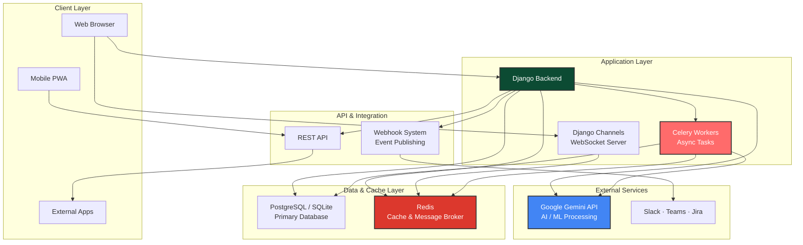

# PrizmAI — AI-Powered Project Management Platform

[](https://github.com/paulavishek/PrizmAI/actions/workflows/ci.yml)
[](https://www.python.org/downloads/)
[](https://www.djangoproject.com/)
[](https://opensource.org/licenses/MIT)

> Visual project management, rooted in strategy, accelerated by AI.

PrizmAI is a full-stack project management platform built with Django, Google Gemini, WebSockets, and a REST API. It goes beyond task tracking — connecting individual work items to an organization's strategic goals through a structured hierarchy, while AI surfaces risks, explains its reasoning, and helps teams stay ahead of problems before they escalate.

**Open-source portfolio project** demonstrating full-stack development, AI integration, enterprise security, and modern software architecture.

---

## Features

### Project Management Core

- **Visual Kanban Boards** — Drag-and-drop task management with AI-suggested column structures
- **Gantt Charts** — Interactive timelines with milestone tracking and task dependency visualization
- **Burndown Charts & Sprint Forecasting** — Real-time sprint progress with AI-powered completion predictions and confidence intervals
- **Time Tracking & Timesheets** — Log hours, track team utilization, and manage labor costs
- **Budget & ROI Tracking** — Multi-currency support, cost forecasting, and ROI analytics
- **Task Dependencies** — Parent-child, related, and blocking dependency types with AI analysis
- **Board & Scheduled Automations** — Trigger-based rules and time-based recurring automation for repetitive workflows
- **Unified Cross-Board Calendar** — Consolidated view of tasks, milestones, and events across all boards

### Strategic Alignment

- **Organizational Goal Hierarchy** — Connect work to strategy through a Goal → Mission → Strategy → Board → Task hierarchy
- **Triple Constraint Dashboard** — Visualize and analyze the Scope, Cost, and Time interplay for a project with AI-powered recommendations
- **Mission & Strategy Management** — Define organizational missions and link strategies to projects and boards

### AI Intelligence (Google Gemini)

- **AI Project Assistant** — Natural language queries with RAG technology and web search, scoped to your project data
- **AI Coach** — Proactive, personalized coaching with recommendations that learn from your feedback
- **Explainable AI** — Every recommendation includes a transparent breakdown: confidence level, contributing factors, assumptions, limitations, and alternative perspectives
- **Scope Creep Detection** — Automatic baseline tracking with alerts when scope expands beyond the original plan
- **Conflict Detection** — Automated detection and resolution suggestions for resource, schedule, and dependency conflicts
- **AI Onboarding** — Enter your organization's goal and let AI generate a complete workspace — missions, strategies, boards, and starter tasks — tailored to your objectives
- **PrizmBrief** — Generate structured, audience-aware presentation content directly from live board data, for clients, executives, or internal teams
- **AI Retrospectives** — Auto-generated lessons learned with improvement tracking
- **Skill Gap Analysis** — Team capability mapping against task requirements, with individual development plans
- **Resource Leveling & Workload Optimization** — Intelligent workload balancing and assignment suggestions
- **AI Bubble-up Summaries** — On-demand AI summaries generated and propagated at every level of the hierarchy (task, board, strategy, mission)
- **Deadline Prediction & Risk Assessment** — AI-powered deadline estimates and risk scoring with mitigation suggestions
- **Semantic Task Search** — Find tasks by meaning and intent, not just keywords

### Enterprise & Collaboration

- **Open Access Model** — Any authenticated user can access all boards and features; access control is intentionally kept flat to reduce friction
- **Stakeholder Management** — Track influence, interest levels, and engagement across projects
- **Real-Time Messaging** — WebSocket-powered team chat with @mentions and notifications
- **Board Member Invitations** — Invite collaborators via email with tokenized invitation links
- **Knowledge Base & Wiki** — Markdown documentation with AI-assisted meeting analysis
- **Meeting Transcript Import** — Import from Fireflies, Otter, Zoom, Teams, and Meet with AI extraction
- **File Attachments with AI Analysis** — Attach files to tasks and let AI extract structured tasks from documents

### Security & Compliance

- **OAuth 2.0** — Google login via django-allauth
- **Brute-Force Protection** — Account lockout on repeated failed authentication attempts (django-axes)
- **XSS & CSRF Protection** — HTML sanitization (bleach) and token validation
- **SQL Injection Prevention** — Django ORM with parameterized queries throughout
- **Content Security Policy** — CSP headers enforced via django-csp
- **Audit Logging** — Complete audit trail of sensitive operations with IP tracking
- **Secure File Uploads** — MIME type validation and malicious content detection
- **AI Usage Monitoring** — Track and manage AI feature consumption with configurable quota limits

### Integrations & Platform

- **RESTful API** — Token-authenticated REST API for third-party integrations and mobile clients
- **Webhook Integration** — Event-driven automation with external applications
- **Mobile PWA** — Progressive Web App with offline support and home-screen installation
- **Board Import / Export** — Import and export boards in PrizmAI's JSON format
- **Lean Six Sigma Classifications** — Built-in LSS task labels (Value-Added, NVA, Waste)
- **Colorblind Accessibility** — Optimized color palettes with pattern indicators

**→ [Detailed feature documentation](FEATURES.md)**

---

## Quick Start

### Prerequisites

- Python 3.10+
- pip
- Virtual environment (recommended)

### Installation

```bash
# Clone the repository
git clone https://github.com/paulavishek/PrizmAI.git
cd PrizmAI

# Create and activate a virtual environment
python -m venv venv
source venv/bin/activate       # Windows: venv\Scripts\activate

# Install dependencies
pip install -r requirements.txt

# Configure environment variables
cp .env.example .env
# Edit .env — add your SECRET_KEY and GEMINI_API_KEY at minimum

# Apply migrations
python manage.py migrate

# (Optional) Populate demo boards with sample data
python manage.py populate_test_data

# Start the development server
python manage.py runserver
```

Open [http://localhost:8000](http://localhost:8000) and sign up to get started.

---

## Demo Data & Test Accounts

PrizmAI ships with a demo-mode toggle that gives you access to pre-populated demo boards — a software development sprint, a bug-tracking workflow, and a marketing campaign — each populated with realistic tasks, milestones, budgets, and dependencies. All demo dates are calculated relative to today so the boards always appear current.

To populate the demo data, run the setup command first:

```bash
python manage.py populate_test_data
```

After signing up, activate **demo mode** from the UI to explore the sample boards.

### Demo Test Accounts

To explore without creating an account:

| Username | Password |
|---|---|
| `alex_chen_demo` | `demo123` |
| `sam_rivera_demo` | `demo123` |
| `jordan_taylor_demo` | `demo123` |

All users have equal access — PrizmAI uses an open access model where every authenticated user can access all boards and features.

> Demo accounts have rate-limited AI features (5 calls per 10 minutes). Create your own account for unrestricted AI access.

### Keeping Demo Data Fresh

```bash
# Refresh all demo dates to stay relative to today
python manage.py refresh_demo_dates

# Remove duplicate demo boards if they appear
python manage.py cleanup_duplicate_demo_boards --auto-fix
```

**→ [Full setup and configuration guide](SETUP.md)**

---

## Documentation

| Document | Description |
|---|---|
| **[USER_GUIDE.md](USER_GUIDE.md)** | Practical usage, workflows, and best practices |
| **[FEATURES.md](FEATURES.md)** | Detailed feature descriptions and AI capabilities |
| **[API_DOCUMENTATION.md](API_DOCUMENTATION.md)** | REST API reference |
| **[SETUP.md](SETUP.md)** | Installation and configuration guide |
| **[SECURITY.md](SECURITY.md)** | Security policy and vulnerability reporting |
| **[CONTRIBUTING.md](CONTRIBUTING.md)** | How to contribute |

### Developer Guides (`docs/`)

| Document | Description |
|---|---|
| **[Aha Moment Integration](docs/AHA_MOMENT_INTEGRATION_GUIDE.md)** | Integrating aha moment detection into views |

---

## Technology Stack

**Backend**
- Python 3.10+ with Django 5.2
- Django REST Framework
- Django Channels 4 (WebSockets)
- Celery + django-celery-beat (async and scheduled tasks)
- Google Gemini API — `gemini-2.5-flash` (complex reasoning & analysis) and `gemini-2.5-flash-lite` (standard tasks, default)
- scikit-learn, numpy, scipy (ML pipeline for priority and deadline models)

**Frontend**
- HTML5, CSS3, JavaScript
- Bootstrap 5
- Progressive Web App (PWA) support

**Data & Caching**
- PostgreSQL or SQLite
- Redis — cache backend and Celery message broker
- django-redis, WhiteNoise

**Security**
- bleach (XSS prevention)
- django-csp (Content Security Policy)
- django-axes (brute-force protection)
- django-allauth with OAuth 2.0 (Google login)
- PyJWT, cryptography

---

## System Architecture


```mermaid
graph TB
    subgraph "Client Layer"
        A[Web Browser]
        B[Mobile PWA]
        ExtApp[External Apps]
    end

    subgraph "Application Layer"
        App[Django Backend]
        WS[Django Channels\nWebSocket Server]
        Worker[Celery Workers\nAsync Tasks]
    end

    subgraph "API & Integration"
        API[REST API]
        Hooks[Webhook System\nEvent Publishing]
    end

    subgraph "External Services"
        Gemini[Google Gemini API\nAI / ML Processing]
        ThirdParty[Slack · Teams · Jira]
    end

    subgraph "Data & Cache Layer"
        DB[PostgreSQL / SQLite\nPrimary Database]
        Cache[Redis\nCache & Message Broker]
    end

    A --> App
    A --> WS
    B --> API
    App --> API
    App --> Gemini
    App --> DB
    App --> Cache
    WS --> Cache
    Worker --> Gemini
    Worker --> DB
    Worker --> Cache
    App --> Worker
    Hooks --> ThirdParty
    App --> Hooks
    API --> ExtApp

    style Gemini fill:#4285f4,stroke:#333,stroke-width:2px,color:#fff
    style App fill:#0c4b33,stroke:#333,stroke-width:2px,color:#fff
    style Worker fill:#ff6b6b,stroke:#333,stroke-width:2px,color:#fff
    style Cache fill:#dc382d,stroke:#333,stroke-width:2px,color:#fff
```

**Key Components**

- **Django Backend** — Core application logic, business rules, and data processing
- **WebSocket Server** — Real-time collaboration and live updates via Django Channels
- **Celery Workers** — Asynchronous task processing for AI operations and scheduled automations
- **Redis** — Message broker for Celery and a shared caching layer
- **Google Gemini API** — AI recommendations, forecasting, summaries, and coaching
- **REST API** — Token-authenticated endpoints for third-party integrations and mobile clients
- **Webhook System** — Event-driven automation with external tools

---

## Caching

PrizmAI includes a multi-tier caching system built for cloud deployment:

| Tier | Backend | Purpose |
|---|---|---|
| L1 | Local memory | Hot data, single-process |
| L2 | Redis | Shared across processes, persistent |
| Specialized | Redis (separate stores) | AI responses, sessions, analytics |

Features include automatic cache invalidation via Django signals, tag-based group invalidation, ETag support for API responses, and cache warmup utilities.

```bash
# Cache management commands
python manage.py cache_management --action=stats
python manage.py cache_management --action=clear-all
python manage.py cache_management --action=warmup --board=<id>
python manage.py cache_management --action=test
```

---

## Security

- **Brute-Force Protection** — Account lockout on repeated failed login attempts (django-axes)
- **XSS & CSRF Protection** — HTML sanitization (bleach) and token validation on all forms
- **SQL Injection Prevention** — Django ORM with parameterized queries
- **Content Security Policy** — Enforced via django-csp headers
- **Secure File Uploads** — MIME type validation and malicious content detection
- **Authentication Enforcement** — All routes require login via `@login_required`
- **Audit Logging** — Complete audit trail of sensitive operations with IP tracking
- **HTTPS Enforcement** — HSTS support for encrypted data in transit

**→ [Security Policy](SECURITY.md)**

---

## Mobile PWA

A companion Progressive Web App is available in a separate repository, consuming the Django REST API.

- Mobile-first, thumb-friendly navigation
- Offline support with background sync
- Installable to home screen (iOS and Android)
- Bearer token authentication

**Mobile PWA repository:** [github.com/paulavishek/PrizmAI_mobile_PWA](https://github.com/paulavishek/PrizmAI_mobile_PWA)

```bash
# Start the Django backend (provides the REST API for the PWA):
python manage.py runserver

# Serve the PWA (from the separate PWA repo):
cd PrizmAI_mobile_PWA
python -m http.server 8080
```

---

## Use Cases

**Software Development Teams** — Sprint planning, bug tracking, release management, burndown forecasting

**Marketing & Product Teams** — Campaign planning, content tracking, timeline management

**Operations & Support** — Process coordination, incident management, service requests

**Strategic Planning** — Connect organizational goals to operational projects through the full Goal → Mission → Strategy → Board hierarchy

**→ [Real-world examples and workflows](USER_GUIDE.md)**

---

## License

MIT License — free to use, modify, and deploy anywhere.

---

## Contributing & Support

- **Documentation** — Comprehensive guides included in this repository
- **Bug Reports** — [Open an issue on GitHub](https://github.com/paulavishek/PrizmAI/issues)
- **Discussions** — Community forum for questions and ideas
- **Pull Requests** — Contributions welcome. See [CONTRIBUTING.md](CONTRIBUTING.md)

---

## About This Project

PrizmAI is a **portfolio project** demonstrating:

- Full-stack web development (Django + modern frontend)
- AI/ML integration and prompt engineering (Google Gemini, scikit-learn)
- Enterprise security implementation
- REST API design and development
- Real-time communication via WebSockets
- Database architecture and query optimization
- Asynchronous task processing with Celery
- Project management domain expertise

---

**Built by [Avishek Paul](https://github.com/paulavishek)**
